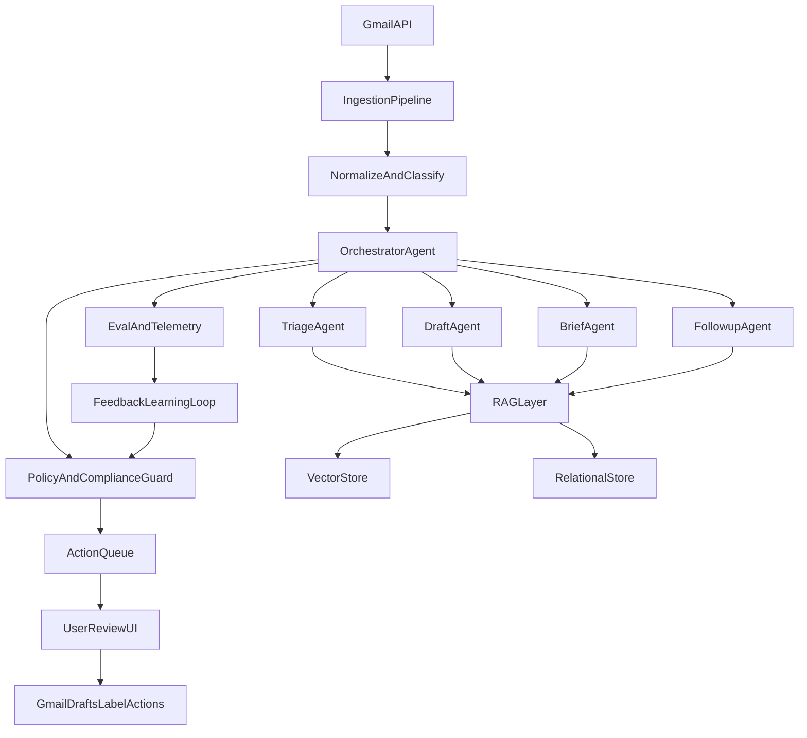

# Inbox Chief of Staff: Compound Engineering Build Plan

## Goal
Create a production-ready "chief of staff for email" system inspired by Cora, with a lightweight architecture, minimal connectors, phase-gated delivery, and a multi-agent orchestrator + RAG core.

## Artifact Storage and Repository Organization (Mandatory)

All implementation outputs must be saved under:
- `/Users/neelmishra/.cursor/Rula/inbox-chief-of-staff`

This is the single source of truth for execution artifacts (PRDs, roadmap, tickets, reviews, architecture notes, and research).

Folder structure (aligned to compound engineering layout and GitHub documentation conventions):
- `/Users/neelmishra/.cursor/Rula/inbox-chief-of-staff/README.md`
- `/Users/neelmishra/.cursor/Rula/inbox-chief-of-staff/roadmap.md`
- `/Users/neelmishra/.cursor/Rula/inbox-chief-of-staff/research/`
- `/Users/neelmishra/.cursor/Rula/inbox-chief-of-staff/prds/`
- `/Users/neelmishra/.cursor/Rula/inbox-chief-of-staff/tickets/`
- `/Users/neelmishra/.cursor/Rula/inbox-chief-of-staff/reviews/`
- `/Users/neelmishra/.cursor/Rula/inbox-chief-of-staff/architecture/`
- `/Users/neelmishra/.cursor/Rula/inbox-chief-of-staff/architecture/frontend/`
- `/Users/neelmishra/.cursor/Rula/inbox-chief-of-staff/architecture/backend/`
- `/Users/neelmishra/.cursor/Rula/inbox-chief-of-staff/runbooks/`

Initialized execution artifacts:
- Workspace index: [/Users/neelmishra/.cursor/Rula/inbox-chief-of-staff/README.md](/Users/neelmishra/.cursor/Rula/inbox-chief-of-staff/README.md)
- Roadmap: [/Users/neelmishra/.cursor/Rula/inbox-chief-of-staff/roadmap.md](/Users/neelmishra/.cursor/Rula/inbox-chief-of-staff/roadmap.md)
- Research synthesis: [/Users/neelmishra/.cursor/Rula/inbox-chief-of-staff/research/product-context-synthesis.md](/Users/neelmishra/.cursor/Rula/inbox-chief-of-staff/research/product-context-synthesis.md)
- PRDs: [/Users/neelmishra/.cursor/Rula/inbox-chief-of-staff/prds/prototype-prd.md](/Users/neelmishra/.cursor/Rula/inbox-chief-of-staff/prds/prototype-prd.md), [/Users/neelmishra/.cursor/Rula/inbox-chief-of-staff/prds/mvp-prd.md](/Users/neelmishra/.cursor/Rula/inbox-chief-of-staff/prds/mvp-prd.md), [/Users/neelmishra/.cursor/Rula/inbox-chief-of-staff/prds/production-prd.md](/Users/neelmishra/.cursor/Rula/inbox-chief-of-staff/prds/production-prd.md)
- Tickets: [/Users/neelmishra/.cursor/Rula/inbox-chief-of-staff/tickets/prototype-tickets.md](/Users/neelmishra/.cursor/Rula/inbox-chief-of-staff/tickets/prototype-tickets.md), [/Users/neelmishra/.cursor/Rula/inbox-chief-of-staff/tickets/mvp-tickets.md](/Users/neelmishra/.cursor/Rula/inbox-chief-of-staff/tickets/mvp-tickets.md), [/Users/neelmishra/.cursor/Rula/inbox-chief-of-staff/tickets/production-tickets.md](/Users/neelmishra/.cursor/Rula/inbox-chief-of-staff/tickets/production-tickets.md)
- Gate approvals: [/Users/neelmishra/.cursor/Rula/inbox-chief-of-staff/reviews/phase-gates.md](/Users/neelmishra/.cursor/Rula/inbox-chief-of-staff/reviews/phase-gates.md)
- Connectors/APIs/env vars: [/Users/neelmishra/.cursor/Rula/inbox-chief-of-staff/architecture/connectors-apis-env.md](/Users/neelmishra/.cursor/Rula/inbox-chief-of-staff/architecture/connectors-apis-env.md)
- Repo-structure best practices: [/Users/neelmishra/.cursor/Rula/inbox-chief-of-staff/architecture/repo-structure-best-practices.md](/Users/neelmishra/.cursor/Rula/inbox-chief-of-staff/architecture/repo-structure-best-practices.md)
- Frontend architecture outputs: [/Users/neelmishra/.cursor/Rula/inbox-chief-of-staff/architecture/frontend/README.md](/Users/neelmishra/.cursor/Rula/inbox-chief-of-staff/architecture/frontend/README.md)
- Backend architecture outputs: [/Users/neelmishra/.cursor/Rula/inbox-chief-of-staff/architecture/backend/README.md](/Users/neelmishra/.cursor/Rula/inbox-chief-of-staff/architecture/backend/README.md)
- Execution runbook: [/Users/neelmishra/.cursor/Rula/inbox-chief-of-staff/runbooks/execution-runbook.md](/Users/neelmishra/.cursor/Rula/inbox-chief-of-staff/runbooks/execution-runbook.md)

Execution rule:
- Coding agent must read and follow `prds/`, then `roadmap.md`, then phase `tickets/`.
- Ticket files are living trackers and must be updated with status, owner, date, blockers, and links to evidence artifacts.
- Gate decisions must be documented in `reviews/` before advancing phases.
- All frontend architecture deliverables must be saved under `architecture/frontend/`.
- All backend architecture deliverables must be saved under `architecture/backend/`.

This plan follows your compound engineering loop: **Plan -> Work -> Review -> Compound** from:
- [/Users/neelmishra/.cursor/Rula/skills/compound-engineering/README.md](/Users/neelmishra/.cursor/Rula/skills/compound-engineering/README.md)
- [/Users/neelmishra/.cursor/Rula/skills/compound-engineering/02-compound-engineering-framework.md](/Users/neelmishra/.cursor/Rula/skills/compound-engineering/02-compound-engineering-framework.md)
- [/Users/neelmishra/.cursor/Rula/skills/compound-engineering/15-end-to-end-compound-engineering-sop.md](/Users/neelmishra/.cursor/Rula/skills/compound-engineering/15-end-to-end-compound-engineering-sop.md)

And starts with your internal PRD workflow:
- PRD agent definition: [/Users/neelmishra/.cursor/Rula/skills/prd.md](/Users/neelmishra/.cursor/Rula/skills/prd.md)
- PRD template: [/Users/neelmishra/.cursor/Rula/business dna/ops/prd.md](/Users/neelmishra/.cursor/Rula/business%20dna/ops/prd.md)

## Product Context (Research Synthesis)

Reference document for full research notes:
- [/Users/neelmishra/.cursor/plans/inbox_chief_of_staff_product_context_research.md](/Users/neelmishra/.cursor/plans/inbox_chief_of_staff_product_context_research.md)

### Website context (cora.computer)
Core experience to emulate and improve:
- AI inbox triage: separate urgent/respond-now from non-urgent.
- Draft replies in user voice, user remains final sender.
- Twice-daily brief for non-action emails.
- Learns preferences from history + explicit feedback.
- Trust posture: no training on customer data, strong compliance/security messaging.

### Reddit user research themes (professionals)
Most common pain points:
- Inbox as uncontrolled task list.
- Thread-task drift across email and task tools.
- Context switching and triage fatigue.
- Follow-up leakage and stale commitments.
- Privacy/trust concerns around AI email processing.

Feature opportunities validated by research:
- Outcome-focused inbox score (not just inbox zero).
- Thread-to-task syncing with owner/SLA states.
- Proactive daily executive briefing.
- Tight human approval controls for all outward actions.
- Explainable triage rationale + audit logs.

## System Architecture (Target)

### Verticalized workflow agents
- **Triage vertical:** classify, prioritize, route to inbox/brief.
- **Draft vertical:** tone-safe, context-grounded draft generation.
- **Brief vertical:** digest non-urgent messages into morning/afternoon brief.
- **Follow-up vertical:** commitments extraction, reminders, stale-thread detection.
- **Policy/compliance vertical:** enforce no-send/delete, PII controls, tenant policy.

### Orchestrator responsibilities
- Owns workflow state machine and handoffs between agents.
- Enforces confidence thresholds and fallback routes.
- Applies tool permissions by agent role.
- Emits full event logs for auditability and evals.

### RAG responsibilities (production)
- Retrieve user-specific context: past replies, contact VIP map, preference memory, policy profile.
- Ground all generation with cited retrieval chunks.
- Reject generation when retrieval confidence below threshold.

## Build Profiles (Scope + Cost)

### Light build (recommended path)
- Gmail-only connector.
- Single LLM provider + one fallback model.
- One vector store + one relational DB.
- Draft + triage + brief + basic follow-up.
- Manual policy configuration and basic admin panel.
- Lowest cost and fastest delivery.

### Medium build
- Gmail + Outlook.
- Expanded policy engine and role-based org controls.
- Advanced analytics dashboard and richer eval automation.
- More robust incident tooling.

### Heavy build
- Multi-channel ingestion (email + calendar + Slack).
- Deep enterprise controls (SCIM, SSO variants, DLP layers, custom retention).
- Multi-region and high-availability architecture.
- Higher operational overhead and connector complexity.

## Infrastructure Strategy

### Frontend (deploy on Vercel)
- Stack: Next.js + TypeScript + design system.
- Surfaces: onboarding, triage feed, draft review queue, brief reader, settings/policy, trust center.
- Deployment: Vercel Preview per PR, Production branch protection, edge caching for static UI only.

### Backend API + workers (options)
- **Option A (lightest):** Render/Fly for API + background workers.
- **Option B (serverless):** Cloud Run + Cloud Tasks + Pub/Sub.
- **Option C (full control):** AWS ECS Fargate + SQS + EventBridge.

### Data components
- Relational DB: Postgres (tenant configs, workflow states, audit events metadata).
- Vector DB: pgvector in Postgres (light path) or managed vector DB at scale.
- Object storage: S3/GCS for encrypted artifacts and logs.
- Queue: managed queue for asynchronous pipeline and retries.
- Secrets: managed KMS/secret manager.

### Lightweight recommendation
For least connectors + lowest cost: **Vercel (frontend) + Cloud Run (backend/workers) + Cloud SQL Postgres with pgvector + Cloud Tasks + GCS**.

## External Connectors, APIs, and Environment Variables by Phase

### Phase 1: Prototype (minimum viable connector set)

#### External connectors and APIs
- **Google OAuth 2.0 / Gmail API** for mailbox access (read metadata/content, labels, drafts only).
- **LLM API (single primary provider)** for triage, draft generation, and brief summarization.
- **Optional secondary LLM API** as fallback for resilience tests (can be disabled for lowest cost).
- **Postgres API/driver** for workflow state, user settings, and audit metadata.
- **Object storage API** for artifacts/log bundles.
- **Queue API** for async orchestration tasks.
- **Observability API** (minimal logs/metrics) for error tracking and eval telemetry.

#### Environment variables
- **App/runtime**
  - `NODE_ENV`
  - `APP_BASE_URL`
  - `API_BASE_URL`
  - `WEBHOOK_BASE_URL`
- **Auth (Google)**
  - `GOOGLE_CLIENT_ID`
  - `GOOGLE_CLIENT_SECRET`
  - `GOOGLE_OAUTH_REDIRECT_URI`
  - `GOOGLE_PUBSUB_TOPIC` (if push model used)
- **Gmail integration**
  - `GMAIL_SCOPES`
  - `GMAIL_WATCH_LABELS`
- **LLM**
  - `LLM_PROVIDER`
  - `LLM_API_KEY`
  - `LLM_MODEL_TRIAGE`
  - `LLM_MODEL_DRAFT`
  - `LLM_MODEL_BRIEF`
  - `LLM_FALLBACK_PROVIDER` (optional)
  - `LLM_FALLBACK_API_KEY` (optional)
- **Data**
  - `DATABASE_URL`
  - `DATABASE_POOL_SIZE`
  - `VECTOR_STORE_MODE` (`pgvector` in prototype)
  - `PGVECTOR_EMBEDDING_DIM`
- **Queue/storage**
  - `QUEUE_PROVIDER`
  - `QUEUE_URL`
  - `OBJECT_STORAGE_BUCKET`
  - `OBJECT_STORAGE_REGION`
- **Security/crypto**
  - `ENCRYPTION_KEY_ID`
  - `KMS_KEY_RING` (or equivalent)
  - `SESSION_SECRET`
- **Observability/evals**
  - `LOG_LEVEL`
  - `OTEL_EXPORTER_ENDPOINT` (optional)
  - `ERROR_TRACKING_DSN`
  - `EVAL_DATASET_VERSION`

### Phase 2: MVP (expand reliability + tenancy + RAG)

#### Additional external connectors and APIs
- **Identity/session provider API** for org + user session hardening.
- **Vector retrieval API** (if external vector DB selected instead of pgvector).
- **Billing API** (plan limits, subscription lifecycle, invoicing events).
- **Notification API** for product/system events (email/in-app).
- **Feature flag/config API** for phased rollout control.

#### Additional environment variables
- **Multi-tenant/auth**
  - `AUTH_PROVIDER`
  - `AUTH_ISSUER_URL`
  - `AUTH_AUDIENCE`
  - `JWT_SIGNING_KEY`
  - `TENANT_DEFAULT_PLAN`
- **RAG**
  - `EMBEDDING_PROVIDER`
  - `EMBEDDING_API_KEY`
  - `EMBEDDING_MODEL`
  - `RAG_TOP_K`
  - `RAG_SCORE_THRESHOLD`
  - `RAG_MAX_CONTEXT_TOKENS`
- **Policy/compliance**
  - `PII_REDACTION_ENABLED`
  - `POLICY_ENGINE_MODE`
  - `DATA_RETENTION_DAYS`
  - `AUDIT_LOG_IMMUTABLE`
- **Billing**
  - `BILLING_PROVIDER`
  - `BILLING_API_KEY`
  - `BILLING_WEBHOOK_SECRET`
  - `PRICE_ID_PROFESSIONAL`
  - `PRICE_ID_UNLIMITED`
- **Ops controls**
  - `FEATURE_FLAG_SDK_KEY`
  - `RATE_LIMIT_REQUESTS_PER_MIN`
  - `IDEMPOTENCY_TTL_HOURS`

### Phase 3: Production (hardening + compliance + safety controls)

#### Additional external connectors and APIs
- **SIEM/log archive API** for compliance-grade security audit ingestion.
- **Incident alerting API** (pager/on-call escalation).
- **DLP/scanning API** (if enterprise compliance requires it).
- **Backup/DR API** for snapshot orchestration and restore verification.
- **Optional Outlook/Microsoft Graph API** only if approved as P2 expansion.

#### Additional environment variables
- **Safety controls**
  - `CIRCUIT_BREAKER_ENABLED`
  - `CIRCUIT_BREAKER_ERROR_RATE_THRESHOLD`
  - `CIRCUIT_BREAKER_FALSE_URGENT_THRESHOLD`
  - `KILL_SWITCH_GLOBAL`
  - `KILL_SWITCH_TENANT_LIST`
  - `SAFE_MODE_DEFAULT`
- **Reliability/SLO**
  - `SLO_P95_LATENCY_MS`
  - `SLO_ERROR_BUDGET_PERCENT`
  - `QUEUE_DEAD_LETTER_ENABLED`
  - `RETRY_MAX_ATTEMPTS`
- **Security/compliance**
  - `SECRETS_ROTATION_DAYS`
  - `AUDIT_EXPORT_BUCKET`
  - `DSAR_WORKFLOW_ENABLED`
  - `DATA_RESIDENCY_REGION`
- **DR/backup**
  - `BACKUP_SCHEDULE_CRON`
  - `BACKUP_RETENTION_DAYS`
  - `DR_RESTORE_TEST_CRON`
  - `RPO_TARGET_MINUTES`
  - `RTO_TARGET_MINUTES`
- **Enterprise optional**
  - `MS_GRAPH_CLIENT_ID`
  - `MS_GRAPH_CLIENT_SECRET`
  - `MS_GRAPH_TENANT_ID`
  - `OUTLOOK_SCOPES`

### Connector minimization policy (cost and complexity guardrail)
- Prototype must ship with only: Gmail, one LLM provider, Postgres/pgvector, queue, object storage, and basic observability.
- New connector additions in MVP/Production require: user-value justification, cost estimate, operational owner, and rollback path.
- Any connector not mapped to a P1 or approved P2 ticket remains out-of-scope for that phase.

## Security, Compliance, Governance
- Principle of least privilege across agents/tools.
- OAuth scopes minimal: read/labels/drafts, no send/delete in early phases.
- Encryption in transit and at rest; tenant-scoped keys where feasible.
- Audit log for every agent action and retrieval decision.
- Data retention controls and deletion workflows.
- Compliance roadmap: SOC2 readiness controls first, GDPR baseline from MVP, enterprise controls in Production.

### Circuit breaker + kill switch (Production mandatory)
- **Circuit breaker:** auto-disable autonomous actions when anomaly thresholds exceeded (misclassification spikes, false-urgent spikes, policy violations, latency bursts).
- **Kill switch:** immediate global + tenant-level hard stop for agent execution; degrade to read-only inbox view.
- **Safe mode:** drafts paused, brief only, no auto-label moves until recovery.

## UX Strategy and UX Flow Map Timing

### When to create UX map flow
- Create first UX map in **Prototype week 1** after PRD draft and user persona lock.
- Validate/refine in MVP with usability tests.
- Freeze core UX contracts at Production hardening.

### Primary user archetypes and UX optimization
- **Founder/Executive:** one-screen priority view, fast approval queue, daily strategic brief.
- **Manager/Operator:** thread-to-task conversion, SLA reminders, follow-up dashboard.
- **EA/Chief of Staff human partner:** delegation controls, exception handling, transparency logs.
- **Individual contributor:** lightweight triage + drafting assistance with minimal settings overhead.

### UI/UX agent workflow
- PRD defines UX objectives and constraints.
- UX agent produces journey map + wireflow.
- UI agent maps wireflow to design-system components.
- Design reviews run before frontend implementation starts each phase.

## Phase-Gated Development (No overlap)

## Implementation Flow and Approval Path

### Starting point (where execution begins)
- **Start at Prototype PRD creation only** using `prd-specialist` and [/Users/neelmishra/.cursor/Rula/business dna/ops/prd.md](/Users/neelmishra/.cursor/Rula/business%20dna/ops/prd.md).
- No build work starts before Prototype PRD and Prototype ticket scope are approved.
- The first executable package is: Prototype PRD -> prioritized tickets -> UX flow map -> architecture baseline.

### Execution loop inside every phase
1. **Plan:** finalize phase PRD, scope, priorities (P1/P2/P3), and success criteria.
2. **Work:** implement only in-scope tickets for that phase.
3. **Review:** run QA, tests, evals, and security/compliance checks.
4. **Compound:** publish findings and prevention updates (tests/rules/playbooks).
5. **Approve/hold:** explicit go/no-go decision before next phase can start.

### Approval gates you must sign off
- **Gate 0 (Prototype entry):** approve Prototype PRD completeness, ticket ranking, UX direction, and phase exit criteria.
- **Gate 1 (Prototype exit -> MVP entry):** approve after prototype QA/evals/UAT pass and no critical safety issues remain.
- **Gate 2 (MVP exit -> Production entry):** approve after reliability, security, and RAG/policy performance exceed agreed thresholds.
- **Gate 3 (Production launch):** approve after canary, incident drills, kill switch validation, and rollback readiness are verified.

### Gate blocking rules
- Any unresolved **P1** blocks phase completion.
- **P2** can only defer with owner, due date, risk statement, and explicit approval.
- **P3** moves to backlog unless promoted by risk or user impact.
- If gate criteria fail, phase loops back to Plan/Work/Review until approved.

## Phase 1: Prototype PRD -> Build -> Gate

### 1.1 PRD creation (must happen first)
- Use `prd-specialist` process from [/Users/neelmishra/.cursor/Rula/skills/prd.md](/Users/neelmishra/.cursor/Rula/skills/prd.md).
- Fill template from [/Users/neelmishra/.cursor/Rula/business dna/ops/prd.md](/Users/neelmishra/.cursor/Rula/business%20dna/ops/prd.md).
- Scope: Gmail-only, triage + draft + brief core loop, single-user pilot.

### 1.2 Engineering tickets (priority-ranked)
- **P1**: Gmail OAuth + webhook ingestion.
- **P1**: Message normalization pipeline + schema validation.
- **P1**: Orchestrator skeleton + state machine for triage/draft/brief handoffs.
- **P1**: Triage agent v1 with deterministic fallback rules.
- **P1**: Draft agent v1 (drafts folder only, no send).
- **P1**: Brief agent v1 (morning/afternoon digest).
- **P1**: Basic review UI (priority inbox + draft approval + brief reader).
- **P1**: Core telemetry and QA harness.
- **P2**: Feedback capture controls ("important", "wrongly briefed", tone correction).
- **P2**: Minimal policy guardrail service.
- **P3**: Basic commitment extraction for follow-up list.

### 1.3 QA gate (must pass before MVP)
- Unit + integration tests for ingestion/orchestrator/agents.
- Golden dataset evals for triage precision/recall, draft quality rubric, brief relevance.
- Manual UAT with 5-10 pilot users for 1-2 weeks.
- Exit criteria: agreed accuracy + user time-saved threshold + zero critical policy violations.

### 1.4 Development schedule
- Week 1: PRD + UX flow map + architecture spike.
- Week 2-3: Core backend + orchestrator + triage/draft/brief agents.
- Week 4: Frontend + telemetry + eval harness.
- Week 5: Pilot + bug fixes + gate review.

## Phase 2: MVP PRD -> Build -> Gate (only after Phase 1 approval)

### 2.1 PRD creation
- New PRD constrained by prototype learnings + compounding artifacts.
- Add tenancy, reliability SLOs, stronger policy controls, and measurable onboarding funnel.

### 2.2 Engineering tickets (priority-ranked)
- **P1**: Multi-tenant auth + org/user settings model.
- **P1**: RAG v1 (preferences, VIP graph, historical style retrieval).
- **P1**: Policy/compliance guard v2 (scope controls, PII redaction, explainability).
- **P1**: Queue-based workflow execution + retries + idempotency keys.
- **P1**: Follow-up agent with owner/due-date/SLA states.
- **P1**: Eval platform v2 (offline regression sets + online feedback scoring).
- **P1**: Admin/ops dashboard (errors, confidence, override controls).
- **P2**: Onboarding coach and progressive configuration UX.
- **P2**: Billing and plan limits.
- **P2**: Expanded analytics (time saved, response velocity, false-priority rate).
- **P3**: Outlook connector discovery spike (not release-critical).

### 2.3 QA gate (must pass before Production)
- End-to-end reliability tests with load and failure injection.
- Security tests: OAuth scope verification, permission boundaries, redaction checks.
- Eval delta checks vs prototype baseline (must improve key metrics).
- Controlled beta with support SLA and incident runbook validation.

### 2.4 Development schedule
- Week 1: MVP PRD + revised UX journey + architecture hardening.
- Week 2-4: Multi-tenant backend, RAG v1, policy guard.
- Week 5-6: UX refinement, admin tools, billing, eval automation.
- Week 7: Beta QA gate + go/no-go.

## Phase 3: Production PRD -> Build -> Launch (only after MVP approval)

### 3.1 PRD creation
- Production PRD based on MVP performance + risk review + compliance gaps.
- Includes SLOs, DR strategy, incident response, and release governance.

### 3.2 Engineering tickets (priority-ranked)
- **P1**: Circuit breaker system with automated thresholds and rollback actions.
- **P1**: Kill switch (global/tenant/feature) with audited activation.
- **P1**: RAG v2 with retrieval confidence gating + hallucination suppression.
- **P1**: Compliance controls package (retention/deletion, DSAR support, audit export).
- **P1**: Production observability (SLOs, tracing, anomaly alerts, on-call playbooks).
- **P1**: Disaster recovery and backup/restore validation.
- **P1**: Security hardening (threat model closure, secrets rotation, penetration testing fixes).
- **P2**: Outlook integration (if business-priority approved).
- **P2**: Advanced role-based controls and delegated operations for EA teams.
- **P3**: Extended automations marketplace.

### 3.3 Production launch gate
- Full regression + security + reliability + compliance checks passed.
- Red-team and abuse tests for prompt injection/data exfiltration scenarios.
- 2-week canary with kill-switch drills and circuit-breaker simulations.
- Executive approval sign-off with rollback plan verified.

### 3.4 Development schedule
- Week 1: Production PRD + threat/compliance review.
- Week 2-5: Reliability/security/compliance implementation.
- Week 6: DR drills + kill-switch/circuit-breaker validation.
- Week 7-8: Canary + staged rollout + final sign-off.

## Testing and Evaluation Framework (all phases)
- **Agent-level evals:** triage correctness, draft helpfulness/tone, brief informativeness.
- **Workflow evals:** end-to-end handoff correctness, retries/idempotency behavior.
- **Safety evals:** policy compliance, PII handling, unauthorized action prevention.
- **Product evals:** time saved, priority miss rate, user trust score, approval edit distance.
- **Authorization test data:** synthetic inboxes + consented pilot inboxes with clear legal authorization.

## Data Pipelines, Handoffs, and Feedback Loops
- Ingestion pipeline validates, deduplicates, and enriches message metadata.
- Orchestrator issues agent tasks with explicit contracts per stage.
- Handoffs carry confidence, rationale, and policy tags.
- User feedback updates preference memory and eval datasets.
- Weekly compound review converts recurring failures into policy/tests/rules updates.

## Execution Governance (Compound Engineering)
- Every phase executes: **Plan -> Work -> Review -> Compound**.
- Phase completion requires formal review with P1/P2/P3 closure rules.
- Each phase generates compounding artifacts: eval reports, incidents, policy updates, playbooks, and reusable templates.
- No next-phase PRD starts until prior phase gate is approved.

## Immediate next steps
1. Run Prototype PRD creation using `prd-specialist` and your PRD template.
2. Produce Prototype ticket backlog from PRD, validate P1 scope fits 5-week target.
3. Build UX flow map for four user archetypes and hand to UI/UX agents.
4. Stand up lightweight baseline infrastructure and observability before feature coding.
