# Rula GTM Engineer Case Study Deliverable

Automation from account assignment to verified MAP commitment, grounded in production-oriented system design and implemented prototype architecture.

---

## 0) Self-intro and framing

I am a GTM systems builder focused on turning high-ambiguity revenue operations workflows into reliable products: deterministic where it must be, adaptive where it should be, and measurable end to end. I am strongest at the intersection of RevOps, application engineering, and LLM systems design: connecting business decisions (pipeline quality, forecast trust, campaign utilization) to software architecture (contracts, orchestration, safety controls, and feedback loops).

Rula is an ideal fit for this style of work. The employer motion has clear business leverage, but the hardest parts are operational and trust-based: account prioritization under coverage pressure, quality outreach at scale, and MAP evidence that must be interpreted fairly without introducing friction at the commitment moment. This write-up proposes and demonstrates a pragmatic system that improves speed and consistency now while preserving a clean promotion path to production.

How to read this document:
- This document answers the case prompts directly (Part 1 and Part 2).
- It uses the current implemented architecture in `rula-gtm-agent` as the source of truth.
- Where appropriate, it distinguishes **current prototype behavior** from **production promotion path**.

---

## 1) Problem, scope, and success criteria

### 1.1 Business problem

Rula's employer AE motion depends on high-quality execution across a funnel that is currently manual in critical steps:
- Account research and first-touch drafting consume 20-30 minutes per account.
- MAP commitment evidence is unstructured (emails, Slack, notes, screenshots), hard to verify, and vulnerable to optimistic interpretation.
- RevOps depends on MAP data for forecasting, so weak verification quality directly degrades planning reliability.

At current staffing and coverage targets (5 AEs, 12-14 accounts per half, 3.2x pipeline coverage), the manual workflow does not scale.

### 1.2 Scope boundaries

In scope:
- Automation from account assignment inputs through prospecting outputs.
- MAP evidence ingestion, extraction, scoring, and action flags.
- Structured handoff payloads and human review gates before quota-sensitive CRM updates.

Out of scope (explicit):
- Closed/won confirmation based on campaign launch + second patient start.
- Claims and downstream utilization attribution loops.

### 1.3 Success criteria

This system is successful if it is:
- **Faster**: reduces account prep and MAP review cycle time materially.
- **More consistent**: generates structured, repeatable outputs across uneven data quality.
- **More trustworthy**: applies confidence logic and evidence lineage so RevOps can trust MAP-based forecasting.

---

## 2) Repository-truth architecture

### 2.1 What the repository actually is

The implemented system is a **single-process Streamlit application**, not a separate React frontend + API backend:
- UX shell and workflow controller live in `rula-gtm-agent/app.py`.
- Core domain logic is modularized under `rula-gtm-agent/src/`.
- Persistence is local artifact/JSONL first (`out/`, `telemetry_events.jsonl`, `lineage.jsonl`) with contract-first payloads for downstream systems.
- External connectors are intentionally constrained/simulated in this version for safe prototype operation.

This is a strength for case-study delivery: it enables a complete vertical slice with clear controls and observability while retaining an explicit path to production hardening.

### 2.2 Layered architecture used in this deliverable

1. **Frontend/UX layer**
   - `rula-gtm-agent/app.py`
   - `rula-gtm-agent/src/ui/`

2. **Workflow/orchestration layer**
   - `rula-gtm-agent/src/orchestrator/graph.py`
   - `rula-gtm-agent/src/orchestrator/bulk_prospecting.py`
   - `rula-gtm-agent/src/orchestrator/bulk_map.py`

3. **Specialist agent layer**
   - Prospecting: `rula-gtm-agent/src/agents/prospecting/`
   - MAP verification: `rula-gtm-agent/src/agents/verification/`

4. **Schema and contract layer**
   - `rula-gtm-agent/src/schemas/`
   - `rula-gtm-agent/src/integrations/export.py`
   - `rula-gtm-agent/src/integrations/contract_compat.py`

5. **Control plane**
   - `rula-gtm-agent/src/security/`
   - `rula-gtm-agent/src/safety/`
   - `rula-gtm-agent/src/governance/`

6. **Observability and iteration**
   - `rula-gtm-agent/src/telemetry/`
   - `rula-gtm-agent/eval/drift_check.py`
   - `rula-gtm-agent/eval/compare_shadow.py`

### 2.3 End-to-end flow (assignment to MAP verification)

```mermaid
flowchart LR
  accountAssignment[AccountAssignment] --> gatekeeper[ValidationGatekeeper]
  gatekeeper --> prospectingPod[ProspectingPod]
  prospectingPod --> aeReview[AEReviewQueue]
  aeReview --> funnelStages[AEFunnelStages]
  funnelStages --> mapIngest[MAPEvidenceIngest]
  mapIngest --> mapPod[MAPVerificationPod]
  mapPod --> handoff[StructuredHandoffContracts]
```

Operationally, this means:
- The same orchestration layer can run both prospecting and MAP verification.
- Human review is a first-class state, not a fallback afterthought.
- Every quota-sensitive decision can be traced back to evidence source and confidence logic.

---

## 3) Part 1 - Prospecting Agent

### 3.1 How this component fits the larger pipeline

Prospecting is the system's front-door value layer:
- It transforms raw account assignment data into actionable outreach.
- It standardizes value-prop reasoning before AE execution.
- It creates structured artifacts that can later be linked to MAP evidence for a traceable full arc.

In implementation, this flow is orchestrated through `run_prospecting(...)` and bulk variants in `rula-gtm-agent/src/orchestrator/graph.py` and `rula-gtm-agent/src/orchestrator/bulk_prospecting.py`.

### 3.2 Match engine design

Given an account profile (industry, employee size, health plan, notes, contact richness), the match engine should output:
- Ranked value propositions.
- Reasoning tied to account-specific signals.
- Confidence and data-quality notes.

Practical matching dimensions:
- **Segment fit**: health systems, universities, large employers aligned to Anthem/Aetna/Cigna.
- **Workforce pattern**: field-based, high-turnover, distributed, merger-integration complexity.
- **Care access friction**: underperforming EAP signals, likely wait-time/access problems.
- **Economic angle**: productivity and total cost of care relevance by segment.

This logic is represented in the prospecting agents and schemas:
- `rula-gtm-agent/src/agents/prospecting/matcher.py`
- `rula-gtm-agent/src/schemas/prospecting.py`

### 3.3 Generation engine design

For each account, generate:
1. Personalized first-touch email.
2. Two to three discovery questions.

Output shape should be strict and review-friendly:
- `account_id`
- `primary_value_prop`
- `secondary_value_prop` (optional)
- `email_subject`
- `email_body`
- `discovery_questions[]`
- `reasoning_summary`
- `needs_human_review`
- `review_reason_codes[]`

Generation quality rules:
- Must tie pain points to visible account context.
- Must avoid generic "mental health is important" language.
- Must include a clear call to action for discovery.

Implementation anchors:
- `rula-gtm-agent/src/agents/prospecting/generator.py`
- `rula-gtm-agent/src/validators/response_validator.py`

### 3.4 Evaluation and review gates

A "good" output is:
- Account-specific and segment-aware.
- Value-prop aligned and plausible.
- Tactically useful to an AE with minimal edits.

A "needs review" output is:
- Generic or repetitive language.
- Overclaims without evidence in account context.
- Missing required fields or weak personalization.
- Sparse-data cases where critical entity linkage is absent.

Implementation anchors:
- `rula-gtm-agent/src/agents/prospecting/evaluator.py`
- audit/correction loops in `rula-gtm-agent/src/orchestrator/graph.py`
- correction capture in `rula-gtm-agent/src/agents/prospecting/corrections.py`

### 3.5 Handling sparse data (accounts #5 and #6)

Sparse data is expected, not exceptional. The system should adapt behavior:

**Account #5 style (missing contact, unknown plan):**
- Generate lower-confidence match with explicit unknowns.
- Output "contact discovery needed" as a prerequisite.
- Route to review queue with recommended next data actions (identify decision-maker, confirm benefits structure, verify plan alignment).

**Account #6 style (small employee base, likely ICP miss):**
- Flag probable ICP disqualification.
- Do not spend generation budget on high-polish outreach by default.
- Present a short rationale and replacement recommendation path.

This is where deterministic policy plus LLM output works best: LLM for language and reasoning, deterministic guardrails for process control.

### 3.6 Worked prospecting examples (abbreviated)

#### Example A: Meridian Health Partners
- Likely primary value prop: total cost of care reduction.
- Secondary value prop: workforce productivity.
- Why: large health system, Anthem alignment, multi-site operations.

Discovery questions (example):
1. How are you currently measuring behavioral health utilization and referral completion across sites?
2. Where do you see the largest care-access bottlenecks today: wait times, network depth, or continuity?
3. Are you prioritizing cost trend management, workforce productivity, or both in this year's benefits strategy?

#### Example B: Pinnacle Senior Living (sparse)
- Likely value prop: workforce productivity + access.
- Confidence lower due to missing contact and unknown health plan.
- Required follow-up: identify benefits decision-maker before outreach finalization.

### 3.7 Experimentation: is 6 out of 10 no-edit good?

Yes, **6/10 no-edit is a reasonable v1 baseline** if:
- It beats manual throughput materially.
- It improves over time with structured feedback.
-
- It does not degrade response quality or meeting conversion.

I would evaluate across four metric groups:

1. **Adoption and efficiency (leading)**
   - No-edit send rate.
   - Edit distance before send.
   - Time-to-first-touch per account.

2. **Quality and relevance (leading)**
   - AE quality ratings.
   - Reviewer pass rates.
   - Judge/audit pass rates.

3. **Commercial outcomes (lagging)**
   - Discovery meetings booked.
   - Positive response rate.
   - MAP progression conversion rates.

4. **Safety and consistency**
   - Human-review trigger rate.
   - Hallucination/overclaim incidents.
   - Retry and fallback rates.

Feedback loop:
- Capture AE edits and thumbs feedback.
- Store with prompt/version metadata.
- Run regular drift/shadow checks.
- Promote prompt/model changes only after quality gates pass.

Implementation anchors:
- `rula-gtm-agent/src/context/feedback_memory.py`
- `rula-gtm-agent/eval/drift_check.py`
- `rula-gtm-agent/eval/compare_shadow.py`

---

## 4) Part 2 - MAP Verification

### 4.1 D1 - Unstructured evidence handling (current-state lane)

The MAP verification system must process messy evidence at scale and produce a structured assessment with extraction, scoring, and actioning.

Inputs can include:
- Email text or thread fragments.
- Meeting notes.
- Slack messages.
- Screenshots/OCR-derived text.

Core pipeline:
1. Parse unstructured evidence into normalized fields.
2. Score commitment confidence based on commitment strength and source reliability.
3. Flag required follow-ups before quota credit.
4. Persist lineage and confidence rationale.

Implementation anchors:
- `rula-gtm-agent/src/agents/verification/parser.py`
- `rula-gtm-agent/src/agents/verification/scorer.py`
- `rula-gtm-agent/src/agents/verification/flagger.py`
- `rula-gtm-agent/src/orchestrator/graph.py`

### 4.2 Scoring principles

Signals for firm commitment:
- Named decision-maker or authorized sponsor.
- Explicit campaign actions and timeline.
- Multi-quarter commitment clarity.
- First-party source evidence (email from decision-maker > secondhand internal message).

Signals for soft interest:
- "Exploring", "considering", or contingent language.
- No concrete campaign schedule.
- Secondhand interpretation without source corroboration.
- Dependency statements ("needs buy-in first") without commitment text.

I recommend explicit policy constraints:
- Source reliability caps maximum confidence tier.
- Secondhand-only evidence cannot auto-promote to highest confidence.
- Any quota-attribution candidate requires auditable rationale.

### 4.3 Output schema for MAP verification

Minimum structured output:
- `evidence_id`
- `account_id`
- `source_type`
- `committer_name`
- `committer_title`
- `campaigns[]`
- `timeline_quarters[]`
- `committed_quarter_count`
- `confidence_tier`
- `confidence_score`
- `follow_up_actions[]`
- `count_for_quota` (true/false/pending)
- `rationale`
- `lineage_refs[]`

### 4.4 Evidence A/B/C walkthrough

#### Evidence A - Meridian Health Partners email

Observed characteristics:
- First-party email from VP, Total Rewards.
- Explicit campaign plan across Q2, Q3, Q4.
- Concrete next step to finalize calendar.

Assessment:
- Extraction quality: high.
- Confidence: **HIGH**.
- Follow-up actions: confirm calendar artifacts in CRM, collect final campaign dates.
- Quota treatment: eligible pending standard documentation check.

#### Evidence B - TrueNorth Financial Group meeting notes

Observed characteristics:
- Secondhand note from AE.
- Interest language, no specific campaign commitments.
- Dependency on integration team buy-in.

Assessment:
- Extraction quality: moderate.
- Confidence: **LOW**.
- Follow-up actions: obtain first-party written commitment, secure campaign-specific timeline.
- Quota treatment: not eligible.

#### Evidence C - Atlas Logistics Group AE Slack note

Observed characteristics:
- Secondhand Slack statement reporting verbal commitment.
- Specific campaign claims and annual cadence.
- No first-party corroboration attached.

Assessment:
- Extraction quality: moderate-high.
- Confidence: **MEDIUM** (capped by secondhand source).
- Follow-up actions: collect confirming employer email/doc before quota count.
- Quota treatment: pending corroboration.

### 4.5 D2 - Recommended capture process (future-state lane)

The capture process should not remain fully unstructured, but should preserve momentum at the commitment moment.

Recommended model: **two-lane ingestion**
- **Lane A: zero-friction capture** at the "yes" moment (forward email, send Slack link, quick capture action).
- **Lane B: background normalization + verification** before system-of-record update.

Design principle: **messy in, clean out**.

Canonical artifact model:
- Every source is normalized into one `CommitmentEvidenceArtifact` object with source metadata, linkage IDs, extracted commitments, and verification outputs.

This model is detailed in:
- `interview_case-study/system-architecture/MAP-review_ingestion-system_design.md`

### 4.6 Why this balances conversion and governance

If you force heavy form entry during the commitment moment, you create avoidable friction and may lose momentum. If you allow only free-form artifacts with no normalization, forecasting quality erodes.

A two-lane system captures both:
- AE speed and relationship momentum.
- RevOps trust, auditability, and CRM integrity.

---

## 5) Reliability, controls, and governance

### 5.1 Controls already represented in architecture

The prototype includes the right control surfaces for production-oriented behavior:
- **RBAC checks**: `rula-gtm-agent/src/security/rbac.py`
- **Kill switches**: `rula-gtm-agent/src/safety/kill_switch.py`
- **Circuit breakers**: `rula-gtm-agent/src/safety/circuit.py`
- **DLQ and incident pathways**: `rula-gtm-agent/src/safety/dlq.py`, `rula-gtm-agent/src/safety/incidents.py`
- **Retention controls**: `rula-gtm-agent/src/governance/retention.py`
- **Input sanitization**: `rula-gtm-agent/src/safety/sanitize.py`

### 5.2 Why these controls matter to each panel stakeholder

- **Austin (forecast reliability)**: confidence logic + review queue + lineage reduce false certainty in MAP data.
- **Trevor (CRM safety)**: contract compatibility and gated writes reduce schema drift risk.
- **Cesar (handoff quality)**: deterministic handoff artifacts support campaign operations.
- **Paul (production judgment)**: clear failure modes and control points show engineering maturity beyond demo output quality.

---

## 6) LLM judgment, non-determinism, and evaluation strategy

### 6.1 Prompting and output reliability

The architecture should treat LLM calls as probabilistic components wrapped by deterministic scaffolding:
- Explicit structured output schemas.
- Validation before promotion.
- Independent judge pass for high-impact outputs.
- Bounded retries with clear escalation rules.

### 6.2 Closed-loop quality model

Cycle:
1. Generate candidate output.
2. Evaluate and audit.
3. Retry with targeted correction if needed.
4. Escalate to human review when confidence remains low.
5. Store edit outcomes and feedback for iteration.

Operational anchors:
- feedback memory: `rula-gtm-agent/src/context/feedback_memory.py`
- provider routing/fallback: `rula-gtm-agent/src/providers/router.py`
- telemetry and metrics: `rula-gtm-agent/src/telemetry/`

### 6.3 Experimentation cadence

Weekly:
- Drift checks against golden set.
- No-edit send trend review.
- MAP false-positive/false-negative audit sample.

Monthly:
- Prompt and threshold updates.
- Shadow evaluation on candidate policy changes.
- Promotion decisions based on quality and operational metrics.

---

## 7) Gaps, risks, and production promotion path

### 7.1 Honest current constraints

To preserve credibility, this write-up explicitly acknowledges current gaps:
- No true frontend/backend split yet; Streamlit app acts as shell and controller.
- No IdP-backed authentication boundary yet.
- No live CRM write in prototype path; handoff artifacts are simulated.
- No in-repo CI/CD automation yet; test/lint and readiness flows are local/doc-driven.

These are acceptable for a candidate prototype and do not invalidate architectural quality.

### 7.2 Promotion path (next 2-3 increments)

**Increment 1: integration hardening**
- Implement real ingestion endpoints and connector contracts.
- Add idempotency and replay-safe queue semantics.
- Promote handoff from local artifacts to controlled external adapters.

**Increment 2: platformization**
- Introduce API boundary between UI and orchestration.
- Add real authn/authz with IdP and service roles.
- Move artifact persistence to managed datastore/object storage.

**Increment 3: delivery maturity**
- CI/CD with policy checks, eval gates, and deployment promotion.
- Environment-specific configs and secret management.
- SLO-backed operational dashboards and incident runbooks.

---

## 8) Stakeholder-specific value summary

### Austin (GM RevOps)
- Better MAP confidence hygiene.
- More trusted forecast inputs.
- Less manual interpretation drift.

### Trevor (Salesforce Architect)
- Contract-first integration model.
- Safer field mapping and compatibility controls.
- Controlled promotion path from prototype to CRM writes.

### Cesar (MarTech)
- Cleaner campaign commitment structure.
- Better handoff artifacts for campaign operations.
- Lower ambiguity in quarter-by-quarter campaign plans.

### Paul (Hiring Manager)
- End-to-end builder mindset with realistic constraints.
- Clear distinction between prototype and production.
- Practical, testable architecture with measurable iteration loops.

---

## 9) Submission checklist and linked artifacts

Final package checklist:
- 4-10 page Google Doc with comment access.
- Linked repository and architecture diagrams.
- Prototype/demo references.
- Draft shared at least 24 hours before feedback session.
- Final version shared at least 24 hours before panel.

Suggested linked artifacts:
- `rula-gtm-agent/README.md`
- `rula-gtm-agent/docs/architecture_overview.md`
- `rula-gtm-agent/docs/v1_release_readiness.md`
- `interview_case-study/system-architecture/rula_rev-intel_agent-system_architecture.md`
- `interview_case-study/system-architecture/MAP-review_ingestion-system_design.md`

---

## Appendix A - Concise architecture-to-requirements mapping

| Case requirement | Implemented anchor | Deliverable framing |
|---|---|---|
| Part 1: match + generate + evaluate | `src/agents/prospecting/*`, `src/orchestrator/graph.py` | Strongly implemented, with sparse-data path and review gating |
| Part 1: experimentation and 6/10 | `src/context/feedback_memory.py`, `eval/drift_check.py` | 6/10 is a reasonable v1 baseline with explicit metric ladder |
| Part 2: extract + score + flag | `src/agents/verification/*`, `src/orchestrator/bulk_map.py` | Strongly implemented with confidence policy and follow-up actions |
| Part 2: redesign capture flow | MAP ingestion design doc | Two-lane capture balances low friction and clean data |
| Production thinking | `src/security/*`, `src/safety/*`, `src/governance/*` | Control plane present; promotion path clearly defined |

## Appendix B - Recommended evidence inserts for panel version

When converting to the panel Google Doc, include:
1. One screenshot of prospecting output for a rich account and one sparse account.
2. One table with A/B/C MAP evidence outputs (fields + confidence + actions).
3. One architecture diagram (single-page, simplified lanes).
4. One metrics table with baseline and 30/60/90-day targets.

