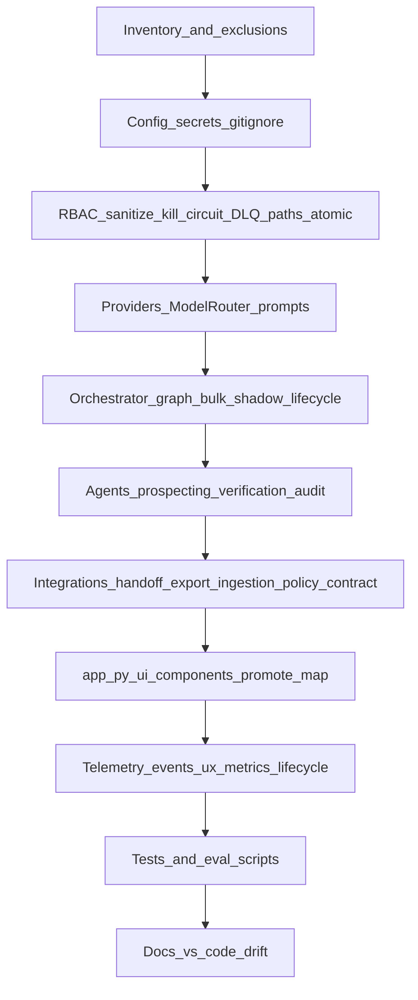

# Comprehensive codebase review plan: rula-gtm-agent

## Framing (from the skill)

- **Role**: Senior principal engineer and security auditor reviewing AI-generated code for production-grade logic, security, and architectural consistency.
- **Repository**: [`rula-gtm-agent`](../rula-gtm-agent) (path: `Rula/rula-gtm-agent` in this workspace).
- **Primary stack** (grounded in [`pyproject.toml`](../rula-gtm-agent/pyproject.toml)): Python 3.11+, Pydantic v2, Streamlit, Anthropic and Google GenAI SDKs; optional **ruff** on `src/` (see `[tool.ruff]`).
- **Entry points**:
  - [`app.py`](../rula-gtm-agent/app.py) — Streamlit UI: Prospecting (3 slides), MAP Review (3 slides), Insights (pipeline + **connector health / SLO-style slices**), Admin; sidebar navigation; optional **Promote to MAP** bridge when evidence is staged from Prospecting.
  - [`src/main.py`](../rula-gtm-agent/src/main.py) — CLI/demo runner.
  - [`eval/*.py`](../rula-gtm-agent/eval) — offline eval, drift, shadow comparisons (`compare_shadow.py` calls `compare_map` / `compare_prospecting` with explicit `actor_role`).
- **Architecture anchor**: [`docs/architecture_overview.md`](../rula-gtm-agent/docs/architecture_overview.md) — pods, controls, promotion criteria, **security model (prototype)** for RBAC vs production auth.

## Current architecture snapshot (2026)

Use this as the **mental model** when mapping pillars to files; it supersedes older “pods-only” shorthand.

| Layer | Responsibility | Key locations |
| ----- | ---------------- | ------------- |
| **UI** | Streamlit flows, session state, errors | `app.py`, `src/ui/components.py`, `src/ui/promote_map.py` |
| **Orchestration** | Single + bulk prospecting/MAP, lineage writes, lifecycle domain events | `src/orchestrator/graph.py`, `bulk_*.py`, `shadow.py`, `execution_agent.py`, `map_execution_agent.py`, `contracts.py`, `map_contracts.py`, `subagents.py` |
| **Routing** | Task routing (payload heuristic) vs **LLM** routing | `src/orchestrator/router.py` (`route_task`), `src/providers/router.py` (`ModelRouter`, connector policy metadata on generation telemetry) |
| **Integrations** | Export, handoff, ingestion, MAP sample combine, **connector policy**, **contract compatibility** | `src/integrations/export.py`, `handoff.py`, `map_handoff.py`, `ingestion.py`, `map_sample_combine.py`, `connector_policy.py`, `contract_compat.py` |
| **Safety & durability** | Sanitize, kill switch, circuit breaker (**telemetry on open/close**), DLQ/incidents (**redacted context**), path-safe filenames, **atomic JSON writes** | `src/safety/sanitize.py`, `kill_switch.py`, `circuit.py`, `dlq.py`, `incidents.py`, `paths.py`, `atomic_io.py` |
| **Telemetry** | Events (metadata policy), UX events, metrics (**LLM by provider**, **breakers**, **lifecycle counts**, connector health snapshot), **lifecycle_domain** milestones | `src/telemetry/events.py`, `ux_events.py`, `metrics.py`, `lifecycle_events.py` |
| **Domain** | Prospecting + verification + audit agents; schemas with **lifecycle ID** fields on outputs | `src/agents/**`, `src/schemas/**` |
| **Governance / context** | Retention, business DNA, feedback memory | `src/governance/retention.py`, `src/context/**` |

## Scope: what “entire codebase” means


| Include | Rationale |
| ------- | --------- |
| `src/**` | All application logic (see [Coverage checklist](#coverage-checklist-explicit-every-part-of-the-codebase)) |
| `app.py`, `src/main.py` | User-facing and CLI surfaces |
| `tests/**` | Testability and regression signal |
| `eval/**` | Shadow/drift behavior |
| `prompts/**`, `docs/**` | Drift vs implementation, operator expectations (`docs/connector_policies.md`, `integration_contracts.md`, `ingest_contract.md`, UX under `docs/ux/`) |
| `pyproject.toml`, `.env.example`, `.gitignore` | Dependencies, secrets hygiene, ignores, ruff |
| `data/*.json` | Sample/fixture data (PII/secrets spot-check only) |
| `codebase-review/**` | Prior review artifacts; update on new runs |
| `telemetry_events.jsonl`, `lineage.jsonl` (if present) | Artifacts: secret/PII spot-check + format sanity only |


| De-prioritize or treat separately | Rationale |
| --------------------------------- | --------- |
| `out/**`, generated `telemetry_events.jsonl` / `lineage.jsonl` | Runtime outputs; scan for accidental secrets, not line-by-line logic review |
| `.pytest_cache/**` | Cache only |


## Skill pillars — mapped to this repo (all cases)

### 1. Contextual integrity and state

- **Cross-module types**: Trace imports from orchestrators and agents into [`src/schemas/`](../rula-gtm-agent/src/schemas) (Pydantic v2) and orchestrator contracts:
  - [`src/orchestrator/contracts.py`](../rula-gtm-agent/src/orchestrator/contracts.py), [`src/orchestrator/map_contracts.py`](../rula-gtm-agent/src/orchestrator/map_contracts.py)
  - Evidence/lineage: [`src/schemas/evidence_artifact.py`](../rula-gtm-agent/src/schemas/evidence_artifact.py) (**schema_version validators** ↔ [`contract_compat.py`](../rula-gtm-agent/src/integrations/contract_compat.py)), [`src/schemas/lineage.py`](../rula-gtm-agent/src/schemas/lineage.py)
  - **Lifecycle fields**: [`src/schemas/account.py`](../rula-gtm-agent/src/schemas/account.py), [`prospecting.py`](../rula-gtm-agent/src/schemas/prospecting.py), [`map_verification.py`](../rula-gtm-agent/src/schemas/map_verification.py) — alignment with [`graph.py`](../rula-gtm-agent/src/orchestrator/graph.py), exports, handoff CRM rows, and **shadow** stripping of per-run IDs in [`shadow.py`](../rula-gtm-agent/src/orchestrator/shadow.py)
- **Hallucinated imports**: Verify every non-stdlib import resolves within the repo (or declared dependency).
- **Streamlit state**: In [`app.py`](../rula-gtm-agent/app.py), audit `st.session_state` keys (navigation, bulk/single results, **map bridge** `map_bridge_*`, promote flow), mutation of nested objects, rerun triggers.
- **Business context path**: [`src/context/business_context.py`](../rula-gtm-agent/src/context/business_context.py) + config in [`src/config.py`](../rula-gtm-agent/src/config.py) — optional DNA paths fail closed when missing or invalid.
- **Config surface area**: [`src/config.py`](../rula-gtm-agent/src/config.py) + `.env.example` — env vars documented, safe defaults; DQ policy, min discovery questions, lineage export, bulk default queue; **connector policy overrides** `RULA_CONNECTOR_*` per [`docs/connector_policies.md`](../rula-gtm-agent/docs/connector_policies.md).

### 2. Logic and edge cases

- **Ordering / bulk semantics**:
  - [`src/orchestrator/bulk_prospecting.py`](../rula-gtm-agent/src/orchestrator/bulk_prospecting.py), [`bulk_map.py`](../rula-gtm-agent/src/orchestrator/bulk_map.py)
  - Queue: [`src/agents/prospecting/queue.py`](../rula-gtm-agent/src/agents/prospecting/queue.py)
  - DQ + graph early-return: [`src/agents/prospecting/dq_policy.py`](../rula-gtm-agent/src/agents/prospecting/dq_policy.py), [`graph.py`](../rula-gtm-agent/src/orchestrator/graph.py)
- **MAP / prospecting kwargs**: `run_map_verification(..., correlation_id=, prospecting_run_id=, account_id=, ...)` — callers from UI (`app.py` bridge) and tests stay consistent.
- **Error handling**: LLM calls, file IO under `out/`, JSON ingestion, retention, **atomic writes** — partial artifacts and permission errors; UI via `render_runtime_error` / `render_permission_error`.
- **Happy-path bias**: Providers, [`src/validators/response_validator.py`](../rula-gtm-agent/src/validators/response_validator.py), verification [`src/agents/verification/`](../rula-gtm-agent/src/agents/verification).

### 3. Style and local flavor

- Align with `from __future__ import annotations`, dataclasses vs Pydantic, logging vs print, package layout.
- **Dual “router” naming**: `orchestrator/router.py` (task routing) vs `providers/router.py` (LLM `ModelRouter`) — avoid conflation in review notes.

### 4. Security audit (skill items + extensions)

**From the skill:**

- Hardcoded secrets vs [`.env.example`](../rula-gtm-agent/.env.example).
- **SQL injection**: N/A unless raw SQL appears.
- **IDOR / authorization**: [`src/security/rbac.py`](../rula-gtm-agent/src/security/rbac.py), [`app.py`](../rula-gtm-agent/app.py), orchestrator `require_permission` — prototype role selector; document production auth gap.

**Extended cases (this codebase):**

- **Prompt and output safety**: [`src/safety/sanitize.py`](../rula-gtm-agent/src/safety/sanitize.py), [`src/providers/prompts.py`](../rula-gtm-agent/src/providers/prompts.py).
- **Secrets in logs/telemetry**: [`src/telemetry/events.py`](../rula-gtm-agent/src/telemetry/events.py) — metadata sanitization policy; lifecycle events must remain non-sensitive strings.
- **HTML / XSS**: [`src/ui/components.py`](../rula-gtm-agent/src/ui/components.py) — `unsafe_allow_html` + escaping for dynamic tier/risk text.
- **Path traversal**: [`src/safety/paths.py`](../rula-gtm-agent/src/safety/paths.py) + handoff/archive filenames in [`map_handoff.py`](../rula-gtm-agent/src/integrations/map_handoff.py).
- **DLQ/incidents**: [`src/safety/dlq.py`](../rula-gtm-agent/src/safety/dlq.py), [`incidents.py`](../rula-gtm-agent/src/safety/incidents.py) — **redacted** `context` before persistence.
- **Webhook/export URLs**: Clay / placeholders in config — SSRF if URLs become user-controlled.
- **Kill switch / circuit**: [`src/safety/kill_switch.py`](../rula-gtm-agent/src/safety/kill_switch.py), [`src/safety/circuit.py`](../rula-gtm-agent/src/safety/circuit.py) — consulted on graph paths; **circuit_state** telemetry on transitions.
- **Dependencies**: [`pyproject.toml`](../rula-gtm-agent/pyproject.toml) — pins, optional `ruff` dev extra.

### 5. Testability

- Modularity: IO vs pure logic seams.
- **Coverage gaps**: [`tests/`](../rula-gtm-agent/tests) vs [`src/`](../rula-gtm-agent/src) — new modules (`contract_compat`, `connector_policy`, `atomic_io`, `lifecycle_events`, `promote_map`, metrics helpers) should have or gain targeted tests.
- **Eval vs tests**: [`eval/`](../rula-gtm-agent/eval) — CI vs manual; align with architecture / promotion docs.

## Recommended execution order (crawl)



## Additional review cases (beyond the skill, full checklist)

**Operational / reliability:** Connector policy defaults and env overrides; timeouts on context fetch via [`connector_policy`](../rula-gtm-agent/src/integrations/connector_policy.py); **atomic** handoff writes [`atomic_io.py`](../rula-gtm-agent/src/safety/atomic_io.py); DLQ/incident redaction.

**Contracts:** [`src/integrations/contract_compat.py`](../rula-gtm-agent/src/integrations/contract_compat.py) vs [`docs/integration_contracts.md`](../rula-gtm-agent/docs/integration_contracts.md), [`docs/ingest_contract.md`](../rula-gtm-agent/docs/ingest_contract.md); `export_contract_version` on exports and handoff manifests.

**Data governance:** [`src/governance/retention.py`](../rula-gtm-agent/src/governance/retention.py) and admin UI in `app.py`.

**Lineage and audit:** [`src/schemas/lineage.py`](../rula-gtm-agent/src/schemas/lineage.py), audit agents, export lineage blocks.

**MAP handoff / export parity:** [`map_handoff.py`](../rula-gtm-agent/src/integrations/map_handoff.py), [`export.py`](../rula-gtm-agent/src/integrations/export.py) — `recommended_actions`, lifecycle IDs on CRM manifest rows.

**UX vs implementation:** [`docs/ux/`](../rula-gtm-agent/docs/ux) vs `app.py` and [`src/ui/components.py`](../rula-gtm-agent/src/ui/components.py).

**Shadow / comparison:** [`shadow.py`](../rula-gtm-agent/src/orchestrator/shadow.py) — audit + lifecycle field stripping for structural fairness.

**Static quality:** `pytest -q`; `ruff check src` if dev extras installed.

**Mechanical grep passes:** `TODO|FIXME|XXX`, bare `except:`, `eval(`, `pickle`, `subprocess` with `shell=True`, suspicious key patterns.

## Numbered crawl (detailed)

1. **Inventory**: List Python modules under `src/` (~79 files); map to layers in [Current architecture snapshot](#current-architecture-snapshot-2026).
2. **Config and secrets**: `config.py`, `validate_startup`, `.env.example`, `.gitignore`.
3. **Security controls**: RBAC, sanitize, kill switch, circuit (+ telemetry), incidents/DLQ redaction, paths + atomic IO.
4. **Providers and validation**: LLM adapters, `ModelRouter`, response validator, correction paths.
5. **Orchestration**: `graph.py` (lifecycle IDs + domain events), bulk runners, execution/map agents, contracts, `orchestrator/router.py`, `shadow.py`, `subagents.py`.
6. **Domain agents**: Prospecting, verification, audit.
7. **Integrations**: Export, handoff, map handoff, ingestion, connector_policy, contract_compat, map_sample_combine.
8. **UI**: `app.py`, `components.py`, `promote_map.py` — session state, errors, optional MAP bridge.
9. **Telemetry**: `events`, `ux_events`, `metrics` (including connector health snapshot), `lifecycle_events`.
10. **Tests and eval**: Gap analysis vs `src/`; eval scripts.
11. **Documentation drift**: Architecture, connector policies, contracts, UX docs vs code.

## Deliverables (per skill OUTPUT REQUIREMENTS)

1. **High-level risk assessment** (Low / Medium / High) with rationale (LLM, filesystem, webhooks, UI).
2. **Critical fixes** — must-fix before production-hardening milestones.
3. **Diff-style or file-scoped refactors** — small, safe improvements.
4. **Clarifying questions** — only where architecture is ambiguous.
5. **`Review_Feedback` artifact for Opus** — action queue using the template in [Machine-actionable output](#machine-actionable-output-for-opus-recommended); **all under** [`rula-gtm-agent/codebase-review/`](../rula-gtm-agent/codebase-review).

## Output location

- **Root folder**: [`rula-gtm-agent/codebase-review/`](../rula-gtm-agent/codebase-review) — create if missing.
- **Convention**: Executive summary, pillar notes, `Review_Feedback.md`, optional pytest log, optional `README.md` index. Do not write review artifacts under `out/`; redact secrets from logs.

## Suggested work products

- Consolidated review artifact under `codebase-review/`: executive summary, pillar findings, extended cases, file index with severity tags.
- Optional: ticket backlog by pillar; `pytest -q` log in `codebase-review/` as regression baseline.

## Coverage checklist (explicit “every part of the codebase”)

Use during review; each bullet gets “reviewed” notes or a justified deferral.

Approximate scale (re-count when executing): **`src/**/*.py` ~79**, **`tests/**/*.py` ~44**, **`app.py` + `eval/*.py`** — adjust in inventory artifact.

- **Root**
  - [`app.py`](../rula-gtm-agent/app.py) — Prospecting / MAP / Insights / Admin; `map_bridge_*` session keys; Promote to MAP expanders; connector health UI section
  - [`pyproject.toml`](../rula-gtm-agent/pyproject.toml), [`.env.example`](../rula-gtm-agent/.env.example), [`README.md`](../rula-gtm-agent/README.md)
  - Artifacts: `telemetry_events.jsonl`, `lineage.jsonl`, `out/` (spot-check)

- **`src/` packages**
  - **agents**
    - Prospecting: [`src/agents/prospecting/`](../rula-gtm-agent/src/agents/prospecting) — enrichment, matcher, generator, evaluator, corrections, queue, DQ policy, context_fetch (**connector policy timeout**), segment/value_prop helpers
    - Verification: [`src/agents/verification/`](../rula-gtm-agent/src/agents/verification) — parser, scorer, flagger, capture, commitment_extractor
    - Audit: [`src/agents/audit/`](../rula-gtm-agent/src/agents/audit) — judge, correction
  - **orchestrator**: [`src/orchestrator/`](../rula-gtm-agent/src/orchestrator) — `graph.py`, `bulk_prospecting.py`, `bulk_map.py`, `shadow.py`, `execution_agent.py`, `map_execution_agent.py`, `contracts.py`, `map_contracts.py`, `router.py` (task route), `subagents.py`
  - **integrations**: [`src/integrations/`](../rula-gtm-agent/src/integrations) — `export.py`, `handoff.py`, `map_handoff.py`, `ingestion.py`, `map_sample_combine.py`, **`connector_policy.py`**, **`contract_compat.py`**, `__init__.py`
  - **schemas**: [`src/schemas/`](../rula-gtm-agent/src/schemas) — account, prospecting, map_verification, lineage, evidence_artifact, map_capture, correction, audit
  - **providers**: [`src/providers/`](../rula-gtm-agent/src/providers) — `router.py` (**ModelRouter**), claude/gemini/base, `prompts.py`
  - **validators**: [`src/validators/`](../rula-gtm-agent/src/validators) — response_validator
  - **security**: [`src/security/`](../rula-gtm-agent/src/security) — rbac
  - **safety**: [`src/safety/`](../rula-gtm-agent/src/safety) — sanitize, circuit, kill_switch, incidents, dlq, **`paths.py`**, **`atomic_io.py`**
  - **governance**: [`src/governance/`](../rula-gtm-agent/src/governance) — retention
  - **telemetry**: [`src/telemetry/`](../rula-gtm-agent/src/telemetry) — events, ux_events, metrics, **`lifecycle_events.py`**
  - **ui**: [`src/ui/`](../rula-gtm-agent/src/ui) — `components.py`, **`promote_map.py`**, `__init__.py`
  - **context**: [`src/context/`](../rula-gtm-agent/src/context) — business_context, feedback_memory
  - **explainability**: [`src/explainability/`](../rula-gtm-agent/src/explainability) — threshold, value_prop, economics, value_prop_reasoner
  - **config + main**: [`src/config.py`](../rula-gtm-agent/src/config.py), [`src/main.py`](../rula-gtm-agent/src/main.py)

- **tests**: [`tests/`](../rula-gtm-agent/tests) — gap analysis vs `src/` (including safety, contract_compat, connector_policy, atomic_io, circuit telemetry, promote_map, metrics connectors, UI components, telemetry, paths, map_handoff, shadow, etc.)

- **eval**: [`eval/`](../rula-gtm-agent/eval) — drift_check, eval_*, compare_shadow (explicit `actor_role`)

- **docs**: [`docs/`](../rula-gtm-agent/docs) — architecture_overview, implementation_runbook, integration_contracts, ingest_contract, **connector_policies**, prospecting_v2_readiness, UX subdirectory, walkthrough, release/readiness docs as applicable

- **codebase-review**: [`codebase-review/`](../rula-gtm-agent/codebase-review) — prior findings; refresh on new review pass

- **data**: [`data/`](../rula-gtm-agent/data) — JSON fixtures; schema/PII spot-check

- **prompts**: [`prompts/`](../rula-gtm-agent/prompts) — README + prompt assumptions

## Machine-actionable output for Opus (recommended)

**Per-finding template** (copy for each item; keep `ID` stable across revisions):

```markdown
### [R-XXX] Short title

- **Severity**: P0 | P1 | P2 (or Critical / High / Medium / Low)
- **Pillar**: 1–5 or extended tag (e.g. `security_webhook`, `test_gap`)
- **Scope**: `path/to/file.py` (+ optional `symbol` or `~line` if known)
- **Observation**: What is wrong today (1–3 sentences; cite behavior, not vibes).
- **Recommendation**: What to change (implementation-agnostic when possible).
- **Acceptance criteria**: Bullet list of how we know it is fixed.
- **Depends on**: None | R-YYY
- **Suggested test**: Existing test to extend, or new test file/case name (if applicable)
```

**Optional index table** at the top of the action queue:

| ID | Severity | Primary file | Pillar | Title |
| -- | -------- | ------------ | ------ | ----- |
| R-001 | P0 | src/... | 4 | ... |

**Deliverable names** (under `codebase-review/`): e.g. `Review_Feedback.md`, optional `risk_assessment.md`, `findings_by_pillar.md`. Prefer outside `out/`; never commit secrets.

**Workflow tip**: Batch by directory or severity (P0 first); paste only the `### [R-XXX]` blocks for the batch.
