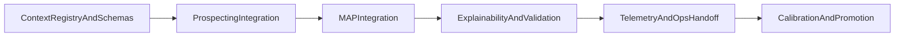
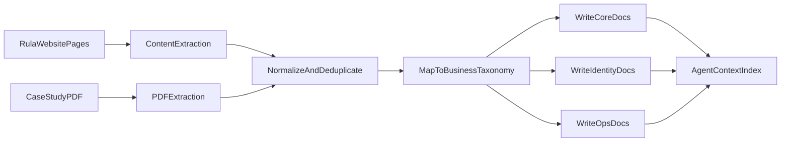

# Rula Business DNA Plan

---

**Overview:** Integrate `business dna` as a structured context layer across deterministic scoring, prompt generation, explainability, MAP verification, and operational workflows in `rula-gtm-agent`, with explicit component-to-context mappings, a documented truth-stack precedence (code > rules > structured context > LLM), per-run context hashing, drift detection, and low-risk rollout gates.

**Todos:**
  - id: inventory-context-contract
    content: Define BusinessContextRegistry schema, file-to-slice extraction contract, and truth-stack precedence (code > deterministic rules > structured context > LLM).
    status: completed
  - id: context-precedence-drift
    content: Implement per-run context bundle id/hash, document canonical-home-per-fact-class, and drift detection (golden tests, shadow compare, validator spike alerts).
    status: completed
  - id: prospecting-context-wire
    content: Integrate context slices into prospecting scoring, segment logic, context fetch, and generation prompt builders.
    status: completed
  - id: map-context-wire
    content: Integrate context slices into MAP parser/scorer/flagger and capture normalization rules.
    status: completed
  - id: explainability-validation-wire
    content: Update explainability and validators to enforce pillar/voice/claim constraints and provenance output.
    status: completed
  - id: telemetry-context-observability
    content: Emit context usage/version metadata across telemetry and handoff/export flows.
    status: completed
  - id: test-calibrate-rollout
    content: Add regression/golden tests, compare baseline vs context-enabled behavior, and gate rollout with feature flags.
    status: completed
isProject: false
---

# Business DNA Integration Plan For Rula GTM Agent

## Objective
Wire `/Users/neelmishra/.cursor/Rula/business dna` into `/Users/neelmishra/.cursor/Rula/rula-gtm-agent` so business context consistently powers reasoning and generation while preserving deterministic behavior, auditability, and safety.

## Integration Strategy
- Add a **BusinessContextRegistry** that loads normalized context from markdown files and exposes typed slices by domain (`core`, `identity`, `ops`).
- Use context in two modes:
  - **Deterministic mode:** rule constraints, claim allowlists, and scoring priors.
  - **Generative mode:** prompt augmentation blocks with source-aware snippets.
- Keep all existing pipelines functional if context fails to load (graceful fallback to current behavior).

## Context Truth Stack, Precedence, And Drift Guardrails

Conflicts between sources must never be resolved ad hoc. The system uses a **fixed precedence order** so behavior is reproducible and auditable.

### Truth stack (highest to lowest authority)
1. **Code invariants** — schemas, sanitization, RBAC, kill switches, circuit breakers, numeric clamps, structured output contracts. Always win.
2. **Deterministic rules** — value-prop scoring (`value_prop_scoring.py` / taxonomy), MAP parse/score/tier (`parser.py`, `scorer.py`, `flagger.py`), evaluator thresholds. These are the executable business contract; markdown does not override them without a code change.
3. **Structured context from `business dna`** — **typed slices** produced by the registry (e.g. ICP constraints, voice/banned terms, allowed claim snippets with optional source URLs), not raw full-file dumps into prompts.
4. **LLM-generated text** — lowest authority; must pass validators and cannot change tiers, scores, or structured facts except via explicit repair/correction paths already in the graph.

**Case-study / PDF vs public site:** When internal GTM mechanics (MAP, employer motion) conflict with public marketing copy, follow the same rule as the Hostfully ICP doc: **structured operational truth (PDF + code) wins for internal motion**; **public claims** in outbound copy must align with `rula.com`-backed snippets in the registry.

### Canonical home per fact class (reduces duplicate truth)
| Fact class | Canonical source for narrative | Executable mirror in code |
| :--- | :--- | :--- |
| ICP segments, MAP semantics | `core/ideal_customer_profile.md` | Segment + scoring rules in prospecting + MAP modules |
| Voice, banned patterns, style | `identity/brand_voice_matrix.md`, `identity/style_guides.md` | Validators + prompt constraints |
| Messaging angles | `identity/messaging_pillars.md` | Pillar tags in explainability + generation routing |
| Public numbers / proof lines | Curated allowlist in registry (sourced from `business dna` + URLs) | Validator allowlist; LLM cannot invent new numbers |
| Ops templates | `ops/*.md` | Optional handoff/export formatting only; no score impact |

### How the system knows “which source for which”
- **Routing table** (extend the index in `core/business_context.md`): for each pipeline stage (enrichment, match, generate, evaluate, MAP parse, judge, export), list **which typed slices** are loaded. Example: prospecting generation loads `VoiceConstraints` + `PillarSummary` + `AllowedClaims[]`; MAP scoring loads `MapSemantics` + ICP commitment language hints.
- **No blob injection:** Registry exposes small, typed objects; prompts receive **bounded** strings derived from those objects.
- **LLM role:** Fill slots and wording **inside** constraints set by (1)–(3); never the source of new business facts.

### Per-run binding and drift detection
- Every pipeline run records **`context_bundle_id` or version + content hash** of the slices used, plus **deterministic rule version** (e.g. existing `SCORING_VERSION`) and **prompt template id/version**.
- **Golden tests:** fixed account/evidence fixtures → expected tiers, flags, key phrases; fail CI if context or rules change without updating goldens.
- **Shadow mode:** optional A/B same input, old vs new context bundle, compare outputs and validator pass rates before promotion.
- **Alerts:** spike in validator rejections, `MISSING_CONTEXT`, or human-review rate after a markdown change.

Implementation detail: document precedence in `src/context/` (or agent README) and enforce via tests that LLM output cannot override structured `ProspectingOutput` / `VerificationOutput` without the existing correction path; emit `context_hash`, `scoring_version`, and `prompt_version` on pipeline telemetry.

## Implementation Workstreams

### 1) Add Context Loading + Contracts
- Build context loader + cache + typed schemas.
- Primary files to add/update:
  - [`/Users/neelmishra/.cursor/Rula/rula-gtm-agent/src/context/`]( /Users/neelmishra/.cursor/Rula/rula-gtm-agent/src/context/ ) (new context registry module)
  - [`/Users/neelmishra/.cursor/Rula/rula-gtm-agent/src/config.py`]( /Users/neelmishra/.cursor/Rula/rula-gtm-agent/src/config.py ) (context path + toggles)
- Inputs:
  - [`/Users/neelmishra/.cursor/Rula/business dna/core/business_context.md`]( /Users/neelmishra/.cursor/Rula/business dna/core/business_context.md )
  - [`/Users/neelmishra/.cursor/Rula/business dna/core/ideal_customer_profile.md`]( /Users/neelmishra/.cursor/Rula/business dna/core/ideal_customer_profile.md )
  - [`/Users/neelmishra/.cursor/Rula/business dna/core/product_dna.md`]( /Users/neelmishra/.cursor/Rula/business dna/core/product_dna.md )
  - [`/Users/neelmishra/.cursor/Rula/business dna/core/competitor_landscape.md`]( /Users/neelmishra/.cursor/Rula/business dna/core/competitor_landscape.md )

### 2) Inject Context Into Prospecting Reasoning + Generation
- Deterministic scoring and segment logic consume ICP/value-prop priors from business DNA.
- Prompt builders receive structured context snippets (segment framing, allowed proof motifs, tone constraints).
- Files:
  - [`/Users/neelmishra/.cursor/Rula/rula-gtm-agent/src/agents/prospecting/value_prop_scoring.py`]( /Users/neelmishra/.cursor/Rula/rula-gtm-agent/src/agents/prospecting/value_prop_scoring.py )
  - [`/Users/neelmishra/.cursor/Rula/rula-gtm-agent/src/agents/prospecting/segment_logic.py`]( /Users/neelmishra/.cursor/Rula/rula-gtm-agent/src/agents/prospecting/segment_logic.py )
  - [`/Users/neelmishra/.cursor/Rula/rula-gtm-agent/src/agents/prospecting/context_fetch.py`]( /Users/neelmishra/.cursor/Rula/rula-gtm-agent/src/agents/prospecting/context_fetch.py )
  - [`/Users/neelmishra/.cursor/Rula/rula-gtm-agent/src/providers/prompts.py`]( /Users/neelmishra/.cursor/Rula/rula-gtm-agent/src/providers/prompts.py )
  - [`/Users/neelmishra/.cursor/Rula/rula-gtm-agent/src/agents/prospecting/generator.py`]( /Users/neelmishra/.cursor/Rula/rula-gtm-agent/src/agents/prospecting/generator.py )
- Relevant business files:
  - `core/business_context.md`, `core/ideal_customer_profile.md`, `core/product_dna.md`
  - `identity/messaging_pillars.md`, `identity/brand_voice_matrix.md`, `identity/ad_copy_frameworks.md`, `identity/style_guides.md`

### 3) Inject Context Into MAP Verification + Flagging
- Apply MAP commitment semantics and employer-motion rules from business context to parser/scorer thresholds and risk labels.
- Files:
  - [`/Users/neelmishra/.cursor/Rula/rula-gtm-agent/src/agents/verification/parser.py`]( /Users/neelmishra/.cursor/Rula/rula-gtm-agent/src/agents/verification/parser.py )
  - [`/Users/neelmishra/.cursor/Rula/rula-gtm-agent/src/agents/verification/scorer.py`]( /Users/neelmishra/.cursor/Rula/rula-gtm-agent/src/agents/verification/scorer.py )
  - [`/Users/neelmishra/.cursor/Rula/rula-gtm-agent/src/agents/verification/flagger.py`]( /Users/neelmishra/.cursor/Rula/rula-gtm-agent/src/agents/verification/flagger.py )
  - [`/Users/neelmishra/.cursor/Rula/rula-gtm-agent/src/agents/verification/capture.py`]( /Users/neelmishra/.cursor/Rula/rula-gtm-agent/src/agents/verification/capture.py )
- Relevant business files:
  - `core/ideal_customer_profile.md`, `core/business_context.md`
  - `ops/meeting_summarizer_protocol.md`, `ops/customer_summary_intelligence.md`

### 4) Align Explainability With Business DNA
- Explanations should cite business-frame reasons (pillar, ICP fit, care/partner impact) and expose provenance.
- Files:
  - [`/Users/neelmishra/.cursor/Rula/rula-gtm-agent/src/explainability/value_prop.py`]( /Users/neelmishra/.cursor/Rula/rula-gtm-agent/src/explainability/value_prop.py )
  - [`/Users/neelmishra/.cursor/Rula/rula-gtm-agent/src/explainability/value_prop_reasoner.py`]( /Users/neelmishra/.cursor/Rula/rula-gtm-agent/src/explainability/value_prop_reasoner.py )
  - [`/Users/neelmishra/.cursor/Rula/rula-gtm-agent/src/explainability/threshold.py`]( /Users/neelmishra/.cursor/Rula/rula-gtm-agent/src/explainability/threshold.py )
  - [`/Users/neelmishra/.cursor/Rula/rula-gtm-agent/src/explainability/economics.py`]( /Users/neelmishra/.cursor/Rula/rula-gtm-agent/src/explainability/economics.py )
- Relevant business files:
  - `core/business_context.md`, `core/ideal_customer_profile.md`, `identity/messaging_pillars.md`

### 5) Enforce Context-Safe Validation + Telemetry
- Add validator checks for banned/unsupported claims and tone constraints derived from identity files.
- Emit telemetry with context-version and context-source fields.
- Files:
  - [`/Users/neelmishra/.cursor/Rula/rula-gtm-agent/src/validators/response_validator.py`]( /Users/neelmishra/.cursor/Rula/rula-gtm-agent/src/validators/response_validator.py )
  - [`/Users/neelmishra/.cursor/Rula/rula-gtm-agent/src/telemetry/events.py`]( /Users/neelmishra/.cursor/Rula/rula-gtm-agent/src/telemetry/events.py )
  - [`/Users/neelmishra/.cursor/Rula/rula-gtm-agent/src/telemetry/ux_events.py`]( /Users/neelmishra/.cursor/Rula/rula-gtm-agent/src/telemetry/ux_events.py )
- Relevant business files:
  - `identity/brand_voice_matrix.md`, `identity/style_guides.md`, `identity/ad_copy_frameworks.md`, `identity/messaging_pillars.md`

### 6) Wire Ops Context Into Launch + Handoff Surfaces
- Use ops templates as operational guidance in handoff summaries and optional generated artifacts.
- Files:
  - [`/Users/neelmishra/.cursor/Rula/rula-gtm-agent/src/integrations/handoff.py`]( /Users/neelmishra/.cursor/Rula/rula-gtm-agent/src/integrations/handoff.py )
  - [`/Users/neelmishra/.cursor/Rula/rula-gtm-agent/src/integrations/export.py`]( /Users/neelmishra/.cursor/Rula/rula-gtm-agent/src/integrations/export.py )
  - [`/Users/neelmishra/.cursor/Rula/rula-gtm-agent/src/orchestrator/graph.py`]( /Users/neelmishra/.cursor/Rula/rula-gtm-agent/src/orchestrator/graph.py )
- Relevant business files:
  - `ops/gtm_launch_playbook.md`, `ops/prd.md`, `ops/release_announcement_workflow.md`, `ops/product_release_milestone_communication.md`

## Component-To-Business-DNA Mapping (Complete)
- **Prospecting enrichment/matching/scoring** -> `core/business_context.md`, `core/ideal_customer_profile.md`, `core/product_dna.md`, `identity/messaging_pillars.md`
- **Prospecting generation (email/questions)** -> `identity/brand_voice_matrix.md`, `identity/ad_copy_frameworks.md`, `identity/style_guides.md`, `identity/messaging_pillars.md`, plus `core/*`
- **Prospecting evaluator** -> `identity/brand_voice_matrix.md`, `identity/style_guides.md`, `identity/ad_copy_frameworks.md`
- **MAP parser/scorer/flagger** -> `core/ideal_customer_profile.md`, `core/business_context.md`, `ops/meeting_summarizer_protocol.md`
- **Audit judge/correction** -> `identity/style_guide_internal.md`, `identity/brand_voice_matrix.md`, `core/ideal_customer_profile.md`
- **Explainability layer** -> `core/business_context.md`, `core/ideal_customer_profile.md`, `identity/messaging_pillars.md`
- **Validators/safety** -> `identity/brand_voice_matrix.md`, `identity/style_guides.md`, `identity/ad_copy_frameworks.md`
- **Telemetry/insights** -> context-version metadata from all consumed files
- **Integrations/handoff/export** -> `ops/gtm_launch_playbook.md`, `ops/prd.md`, `ops/release_announcement_workflow.md`, `ops/customer_summary_intelligence.md`

## Rollout Phases

## Acceptance Criteria
- Every reasoning/generation component records which business-context **slices** (and file hashes) were applied, not only file names.
- **Truth stack** is documented and test-enforced: code and deterministic rules override markdown; LLM output cannot override structured pipeline results without the existing correction/audit path.
- Deterministic outputs remain reproducible when context bundle and rule versions are unchanged.
- Prompt outputs comply with voice/claim guardrails from identity files; validators block unsourced or disallowed claims.
- MAP tiers reflect employer-motion context rules and reduce ambiguous-high outcomes.
- Telemetry exposes **context hash/version**, **scoring_version**, **prompt_version**, coverage, and fallback usage for each run.
- Golden tests and optional shadow comparison cover context bundle upgrades.

## Risks And Mitigations
- **Risk:** Context drift between markdown files and code rules.  
  **Mitigation:** truth-stack precedence; canonical-home table; versioned registry + per-run hash; golden/shadow tests; validator spike alerts.
- **Risk:** Over-coupling prompts to freeform markdown.  
  **Mitigation:** typed slices only; bounded prompt injection; no raw full-file dumps.
- **Risk:** Regression in deterministic scoring.  
  **Mitigation:** golden tests before/after context integration and feature flag rollout.
- **Risk:** LLM invents facts that contradict `business dna` or site-backed claims.  
  **Mitigation:** allowlisted numeric/claim snippets in registry; validators; LLM as lowest authority in stack.

---

## Source 2: rula-business-context-repo_5df999a7.plan.md

---
name: rula-business-context-repo
overview: Create a business-context repository that feeds the existing GTM agent system by ingesting Rula website and case-study PDF context, then materializing normalized markdown knowledge files in the exact folder hierarchy shown in your screenshot.
todos:
  - id: parse-hostfully-templates
    content: Parse Hostfully source markdowns and capture section-level template patterns to mirror in Rula docs.
    status: completed
  - id: define-crawl-seeds
    content: Enumerate and confirm crawl seed URLs for core and representative directory pages.
    status: completed
  - id: extract-and-normalize
    content: Extract text from website pages and PDF, then normalize/deduplicate into structured fact buckets.
    status: completed
  - id: create-business-dna-tree
    content: Mirror the Hostfully `business dna` folder/file structure 1:1 in this repo (exact directories and filenames).
    status: completed
  - id: mirror-content-shape
    content: Mirror section architecture 1:1 from Hostfully files while replacing domain context with Rula facts and language.
    status: completed
  - id: populate-context-files
    content: Populate core, identity, and ops files with sourced, agent-usable context and citations.
    status: completed
  - id: integration-index
    content: Add context index/routing guidance for downstream GTM agent components.
    status: completed
  - id: quality-pass
    content: Run consistency and completeness review to ensure no empty files or unsupported claims.
    status: completed
isProject: false
---

# Rula Business Context Repository Plan

## Scope And Assumptions
- Because scope selection was skipped, I’ll use a **hybrid crawl default**: scrape core high-signal public pages from `https://www.rula.com/` (home, care types, costs/insurance, about, mission, partner pages, FAQs, blog index) plus representative directory pages for segmentation signal; exclude full provider-by-provider deep crawl unless requested.
- I’ll use the folder name exactly as shown: `business dna`.
- I’ll keep all artifacts markdown-first so they are directly consumable by your agent system and easy to diff/version.
- I will mirror Hostfully docs **1:1 at the structure level** (same file tree + similar section scaffolding), but replace all business context with Rula-specific context from `rula.com` and `/Users/neelmishra/Desktop/Rula Case Study - GTM Engineer.pdf`.

## Files And Folders To Create
- Structure source-of-truth for mirroring:
  - `/Users/neelmishra/antigravity/GTM multi-agent system/Hostfully/business dna/`
- Mirroring rule:
  - Recreate the same directory tree and filenames in `/Users/neelmishra/.cursor/Rula/business dna/` as a strict 1:1 structure match.
  - Keep file order/grouping aligned to the source tree (`core`, `identity`, `ops`).
- Create root knowledge tree:
  - `/Users/neelmishra/.cursor/Rula/business dna/core/`
  - `/Users/neelmishra/.cursor/Rula/business dna/identity/`
  - `/Users/neelmishra/.cursor/Rula/business dna/ops/`
- Create files as exact 1:1 mirrors of the provided Hostfully paths:
  - `/Users/neelmishra/.cursor/Rula/business dna/core/business_context.md`
  - `/Users/neelmishra/.cursor/Rula/business dna/core/competitor_landscape.md`
  - `/Users/neelmishra/.cursor/Rula/business dna/core/ideal_customer_profile.md`
  - `/Users/neelmishra/.cursor/Rula/business dna/core/product_dna.md`
  - `/Users/neelmishra/.cursor/Rula/business dna/identity/ad_copy_frameworks.md`
  - `/Users/neelmishra/.cursor/Rula/business dna/identity/brand_voice_matrix.md`
  - `/Users/neelmishra/.cursor/Rula/business dna/identity/creative_direction.md`
  - `/Users/neelmishra/.cursor/Rula/business dna/identity/messaging_pillars.md`
  - `/Users/neelmishra/.cursor/Rula/business dna/identity/style_guide_internal.md`
  - `/Users/neelmishra/.cursor/Rula/business dna/identity/style_guides.md`
  - `/Users/neelmishra/.cursor/Rula/business dna/ops/customer_summary_intelligence.md`
  - `/Users/neelmishra/.cursor/Rula/business dna/ops/gtm_launch_playbook.md`
  - `/Users/neelmishra/.cursor/Rula/business dna/ops/meeting_summarizer_protocol.md`
  - `/Users/neelmishra/.cursor/Rula/business dna/ops/prd.md`
  - `/Users/neelmishra/.cursor/Rula/business dna/ops/product_release_milestone_communication.md`
  - `/Users/neelmishra/.cursor/Rula/business dna/ops/release_announcement_workflow.md`

## Ingestion And Synthesis Workflow
- **Web ingestion**: crawl seed URLs from Rula nav and robots sitemap references, fetch page text, normalize content blocks, strip nav/footer duplication, preserve source URLs.
- **PDF ingestion**: parse `/Users/neelmishra/Desktop/Rula Case Study - GTM Engineer.pdf`, extract business model/sales-motion/ICP/MAP verification concepts as structured notes.
- **Dedup + taxonomy mapping**: map extracted facts into canonical dimensions (business model, buyer personas, value props, care offerings, pricing/insurance, distribution channels, GTM process, proof points).
- **Knowledge writing**: generate concise, agent-ready markdown with:
  - short purpose header
  - canonical facts
  - decision-use snippets (for prompts/agents)
  - source citations section (URL or PDF section reference)

## 1:1 Content Mirroring Rules (From Attached Hostfully Markdown Set)
- Mirror **information architecture**, not the old domain:
  - Same three top-level buckets: `core`, `identity`, `ops`.
  - Same exact file names and relative paths.
  - Preserve high-level section intent in each file (e.g., executive context, ICP, messaging pillars, playbook, PRD template, release workflow).
- Replace all Hostfully-specific context with Rula context:
  - Replace hospitality/STR language with mental healthcare + employer channel language.
  - Replace competitor sets with Rula-relevant alternatives.
  - Replace metrics/claims with only sourced Rula website and case-study-PDF claims.
- Preserve reusable template mechanics where helpful:
  - Keep “AI Agent Context Rule” style blocks in each file, rewritten for Rula.
  - Keep ops templates (`meeting_summarizer_protocol.md`, `prd.md`, release workflows) but adapt placeholders/examples to Rula GTM motion.
- Remove obsolete or conflicting frames:
  - No Hostfully references, no vacation-rental terms, no stale examples from unrelated verticals.

## File-by-File Mapping (Hostfully -> Rula)
| Hostfully Source File | Mirrored Rula Target File | Rula Rewrite Intent | Expected Section Scaffold (Parity Check) |
| :--- | :--- | :--- | :--- |
| `/Users/neelmishra/antigravity/GTM multi-agent system/Hostfully/business dna/core/business_context.md` | `/Users/neelmishra/.cursor/Rula/business dna/core/business_context.md` | Executive context, mission, business model, strategic flywheel, positioning proof themes for Rula mental health care + employer motion. | `Executive Intent` -> `Business Model & Fundamentals` -> `Product Portfolio Snapshot` -> `Strategic Priorities` -> `Organizational Context` -> `Positioning & Proof Themes` -> `AI Agent Context Rule` |
| `/Users/neelmishra/antigravity/GTM multi-agent system/Hostfully/business dna/core/competitor_landscape.md` | `/Users/neelmishra/.cursor/Rula/business dna/core/competitor_landscape.md` | Category-level competitive landscape for Rula (therapy/psychiatry access and employer-benefit alternatives), with fair comparison and segment-fit framing. | Intro framing + data note -> `Direct Competitor Groups` -> `Adjacent Alternatives` -> `How to Use in Messaging` -> `AI Agent Context Rule` |
| `/Users/neelmishra/antigravity/GTM multi-agent system/Hostfully/business dna/core/ideal_customer_profile.md` | `/Users/neelmishra/.cursor/Rula/business dna/core/ideal_customer_profile.md` | Employer-channel ICP schema (health systems, universities, large employers, plan alignment), anti-ICP, segmentation logic, MAP relevance. | Source/provenance note -> `Segmentation Axis` -> `Geography` -> `Product Footprint` -> `Value/Lifetime Logic` -> `Expansion/Contraction` -> `Channel Signals` -> `Retention Lens` -> `Personas by Tier` -> `Anti-ICP` -> `AI Agent Context Rule` -> `Data Provenance` |
| `/Users/neelmishra/antigravity/GTM multi-agent system/Hostfully/business dna/core/product_dna.md` | `/Users/neelmishra/.cursor/Rula/business dna/core/product_dna.md` | Rula product value architecture: care access, insurance coverage, provider matching, therapy+psychiatry pathways, trust and outcomes framing. | `Value Proposition` (multi-audience) -> `Product Moat` -> `USPs` (table format) -> `Product Design Logic` -> `AI Agent Context Rule` |
| `/Users/neelmishra/antigravity/GTM multi-agent system/Hostfully/business dna/identity/ad_copy_frameworks.md` | `/Users/neelmishra/.cursor/Rula/business dna/identity/ad_copy_frameworks.md` | Multi-channel ad-copy framework adapted to Rula audiences (members, employers, partners) with healthcare-safe claims and proof handling rules. | Goal/scope + exclusions -> `Demand Gen` by channel -> `Lifecycle/Expansion` -> `Compliance & Honesty` -> `AI Agent Context Rule` |
| `/Users/neelmishra/antigravity/GTM multi-agent system/Hostfully/business dna/identity/brand_voice_matrix.md` | `/Users/neelmishra/.cursor/Rula/business dna/identity/brand_voice_matrix.md` | Brand voice matrix for Rula: empathetic, clinical-trustworthy, accessible, insurance-clarity-first, anti-hype and anti-stigma guardrails. | `Core Personality` -> `This, Not That` matrix -> `Voice by Context` -> `Vocabulary` (use/avoid) -> `Practical Writing Rules` -> `Brand in One Line` -> `AI Agent Context Rule` |
| `/Users/neelmishra/antigravity/GTM multi-agent system/Hostfully/business dna/identity/creative_direction.md` | `/Users/neelmishra/.cursor/Rula/business dna/identity/creative_direction.md` | Visual and creative direction for Rula campaigns by persona/context (individual care seekers, employers, partners) with compliant message framing. | `Visual Identity & Palette` -> `Imagery Style` (by audience) -> `Ad Creative Guidelines` -> `Brand Symbols/Motifs` -> `AI Agent Context Rule` |
| `/Users/neelmishra/antigravity/GTM multi-agent system/Hostfully/business dna/identity/messaging_pillars.md` | `/Users/neelmishra/.cursor/Rula/business dna/identity/messaging_pillars.md` | Pillars aligned to Rula outcomes: access speed, insurance simplicity, clinical quality, continuity of care, workforce productivity and ROI narrative. | Intro -> `Outcome Pillars` (numbered) -> `Scale/Trust Pillars` -> `Proof & GTM Alignment` -> `AI Agent Context Rule` |
| `/Users/neelmishra/antigravity/GTM multi-agent system/Hostfully/business dna/identity/style_guide_internal.md` | `/Users/neelmishra/.cursor/Rula/business dna/identity/style_guide_internal.md` | Internal communication style for cross-functional GTM + RevOps + clinical/product stakeholders; concise, data-backed, action-oriented updates. | `Core Philosophy` -> `Tone & Diction` -> `This, Not That` internal matrix -> `Structured Messaging Templates` -> `Communication Rituals` -> `AI Agent Context Rule` |
| `/Users/neelmishra/antigravity/GTM multi-agent system/Hostfully/business dna/identity/style_guides.md` | `/Users/neelmishra/.cursor/Rula/business dna/identity/style_guides.md` | External style guides by context (website, sales, lifecycle, product comms) with Rula terminology and healthcare-appropriate clarity standards. | `Operator/Customer-Facing Editorial` -> `Growth & Sales` -> `Product & Technical` -> `Translation Layer` -> `AI Agent Context Rule` |
| `/Users/neelmishra/antigravity/GTM multi-agent system/Hostfully/business dna/ops/customer_summary_intelligence.md` | `/Users/neelmishra/.cursor/Rula/business dna/ops/customer_summary_intelligence.md` | Voice-of-customer intelligence template tailored to employer AEs, MAP signals, friction points, and adoption/activation indicators. | `Persona Deep-Dive` -> `Qualitative Insights` -> `Feature/Request Backlog` -> `Quantitative Health` -> `AI Agent Context Rule` |
| `/Users/neelmishra/antigravity/GTM multi-agent system/Hostfully/business dna/ops/gtm_launch_playbook.md` | `/Users/neelmishra/.cursor/Rula/business dna/ops/gtm_launch_playbook.md` | End-to-end orchestration playbook for Rula launches mapped to prospecting, messaging, MAP capture quality, and post-launch learning loop. | `Phase 1 Foundation` -> `Phase 2 Asset Creation` -> `Phase 3 Channel Execution` -> `Launch Day Rituals` -> `Post-Launch Feedback Loop` -> `AI Agent Orchestration Rule` |
| `/Users/neelmishra/antigravity/GTM multi-agent system/Hostfully/business dna/ops/meeting_summarizer_protocol.md` | `/Users/neelmishra/.cursor/Rula/business dna/ops/meeting_summarizer_protocol.md` | Structured meeting summary/action protocol for AE discovery calls, MAP planning meetings, and cross-functional GTM syncs. | `Metadata Capture` -> `Executive Summary` -> `Decision Log` -> `Action Matrix` (table) -> `Strategic Implications` -> `AI Agent Context Rule` |
| `/Users/neelmishra/antigravity/GTM multi-agent system/Hostfully/business dna/ops/prd.md` | `/Users/neelmishra/.cursor/Rula/business dna/ops/prd.md` | Reusable PRD template adapted to Rula GTM-agent initiatives, MAP verification systems, quality gates, and rollout metrics. | `Document Control` -> `Executive Summary` -> `Problem Statement` -> `Goals & Metrics` -> `Requirements/Architecture` -> `UX Flow` -> `Roadmap` -> `Readiness` -> `GTM Plan` -> `Risks/Assumptions` -> `Appendix/Open Questions` -> `AI Agent Context Rule` |
| `/Users/neelmishra/antigravity/GTM multi-agent system/Hostfully/business dna/ops/product_release_milestone_communication.md` | `/Users/neelmishra/.cursor/Rula/business dna/ops/product_release_milestone_communication.md` | Milestone communication log templates and examples for internal stakeholders across launch phases. | Repeated `Milestone Entry` blocks with metadata (`timestamp`, `channel`, `author`, `phase`, `persona`, `pillar`) + body (`context`, `status`, `ask`, `so what`, `risks`, `next step`) |
| `/Users/neelmishra/antigravity/GTM multi-agent system/Hostfully/business dna/ops/release_announcement_workflow.md` | `/Users/neelmishra/.cursor/Rula/business dna/ops/release_announcement_workflow.md` | Release announcement workflow template for multi-channel rollout with technical accuracy, compliant wording, and measurable adoption tracking. | `Product Context` -> `Multi-Channel Asset Checklist` -> `Distribution Strategy` -> `Success Tracking` -> `AI Agent Context Rule` |

## Agent-System Integration Touchpoints
- Align vocabulary to existing GTM system docs so context can be reused in prompt templates and runbooks:
  - [`/Users/neelmishra/.cursor/Rula/rula-gtm-agent/README.md`](/Users/neelmishra/.cursor/Rula/rula-gtm-agent/README.md)
  - [`/Users/neelmishra/.cursor/Rula/rula-gtm-agent/prompts/README.md`](/Users/neelmishra/.cursor/Rula/rula-gtm-agent/prompts/README.md)
- Add a compact index file (or section in `business_context.md`) describing which downstream agent task should read which context file first.

## Execution Flow

## Validation Checklist
- Folder/file names match the Hostfully reference tree 1:1 and therefore match the screenshot structure.
- Section scaffolding across files mirrors the attached Hostfully markdown set 1:1 at a practical level (comparable headings/blocks/templates), while content is Rula-specific.
- Each markdown file contains non-empty business context tailored to its theme.
- Every major claim has source attribution (website URL or PDF reference).
- No duplicate/contradictory statements across files.
- Context is actionable for prospecting + MAP workflows (not just descriptive copy).
- Zero residual Hostfully terms/placeholders remain after rewrite pass.

## Risks And Mitigations
- **Very large public directory surface**: start hybrid by default; can expand to full crawl in a second pass.
- **Marketing-page repetition noise**: enforce dedup/normalization before writing docs.
- **Agent usability drift**: enforce consistent schema-style sections across all context files.
