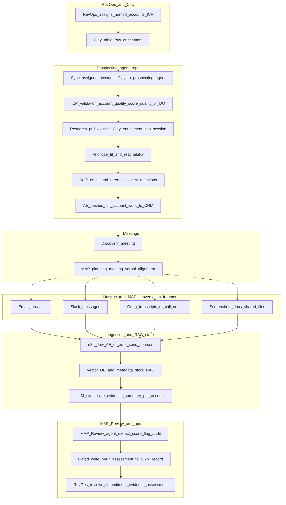
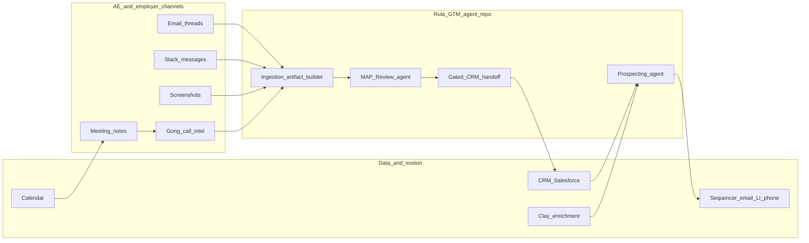

# MAP Review — Ingestion System Design

Design notes for how MAP commitments are captured, normalized, verified, and handed off—balancing **momentum at the commitment moment** with **clean data for the MAP Review agent** and CRM.

---

## 1. How MAP commitments are captured today

Typical AE inputs are inherently messy:

| Source | Nature |
|--------|--------|
| Screenshots | Image + OCR risk, no structured metadata |
| Forwarded emails | Thread fragments, inconsistent quoting |
| Slack messages | Informal language, threads, reactions |
| Meeting notes | Free text, often post-hoc summaries |

**Should it stay that way?**  
Not as the *only* path. The **moment of capture** can stay low-friction; the **system** should assume messiness and normalize **after** capture, not force perfect structure when the employer has just said yes.

---

## 2. Design principle: two-lane ingestion

- **Lane A — Zero-friction capture (at the “yes” moment)**  
  One fast action: send to MAP inbox, forward to a capture address, or rely on connectors. No heavy form.

- **Lane B — Background normalization + MAP verification (before system-of-record)**  
  Parsing, deduplication, calendar/commitment extraction, MAP scoring, audit—then gated CRM handoff.

**Summary:** *Messy in, clean out* — with deterministic (and optionally LLM-assisted) normalization and audit gates between capture and CRM.

---

## 3. Redesigned capture model

### 3.1 Commitment as an “inbox,” not a form

At commitment time the AE should only need to:

- **Primary:** `Send to MAP Inbox` (from email/Slack/notes UI), or **auto-capture** via integrations.
- **Optional:** Confirm `account` / `contact` only when match confidence is low.

Avoid paperwork at the peak of momentum.

### 3.2 Canonical artifact: `CommitmentEvidenceArtifact`

Everything ingested should converge to one normalized object the MAP Review agent consumes:

| Field (conceptual) | Purpose |
|--------------------|---------|
| `evidence_id` | Stable ID for verification and CRM linkage |
| `source_type` | `email`, `slack`, `meeting_note`, `screenshot_ocr`, etc. |
| `raw_text` | Extracted text for parsing |
| `raw_ref` | Deep link: message URL, thread ID, file ID, CRM activity ID |
| `captured_at` | When AE/system captured it |
| Linkage | `account_id`, `opportunity_id`, `contact_id`, optional `outreach_message_id` / `thread_id` |
| Extraction outputs | Campaigns, quarters, year, ambiguity flags |
| MAP outputs | Tier, score, audit status, rationale |

The MAP Review agent should run on **this artifact**, not on ad-hoc blobs alone.

### 3.3 AE experience tiers

| Tier | When | Friction |
|------|------|----------|
| **1** | High confidence match | 1-click “mark as MAP commitment evidence” |
| **2** | Ambiguous account/contact | At most 2 fields: account + contact |
| **3** | Low confidence / noisy source | Deferred to RevOps / review queue with reason |

---

## 4. Data sources feeding the MAP Review agent

### Primary

- **Email** — replies, forwards, attachments; thread metadata.
- **Slack** — channel posts, DMs, thread URLs.
- **Meeting notes** — CRM notes, call recorder summaries, internal docs.
- **Screenshots / images** — OCR + stored image reference.

### Secondary (enrichment & linkage)

- Calendar (meeting date, attendees).
- Sequencer / email platform (sent/replied events, message IDs).
- CRM activity timeline (same account/opportunity context).

All of these are **unstructured or semi-structured**; the ingestion engine must normalize into `CommitmentEvidenceArtifact` before or as part of MAP pipeline entry.

---

## 5. Role of n8n (or similar orchestration)

n8n fits well as the **connector and orchestration layer** for messy, multi-source intake.

**Responsibilities:**

1. **Triggers:** Gmail/Outlook webhooks, Slack events, Drive/file watchers, CRM “note created.”
2. **Fetch** raw content + metadata (sender, channel, timestamps, links).
3. **Enrich** where needed: OCR, transcription, light entity match hints.
4. **Emit** a `CommitmentEvidenceArtifact` (or POST to your ingestion API / queue).
5. **Reliability:** retries, backoff, idempotency keys, dead-letter for poison messages.

**Example flow:**

```text
Source event → enrich metadata → build artifact → call MAP ingest API
    → (optional) extraction pass → MAP verification → pass/fail routing
    → CRM-ready queue vs human review queue
```

n8n does **not** need to own business logic for scoring; it should **transport and normalize handoff** into your agent’s contract.

---

## 6. Verification and CRM handoff (gated, not direct)

**Do not** write CRM MAP stage from raw capture alone. Use explicit states:

| State | Meaning |
|-------|---------|
| `Captured` | Inbox received |
| `Parsed` | Text/structure extracted |
| `MAP_Verified` | MAP Review agent completed |
| `CRM_Ready` | Passed policy + confidence gates |
| `CRM_Synced` | Downstream CRM write acknowledged |
| `Needs_Review` | Ambiguous, failed audit, or low tier—human path |

### CRM handoff payload (conceptual)

- Account / opportunity / contact IDs (join keys to Prospecting and RevOps).
- Evidence provenance: `source_type`, link, `captured_at`.
- Extracted commitments: initiative, quarter, year (calendar view).
- MAP: tier, score, audit pass/fail, short rationale.
- Optional: reviewer overrides, correlation IDs for replay and support.

This makes updates **explainable, reversible, and auditable**.

---

## 7. Connection to Prospecting (full arc)

High-level lifecycle an AE cares about:

1. **Assignment** — account/opportunity owned by AE.
2. **Prospecting** — outreach generated and sent (sequencer).
3. **Commitment signal** — reply, call, Slack “we’re in,” forwarded email.
4. **Capture** — artifact into MAP inbox (low friction).
5. **MAP Review** — verify commitment strength and calendar.
6. **CRM** — promote stage / custom fields only when gated.

**Gap in many demos:** Prospecting and MAP share an app but not always **shared IDs** (`account_id`, `opportunity_id`, `message_id`, `evidence_id`) or a **single artifact** that links outreach to evidence. Closing that gap is what makes the arc traceable in telemetry and CRM.

---

## 8. Trade-offs (concise)

| More structure up front | More structure after capture |
|-------------------------|------------------------------|
| Cleaner data immediately | Risk of feeling like paperwork at “yes” |
| Can kill momentum | Preserves momentum |
| Good for mature, process-heavy orgs | Better default for delicate commitment moments |

**Recommendation:** optimize the **commitment moment** for speed; optimize **post-capture** for structure, verification, and CRM safety.

---

## 9. Full user journey: prospecting → MAP commitment review (ideal state)

This section is written for an **executive walkthrough** of the end-to-end motion. Stage names and business context align with Rula’s **GTM Engineer case study** (employer AE funnel, MAP as the key commitment mechanism, unstructured evidence today, automation from assignment through verified MAP).

### 9.1 North star in one sentence

From **named-account assignment** through **verified MAP**, the AE uses familiar systems (CRM, enrichment, outreach, calls, chat, email); the **Rula GTM agent layer** (`rula-gtm-agent`) turns research and drafting into seconds-grade assistance, turns messy commitment signals into **structured, scored, auditable** MAP artifacts, and only then promotes **CRM / quota-relevant** state through explicit gates.

### 9.2 Target architecture narrative (Clay → prospecting → CRM → evidence stack → MAP agent)

This is the **ideal end-to-end story** the team can walk an executive through; it matches how the prospecting agent is already structured and how MAP review should ingest evidence at scale.

1. **RevOps + Clay (system of record for the book)**  
   RevOps assigns **named accounts** against **ICP criteria** in a **Clay table**. Rows are **enriched directly in Clay** (firmographics, signals, contacts). The AE treats that table as the canonical list of “what I own.”

2. **Sync into the prospecting agent**  
   The AE **syncs assigned accounts from Clay** into the **prospecting agent** environment so the agent is working the same book—not a forked CSV.

3. **Qualification inside the prospecting agent**  
   The prospecting agent **validates ICP fit**, assigns an **account quality / fit score**, and **qualifies or disqualifies** accounts that do not meet the bar (replacement flows back to RevOps / Clay in operations).

4. **Preparation phase (research without re-fetching blindly)**  
   For accounts that pass, the agent **pulls Clay enrichments already on the row** into the working context—research is **grounded in the same enrichment** RevOps and the AE agreed on.

5. **Prioritization**  
   The agent **prioritizes** accounts by **strength of fit and reachability** (consistent with the current product behavior).

6. **Outreach drafting**  
   The agent drafts the **first-touch email** and **discovery questions** (e.g. three questions) for sequencer or email send.

7. **Handoff to CRM**  
   The AE takes the **full account package** the prospecting flow already assembles—scores, rationale, drafts, key fields—and **pushes to CRM** so activity and ownership stay in the system of record.

8. **Meetings (discovery → MAP planning)**  
   After outreach, the AE runs **discovery**; the employer may agree to a **second meeting** to plan campaigns. In that **MAP planning** conversation, alignment happens through **live discussion**, and the **record** of intent splinters across **email threads**, **Slack**, **Gong (or call transcripts / notes)**, and sometimes **screenshots or docs**—all **unstructured** and **physically separate**.

9. **Consolidation layer (n8n + retrieval database + optional LLM summary)**  
   Goal: make splintered MAP conversation **retrievable** and **account-scoped**. A practical pattern: an **n8n flow** lets the AE (or automation) **send** MAP-related payloads from **email, Slack, Gong exports, uploads**, etc., into a **retrieval store** (e.g. **vector DB** + object/metadata store for RAG). An **LLM** can **synthesize** those raw chunks into a **single evidence summary text per account**—still tied to source links/IDs for audit.

10. **MAP Review agent ingestion**  
    The **MAP Review agent** (built in this repo) **retrieves** that consolidated evidence (raw chunks, summary, or both—product choice) and **runs its pipeline**: extract structured commitments → score confidence → flag follow-ups → optional audit.

11. **RevOps + CRM**  
    The **structured MAP output** is **written back to the CRM** on the **specific account/opportunity** the AE owns so **RevOps** can review **MAP commitment, underlying evidence lineage, and the agent assessment** in one place.

**Design fork (explicit):** the MAP agent can ingest **(A)** chunked sources only (pure RAG at query time), **(B)** an **LLM-produced evidence summary** per account as the primary paste target, or **(C)** both—summary for speed, chunks for dispute resolution. The n8n + vector DB + summarizer pattern supports **B/C**.

**Prototype note:** Steps 1–7 above describe the **ideal** prospecting journey. For **what the Streamlit prototype does today** versus that ideal—line by line, with **Gap — ideal state** excerpts—use the **§9.6 read-aloud** phases **one through seven** (updated for the current `rula-gtm-agent` tree: optional **DQ YAML** hard-skip, **Promote to MAP** bridge, **`src/ui/pages/`** Insights, **connector-policy** timeouts on LLM calls, **telemetry** hygiene).

### 9.3 Funnel stages (case-study aligned)

| Stage | What happens (business) | Primary systems the AE touches |
|-------|-------------------------|--------------------------------|
| **1 — Assignment & qualification** | RevOps assigns a book from ICP; AE accepts/disqualifies | **CRM** (Salesforce or equivalent), **RevOps** views / account views |
| **2 — Research & preparation** | Validate contacts, warm paths, prioritize reachability | **CRM**, **LinkedIn**, internal directories; **Clay** (or similar) for enrichment, firmographics, signal scraping |
| **3 — Personalized outreach** | Multi-touch sequence (email, LinkedIn, phone) to book discovery | **Sequencer** (e.g. Outreach/Salesloft) or mail client, **LinkedIn**, **CRM** activity logging |
| **4 — Discovery & demo (meeting 1)** | 30m intro: discovery, overview, demo; goal = verbal yes + meeting 2 | **Calendar**, **video**, **Gong** (or similar) for call capture & notes, **CRM** next steps |
| **5 — Campaign planning & MAP (meeting 2)** | Align on MAP: campaign types, launch timing, multi-quarter calendar; commitment often confirmed in **writing** later | **Calendar**, live doc or deck, **email**, **Slack** (internal recap), **Gong** summary of planning call, **CRM** opportunity hygiene |
| **6 — Launch & closed/won** | First campaign live; patient-start milestones; handoff to AM | **CRM**, marketing/campaign ops tooling, **AM** handoff |

**MAP-specific reality (from case study):** there is often **no signed contract**; evidence is **email threads, notes, Slack, screenshots** uploaded to CRM—hence **verification** and **incentive alignment** (quota vs. forecast) matter.

### 9.4 Legend: how to read “touch” types

| Label | Meaning |
|-------|---------|
| **Manual** | AE or human does the work in the tool of record. |
| **Agent-assisted** | `rula-gtm-agent` proposes content, structure, or scores; AE reviews. |
| **Automated** | Integration/orchestrator (e.g. n8n, webhooks) moves data without AE retyping. |
| **Gated** | System will not write quota-sensitive CRM fields until policy + confidence gates pass. |

### 9.5 Where the repository’s agent system fits (touchpoints)

**Repository:** [rula-gtm-agent](../../rula-gtm-agent/) — Streamlit entrypoint `app.py` + Python orchestration: prospecting pipeline (`run_prospecting`), MAP verification (`run_map_verification`), bulk flows, **filesystem handoff stubs** (`handoff_orchestrator`, `map_handoff_orchestrator`), **connector policy** defaults (`src/integrations/connector_policy.py`, including LLM HTTP timeouts wired in provider clients), **telemetry** (JSONL + Insights UI in `src/ui/pages/insights.py`), and **ingestion contracts** (`src/integrations/ingestion.py` — test fixtures, Clay placeholder + webhook payload shape).

| Journey phase | Tooling | Ideal interaction | Agent touchpoint (this repo / roadmap) |
|-----------------|---------|-------------------|----------------------------------------|
| Research (2) | Clay + CRM | AE opens account; enrichment already synced or on-demand | **Prospecting agent**: value-prop **match** + reasoning from account profile (case-study table / CRM-shaped record). |
| Outreach (3) | Sequencer + CRM | AE selects or edits first touch, logs send | **Prospecting agent**: **generate** personalized email + discovery questions; **evaluate** / review flags before send. |
| Post-call (4) | Gong + CRM | AE confirms contacts, next step | CRM activity; optional future: summarize Gong into CRM note (connector, not core MAP). |
| MAP moment (5) | Email, Slack, screenshot, shared doc | AE captures **fast** (forward, upload, “send to MAP inbox”) | **Ingestion** (n8n/API target): today **`validate_commitment_ingest_dict`** + **`ClayWebhookConfig`** / `build_clay_webhook_payload` scaffold the contract; live n8n → artifact pipeline is still roadmap. |
| MAP verification | GTM agent app | AE or RevOps runs verification on evidence | **MAP Review agent**: **extract** → **score** → **flag** → optional **audit**; UI slides + bulk; **Promote to MAP** from prospecting builds synthetic evidence text with **`prospecting_run_id`** (`src/ui/promote_map.py`); optional **combine first two evidence rows** for bulk demo (`combine_first_two_map_evidence`). |
| CRM promotion (5–6) | CRM | Forecast and stage reflect **verified** MAP only | **Gated handoff**: manifests under `out/` with **atomic JSON writes**, path-safe review filenames; export via **`build_map_export`** — **no live CRM API** in repo. |
| Ops / observability | App | Operator views pipeline health | **Insights** page (`src/ui/pages/insights.py`): metrics + connector-style slices from telemetry; **nested metadata redaction** on emit (`src/telemetry/events.py`). |

**Today vs ideal:** the prototype emphasizes **agent-assisted** research/outreach and **agent-assisted** MAP verification inside the app; **full automation** of Clay → CRM → sequencer is **roadmap** requiring connector hardening, shared IDs, and policy gates (see Sections 5–7).

### 9.6 Simple end-to-end journey (Mermaid)

Read **top to bottom**. Tool callouts: **Clay**, **Prospecting agent**, **CRM**, **Calendar / meetings**, **Email**, **Slack**, **Gong**, **n8n**, **Vector DB**, **LLM**, **MAP Review agent**, **RevOps**. The diagram shows the **target** wiring; the **read-aloud narrative** under it reconciles **prospecting phases 1–7** with what [rula-gtm-agent](../../rula-gtm-agent/) **actually implements today** and lists **gaps** to reach this diagram.



**Diagram legend:** Solid arrows show the **happy-path motion of data and work** through the stack. Dotted lines from **MAP planning** mean the real-world conversation **shows up as artifacts** in email, Slack, Gong, and files—not that the calendar invite *is* the evidence store.

---

#### Full journey narrative (read-aloud)

The following is a **verbatim-friendly walkthrough** of the same journey as the diagram above. You can read it aloud to an executive or cross-functional panel; it names the tools, who does what, and where automation fits.

**How to read “prototype” vs “ideal” here.** For **phases one through seven** (prospecting workspace in [rula-gtm-agent](../../rula-gtm-agent/)), each phase first states what the **current prototype actually does**, grounded in `run_prospecting` ([`graph.py`](../../rula-gtm-agent/src/orchestrator/graph.py)), `enrich_account` ([`enrichment.py`](../../rula-gtm-agent/src/agents/prospecting/enrichment.py)), optional **`evaluate_dq_policy`** ([`dq_policy.py`](../../rula-gtm-agent/src/agents/prospecting/dq_policy.py)), the Streamlit prospecting slides ([`app.py`](../../rula-gtm-agent/app.py)), bulk run + `handoff_orchestrator` ([`bulk_prospecting.py`](../../rula-gtm-agent/src/orchestrator/bulk_prospecting.py), [`handoff.py`](../../rula-gtm-agent/src/integrations/handoff.py)). Under each phase, **Gap — ideal state** lists what the narrative’s target architecture still needs. **Phases eight through eleven** are **forward-looking** (n8n, vector store, summarizer—not implemented). **Phases twelve through fourteen** reflect the **MAP Review workspace that exists in the repo**, with explicit gaps for ingestion and CRM.

**Opening — why this exists.** Rula’s employer Account Executives work a **named-account** motion. RevOps assigns a **book of accounts** that match an **Ideal Customer Profile**. The “sale” is not a purchase order—it is the employer’s **commitment to run marketing campaigns** over time. That commitment is captured as a **Mutual Action Plan**, or MAP. Because there is often **no traditional contract**, leadership and RevOps need **evidence and verification**, not just an AE’s optimism. This journey is how we get from **assignment** to **trustworthy MAP** in the CRM.

**Phase one — book of accounts (RevOps / Clay in ideal; test data in prototype).** In the **ideal** motion, **RevOps assigns named accounts against ICP rules** and those accounts live as **rows in Clay** with firmographics, health-plan fit, scale, and enrichments everyone trusts. In the **prototype**, the AE chooses **“Test Data”** in the Prospecting workspace; accounts are loaded from **`data/accounts.json`** (case-study-style fixtures). Choosing **“Clay”** shows **“integration coming soon”** and does not load a live book—so the demo book is **local JSON**, not RevOps’ production Clay table.

> **Gap — ideal state:** Real **Clay (or CRM) API sync** for the assigned book, auth, and row-level enrichments maintained by RevOps—replacing the static file as the source of truth.

**Phase two — getting accounts into the prospecting agent.** In the **ideal** story, the AE **syncs Clay into the agent** so there is no duplicate book. In the **prototype**, there is **no sync job**: the app **reads the same JSON list** into memory for **bulk** (“all accounts”) or **single-account** (dropdown) runs. The pipeline entrypoint is **`run_prospecting(account_payload, …)`** with a dict shaped like the sample accounts—no pull from Clay.

> **Gap — ideal state:** One-click or scheduled **import from Clay** (or Salesforce report) with stable **`account_id`** and versioning so the agent always matches RevOps’ book.

**Phase three — ICP signals and “qualification.”** In the **ideal** story, the agent **disqualifies** poor-fit accounts and sends replacements back to RevOps. In the **prototype**, **`enrich_account`** computes **`icp_fit_score`** (0–100), **`data_completeness_score`**, and **flags** such as **`BELOW_ICP_THRESHOLD`**, **`NEEDS_CONTACT_RESEARCH`**, **`UNKNOWN_HEALTH_PLAN`**, **`LIMITED_DIGITAL_ACCESS`**. After enrichment, **`evaluate_dq_policy`** reads an **optional YAML file** (path from config / `RULA_DQ_POLICY_PATH`). Rules can **`soft_flag`** (merge extra flags), **`allow`**, or **`block_generation`**. When **`block_generation`** matches, `run_prospecting` returns a **skipped** output (placeholder email, **`skipped=True`**, telemetry `prospecting_skipped_dq`) and **does not call** the LLM. **Default demo:** with **no policy file** configured, DQ evaluates to **allow**—so behavior matches the older “informational flags only” story unless operators opt in. Disqualification is **not** yet a RevOps workflow or Clay return path.

> **Gap — ideal state:** Productized **DQ templates**, **return path** to RevOps/Clay for account replacement, book hygiene metrics, and UX that surfaces **soft_flag** vs **block** clearly for AEs—beyond the YAML hook.

**Phase four — preparation and research.** In the **ideal** story, the agent pulls **live Clay columns** into session. In the **prototype**, “enrichment” is **deterministic scoring and flags from the fields already present** on the **`Account`** payload—there is **no second fetch from Clay**. External “research” hooks exist as **stubs**: **`fetch_company_context`** ([`context_fetch.py`](../../rula-gtm-agent/src/agents/prospecting/context_fetch.py)) is **LinkedIn-first, news-fallback** by design but **returns empty placeholders in the default stub path**, so generation often runs with **`MISSING_CONTEXT`**-style behavior unless the JSON alone is enough. **Value-prop matching** uses the config-driven engine (**`score_value_props`** / matcher) on that **`EnrichedAccount`**. Optional **Business DNA** context can influence prompts when enabled.

> **Gap — ideal state:** Live **Clay-backed fields**, working **context retrieval** (or approved alternatives), and **warm-path / reachability** signals—not only static JSON.

**Phase five — prioritization.** In the **ideal** story, the agent **ranks** the book by fit and reachability so the AE works the best next account. In the **prototype**, **bulk** mode iterates accounts in **`data/accounts.json` order** with **no reordering**; **single** mode relies on the AE picking an account from a **dropdown**. There is **no automated priority queue** across accounts inside the agent.

> **Gap — ideal state:** A **ranked work queue** (scores + reachability + rep preferences) and surfacing of “work next” in the UI.

**Phase six — outreach drafting.** In the **prototype**, the pipeline produces **`OutreachEmail`** (subject, body, CTA) and **`discovery_questions`** via **`generate_outreach`** (LLM-backed in v3 with validation/repair paths). Provider calls use **`get_connector_policy(LLM_PROVIDER)`** for **HTTP timeouts** (Anthropic `timeout` seconds; Google GenAI `HttpOptions` milliseconds)—see [`docs/connector_policies.md`](../../rula-gtm-agent/docs/connector_policies.md). **`evaluate_output`** assigns a **1.0–5.0 `quality_score`**, **`human_review_needed`**, and additional flags. The **audit judge** can loop **corrections** (`judge_prospecting` / `apply_prospecting_corrections`). The judge expects **at least two** discovery questions—not strictly three every time. The AE reviews in **Streamlit** (slides 1–2); inline edit/correction patterns exist where wired in the UI.

> **Gap — ideal state:** Guaranteed **N questions** if policy requires it, **direct push** into Outreach/Salesloft (or Gmail) from the app, and **telemetry** on edit distance for adoption measurement.

**Phase seven — handoff to CRM and sequencer.** In the **ideal** story, the AE **pushes** the full package into **Salesforce** (and sequencer) on the right account/opportunity. In the **prototype**, **single-account** runs expose a **downloadable CRM-shaped JSON** via **`build_prospecting_export`**. **Bulk** runs unlock **Slide 3 “Submit Now”**, which calls **`handoff_orchestrator`**: it materializes **local stub payloads** under **`out/<run_id>/`**—**`sequencer_payloads/`**, **`crm_manifest/`**, **`review_queue/`**—using **atomic JSON writes** and **connector policy** metadata for observability; the UI uses **product language** (“synced to CRM”) for this **simulation**. There is **no Salesforce or sequencer API write** in code.

> **Gap — ideal state:** Real **CRM upsert** (account, contact, opportunity IDs), real **sequencer create-message** APIs, **idempotency**, and **RBAC-aligned** production deployment—not filesystem stubs.

**Phase eight — discovery and the path to MAP.** With outreach in market, the AE books and runs a **discovery meeting**. In Rula’s motion, the goal of that first call is a **verbal agreement to partner** and a **second meeting** to plan campaigns. That second meeting is where **MAP** takes shape: campaign types, timing, quarters, and launch rhythm. On the calendar, this is still **human selling**: trust, tone, and negotiation. *(Outside the repo—no prototype module for meetings.)*

**Phase nine — why MAP evidence is messy.** After MAP planning, the **truth of the commitment** rarely lives in one field in Salesforce. It lives in **fragments**: a **verbal** alignment on Zoom, a follow-up **email thread** with the benefits leader, an internal **Slack** recap the AE sends their manager, **Gong** or call notes from the planning conversation, a **screenshot** of a slide, a **shared document** that never got uploaded uniformly. Each fragment is **unstructured** and **physically separate**. That is not failure—that is how real employers say yes. Our systems have to **respect the moment** and still **make RevOps whole**.

**Phase ten — n8n and the retrieval database (target).** We introduce an **orchestration layer**—practically, **n8n flows**—so the AE (or automation) can **send MAP-related payloads** from those fragments into one place. Email forwards, Slack exports, Gong pulls, file drops, webhook events: they all **land in a retrieval store**. Think **vector database** plus **metadata** so we can do **retrieval-augmented generation** later: every chunk knows **which account**, **which source**, and **when** it arrived.

> **Gap — ideal state:** Implemented **n8n** (or equivalent) workflows, **chunking**, **PII policy**, and **account/opportunity foreign keys** on every document—not present in the current MAP UI path.

**Phase eleven — LLM evidence summary per account (target).** Raw chunks alone can be noisy for an AE in a hurry. So we add an **LLM step** that **synthesizes** the ingested material into a **single evidence narrative per account**—still **linked** to the underlying sources for audit. That summary is not a replacement for the truth; it is a **compression layer** so the MAP Review agent receives **one coherent text** while RevOps can still **drill into provenance** when something looks wrong.

> **Gap — ideal state:** A **summarization job** with **source attribution** and **human override** before MAP ingest—not built into the repo today.

**Phase twelve — MAP Review agent execution (prototype in repo).** The **MAP Review agent** runs **`run_map_verification`** in the same repository: **parse** evidence → **score** commitment (with breakdown) → **flag** actions → optional **judge/audit** loop. The **Streamlit MAP workspace** supports **structured capture**, **sample evidence**, and **bulk MAP** over fixtures. Evidence text is **supplied by the user** (paste / samples from **`data/map_evidence.json`**), **not** retrieved automatically from the vector database described in phases ten–eleven. **Cross-pipeline link:** **Prospecting → MAP** uses **`build_evidence_from_prospecting`** to synthesize an evidence blob (includes **`prospecting_run_id`**) and session keys so the AE can jump into MAP with **traceable lineage**—still **not** a substitute for n8n/RAG ingest.

> **Gap — ideal state:** Wire **RAG or summarized evidence per account** from the consolidation layer as the default ingest path, with **correlation IDs** to prospecting/CRM (the promote bridge proves the **ID story**, not automated chunk ingest).

**Phase thirteen — write-back to CRM (prototype vs ideal).** In the **ideal** story, gated policy **updates Salesforce MAP fields** on the right opportunity. In the **prototype**, MAP produces **downloads** (**`build_map_export`**, manifests) and **`map_handoff_orchestrator`** output (**CRM manifest rows**, review queue, optional archive under **`out/`**) with fields such as **`map_run_id`**, **`correlation_id`**, **`prospecting_run_id`**, **`account_id`** on rows when present—**no live CRM mutation**.

> **Gap — ideal state:** **Gated API writes**, field-level mapping, and **RevOps approval** queues tied to CRM records.

**Phase fourteen — RevOps review.** In the **ideal** story, RevOps reviews **in CRM** with lineage attached. In the **prototype**, RevOps (or the panel) reviews **in the app UI**, **exports**, and **stub manifests**—a credible **demo of the assessment**, not a single CRM screen of record.

> **Gap — ideal state:** **Native CRM** reporting, **audit trail** in the system of record, and **quota** logic consuming verified MAP objects only.

**Closing — telling the story honestly.** The **arc** is unchanged: from **book** through **prospecting intelligence** and **human meetings**, across **messy MAP evidence**, into **consolidation and verification**, to **governed CRM**. The **prototype** already proves **core agent brains**—prospecting generation + MAP extract/score/flag + export shapes—plus **operational guardrails** (optional DQ block, connector timeouts, recursive telemetry metadata sanitization, Insights metrics) and a **Prospecting→MAP promote** path. **Integrations** (Clay sync, live context, CRM/sequencer APIs, n8n, vector DB, summarizer) remain the **intentional next build** to match the ideal narrative end to end.

### 9.7 Systems map (external connectors — compact view)



**Repo alignment:** **Prospecting** and **MAP Review** are implemented in `rula-gtm-agent`; **Ingest** is **partially** scaffolded (`ingestion.py` contracts + Clay webhook shape) rather than a live **n8n → artifact** service. **Gated CRM handoff** is **stub manifests** on disk, not CRM API calls.

### 9.8 Ideal-state journey timeline (labeled swim view)

Use this table in a deck as a **horizontal journey**; each row is a slice of time, not a separate product.

| Step | Stage | AE does | Systems | Agent / automation |
|------|-------|---------|---------|-------------------|
| A | 1 | Reviews assigned accounts, DQs poor fit | CRM, RevOps reports | Optional: ICP fit hints (future) |
| B | 2 | Confirms contacts, prioritizes | CRM, LinkedIn, **Clay** | **Prospecting**: match value props + rationale |
| C | 3 | Personalizes and launches touches | **Sequencer**, LinkedIn, CRM | **Prospecting**: generate email + questions; quality / review flags |
| D | 4 | Runs discovery; books MAP planning | Calendar, Zoom/Meet, **Gong**, CRM | Manual logging; optional summarization via connector |
| E | 5a | Employer signals commitment verbally / in writing | Email, Slack, docs, **Gong** recap | **Manual** capture at “yes” moment (low friction) |
| F | 5b | AE forwards/uploads or inbox capture | Email, Slack, screenshots → **ingestion** | **Automated**: artifact + linkage IDs where possible |
| G | 5c | MAP structured + scored | **rula-gtm-agent** MAP UI | **Agent-assisted**: extract, score, flag, audit |
| H | 5d–6 | CRM updated for forecast / quota | CRM | **Gated**: verified MAP only; provenance attached |

### 9.9 Executive talking points

1. **Prospecting (today):** The prototype runs **match → generate → evaluate → audit** on **`data/accounts.json`** with **deterministic ICP-style scoring** and flags; **optional DQ YAML** can **skip generation**; **Clay** and **live CRM/sequencer** are **stubs / downloads**. **Prospecting (target):** Same agent core, wired to **Clay + Salesforce + sequencer** with real sync and writes.  
2. **MAP (today):** **Paste or fixture evidence** (plus **Promote from prospecting**) → **extract / score / flag / export** in-app; handoff manifests include **correlation / prospecting_run** fields when available; **MAP (target):** **n8n + vector store + optional summarizer** feeding the same MAP pipeline, then **gated CRM** updates—not yet live APIs.  
3. **Honest demo value:** You are showing **production-shaped outputs and governance patterns** (RBAC, breakers, lineage hooks, export contracts, **LLM timeouts** from connector policy, **telemetry** + Insights) while being clear which arrows are **simulated** (e.g. `handoff_orchestrator` / `map_handoff_orchestrator` writing to `out/`).  
4. **North-star governance:** **Quota-sensitive CRM fields** should only move on **verified MAP** with **evidence lineage**—the prototype **models** that with exports and stubs; **full enforcement** needs CRM integration.

---

## 10. Summary

- Keep capture **messy-friendly** at the AE moment.
- Standardize on **`CommitmentEvidenceArtifact`** + inbox + optional n8n orchestration.
- Run **MAP Review** on normalized artifacts, not only raw paste.
- **Gate CRM** on verified states with full provenance in the handoff payload.
- **Link** Prospecting → evidence → MAP → CRM with shared identifiers for a complete RevOps story.
- Use **Section 9** as the **end-to-end journey map**: **Mermaid + §9.2** for the **target** story; **§9.6 read-aloud** for **prototype-accurate prospecting (phases 1–7)** with **Gap — ideal state** callouts, plus MAP/ingestion gaps for phases 10–14 (aligned with current **`rula-gtm-agent`**: DQ policy hook, promote-to-MAP bridge, Insights/telemetry, connector-policy LLM timeouts, map handoff manifest fields).
- For **what to build in the enclosed prototype** vs **ghost UI for future connectors** (Clay, n8n evidence DB, CRM, summarizer) vs **deferred production work**, use [rula-gtm-agent_gap-implementation_plan.md](../rula-gtm-agent_gap-implementation_plan.md) (**v3.4**: STRUCTURAL / GHOST / PRODUCTION deferred, **phases 0–6**, **code + UAT gates**, **browser-based UAT + explicit APPROVED/DENIED** between phases, **original-build baseline + revert**).

---

*Document version: 1.10 — Aligned read-aloud (§9.6) and touchpoints (§9.5) with current `rula-gtm-agent` (DQ YAML, promote-to-MAP, Insights, connector timeouts, telemetry redaction, map handoff fields); fixed repo-relative links to `../../rula-gtm-agent/`.*
