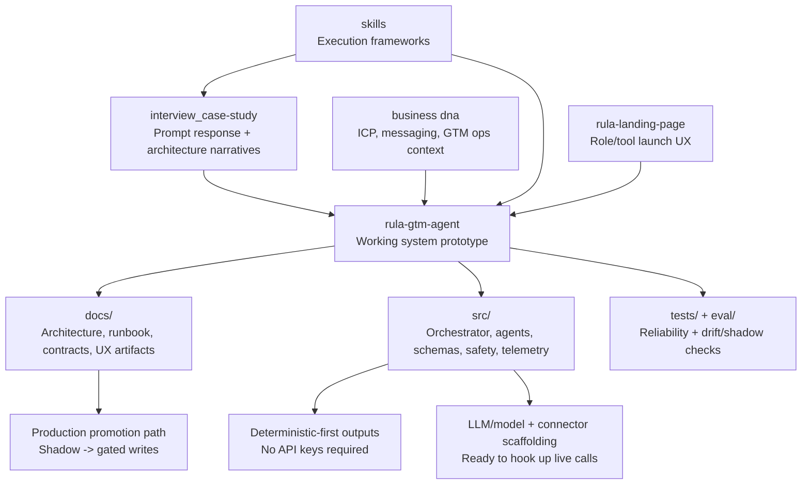

# GitHub Inventory: Beyond the Case Study

This writeup reframes the final deliverable around the full depth of the repository, not just the case prompt response. The case study is one artifact in a much broader build: a working deterministic-first GTM intelligence product with production-oriented scaffolding, documentation, evaluation infrastructure, and UX/operational hardening.

---

## 1) Executive framing

The case deliverable answers the assignment well, but it undersells what is actually present in GitHub:

- This repo is not just a strategy memo or architecture thought exercise.
- It includes a functioning end-to-end product prototype (`rula-gtm-agent`) with modular architecture and test coverage.
- It includes a companion deployment-facing landing experience (`rula-landing-page`) for role and workflow entry.
- It includes planning and compound-engineering artifacts that show how requirements were translated into implementable systems.
- It includes explicit production-promotion scaffolding (contracts, controls, release readiness, evaluation scripts), even where live external APIs are intentionally not yet activated.

Put simply: the case is the narrative layer; the repository is the evidence layer.

---

## 2) What this GitHub repo actually contains

## Top-level inventory

1. `rula-gtm-agent/`  
   Primary implementation: Streamlit-based GTM intelligence system with prospecting + MAP verification workflows, deterministic and LLM-assisted execution paths, safety controls, telemetry, integration contracts, and tests.

2. `rula-landing-page/`  
   Next.js/Vercel launch surface that deep-links users into specific Streamlit workflows (`prospecting`, `map`) with role context for operational UX.

3. `interview_case-study/`  
   Final deliverable, planning docs, and deep technical architecture artifacts used to drive and communicate system design decisions.

4. `business dna/`  
   Domain strategy corpus (ICP, messaging, operations playbooks, product DNA) that anchors GTM logic in business context rather than generic prompting.

5. `skills/`  
   Reusable role and execution frameworks (solution architect, AI engineer, PRD, UX, writing style) that support consistent compound-engineering workflows.

---

## 3) Visual story of the repo (for people who do not click around)

The key message for review panels: this is already a system with implementation depth, not a one-off case writeup.

---

## 4) `rula-gtm-agent`: depth of implementation

### 4.1 Product behavior that already exists

The current implementation is a single-process application with clear internal layering:

- UI/workflow shell: `app.py` + `src/ui/`
- Orchestration: `src/orchestrator/`
- Specialist pipelines:
  - Prospecting: `src/agents/prospecting/`
  - MAP verification: `src/agents/verification/`
- Contracts/schemas: `src/schemas/`, `src/integrations/`
- Safety/security/governance: `src/safety/`, `src/security/`, `src/governance/`
- Observability + explainability: `src/telemetry/`, `src/explainability/`, `src/context/`

This is materially beyond “slides + pseudo-code”; it is an operational prototype with modularized domains.

### 4.2 Deterministic-first architecture (explicitly addresses feedback)

This repo intentionally starts deterministic-first:

- The system works without API keys.
- Fallback pathways preserve output validity.
- Contracts and validators shape reliable output even under non-deterministic generation.

This is not a limitation; it is a deliberate risk-managed sequencing strategy:

1. Prove workflow logic and controls.
2. Stabilize schema + quality gates.
3. Attach live provider/API calls with lower operational risk.

### 4.3 “Not currently enabled for API calls” clarified as planned sequencing

The implementation already contains scaffolding that shows live API integration was anticipated:

- Provider abstraction + routing (`src/providers/`)
- Ingestion and handoff interfaces (`src/integrations/`)
- Environment variables and connector placeholders in `README.md`
- Explicit “future HTTP ingest/orchestrator” references in docs

Therefore, “not enabled for API calls” should be presented as:

- **Current state:** deterministic + optional model pathways, shadow-safe export behavior.
- **Designed next step:** wire live endpoints/connectors into existing interfaces.
- **Why this is strong engineering:** architecture decouples core logic from provider volatility and integration risk.

### 4.4 Reliability, controls, and production judgment

Implementation includes real control-plane signals expected in production-minded systems:

- RBAC model (`src/security/rbac.py`)
- kill switch, circuit breaker, DLQ, incidents (`src/safety/`)
- retention governance (`src/governance/retention.py`)
- response validation + policy checks (`src/validators/`, `src/agents/*/dq_policy.py`)
- audit and correction loops (`src/agents/audit/`, orchestrator flows)

This demonstrates builder maturity beyond output generation quality.

### 4.5 Evidence of engineering rigor: testing and eval

The repository includes extensive tests and quality instrumentation:

- Broad `tests/` suite spanning orchestrator, safety, contracts, UI, ingestion, telemetry, and reliability paths.
- `eval/` scripts for drift checks and shadow comparisons.
- Golden data fixtures and policy fixture files.

This is key narrative evidence that the project is engineered as a system, not a demo script.

---

## 5) `rula-landing-page`: productization depth beyond case prompt

The repo also includes a dedicated Next.js landing experience for deployment-facing workflow entry:

- Role/tool selection UX
- Deep-link contract into Streamlit workflow routes
- Environment configuration for hosted deployment
- UAT and behavior-preservation docs

Why this matters:

- Shows attention to user entrypoint design, not only internal model logic.
- Demonstrates interoperability between front-door UX and operational app.
- Signals product thinking: onboarding flow, route hygiene, environment handling.

---

## 6) Planning artifacts and compound engineering evidence

This feedback point is exactly right: these assets should be surfaced prominently because they prove system-level thinking.

## High-signal planning assets

- `interview_case-study/planning/rula_rev-intel_prd.md`
- `interview_case-study/planning/rula_rev-intel_plan.md`
- `interview_case-study/planning/rula-gtm-agent_code-review_plan.md`
- `interview_case-study/planning/rula_business-dna_plan.md`

These establish intent, sequencing, and quality criteria before/alongside implementation.

## Architecture and design artifacts

- `interview_case-study/system-architecture/rula_rev-intel_agent-system_architecture.md`
- `interview_case-study/system-architecture/MAP-review_ingestion-system_design.md`
- Deep-dive docs in builder mindset, experimentation mindset, GTM fluency, security architecture, and system/LLM reasoning.

## Implementation documentation inside product repo

- `rula-gtm-agent/docs/architecture_overview.md`
- `rula-gtm-agent/docs/implementation_runbook.md`
- `rula-gtm-agent/docs/v1_release_readiness.md`
- `rula-gtm-agent/docs/integration_contracts.md`
- `rula-gtm-agent/docs/ingest_contract.md`
- `rula-gtm-agent/docs/connector_policies.md`
- UX research/design artifacts under `rula-gtm-agent/docs/ux/`

This is textbook compound engineering: requirements -> architecture -> implementation -> controls -> readiness.

---

## 7) Repo narrative to use in interviews/panels

Use this concise positioning statement:

> “The case document is the tip of the iceberg. The GitHub repo contains a deterministic-first GTM intelligence system with modular orchestration, prospecting and MAP verification pipelines, reliability controls, evaluation harnesses, deployment-facing UX, and a full planning/documentation trail for production promotion. Live API wiring is intentionally staged, and the integration scaffolding is already in place.”

If the reviewer never clicks GitHub, add these three proof points directly in the deliverable:

1. **System breadth:** two product surfaces (`rula-gtm-agent` + `rula-landing-page`) and complete pipeline modules.
2. **Engineering depth:** safety controls, contract-first exports, extensive tests/eval, telemetry.
3. **Compound planning:** PRD, plans, architecture docs, runbook/readiness, UX artifacts, and explicit promotion path.

---

## 8) Suggested “GitHub depth” insert block for final case document

### What this repository adds beyond the written case

- **Working software, not just proposal:** The repo includes a runnable GTM intelligence application with prospecting and MAP verification workflows.
- **Deterministic-first by design:** Current operation is intentionally deterministic-safe; model/API integrations are scaffolded and can be activated incrementally.
- **Production-oriented controls:** RBAC, validation, safety controls, DLQ/incident patterns, and governance artifacts are already represented.
- **Evaluation discipline:** test suite + drift/shadow evaluation scripts support quality iteration.
- **Compound engineering artifacts:** PRD/plans, architecture docs, integration contracts, and UX documentation show end-to-end systems thinking.

---

## 9) Bottom line

The strongest version of this submission is not “I answered the case thoroughly.”  
It is: **“I designed and built a full-stack, production-minded GTM intelligence system and used the case to explain one slice of it.”**

That framing gives full credit for the breadth and depth already visible in GitHub.
