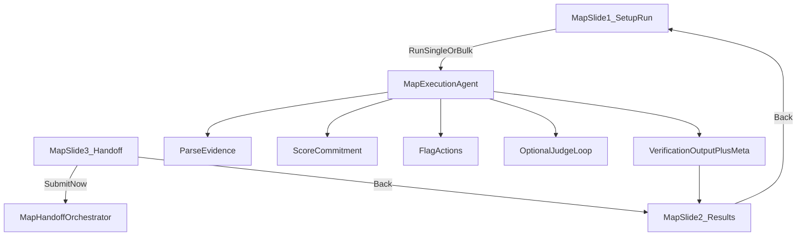

# MAP Review Agent — Implementation Plan (Inspired by Prospecting v2–v4)

## Current MAP architecture (codebase)

- **Pipeline entrypoint**: [`run_map_verification`](rula-gtm-agent/src/orchestrator/graph.py) — `parse_evidence` → `score_commitment` → `flag_actions` → `VerificationOutput`; optional **audit loop** with `judge_map_verification` / `apply_map_correction` (system retries, not AE edits).
- **UI**: [`_page_map_review`](rula-gtm-agent/app.py) — single page; modes “Select sample evidence” vs “Structured capture”; primary CTA **Run MAP verification**; results via [`_render_map_result`](rula-gtm-agent/app.py).
- **Export**: [`build_map_export`](rula-gtm-agent/src/integrations/export.py) → CRM-shaped JSON download only; **no** orchestrated handoff module (unlike prospecting’s [`handoff_orchestrator`](rula-gtm-agent/src/integrations/handoff.py)).
- **Schema**: [`VerificationOutput`](rula-gtm-agent/src/schemas/map_verification.py) — tier, score, risks, actions, judge fields; **no** generation meta / provenance block comparable to prospecting v3.

This baseline is enough to map prospecting plans to MAP-specific equivalents.

### Scope note (vs early prospecting v2 wording)

An older prospecting v2 scope line mentioned **minor MAP touchups only**. This plan **intentionally goes further**: it applies the same **structural** patterns (slides, bulk summary, handoff stubs, contracts) to MAP where they fit. That is a deliberate product/engineering choice for demo and AE parity—not an accidental scope slip.

---

## What transfers directly vs what does not

| Prospecting plan theme | MAP analogue | Directly applicable? |
|------------------------|--------------|----------------------|
| v2: Source selector + Clay placeholder | Evidence source: **Test samples** (`data/map_evidence.json`) vs future **ingested evidence** (Clay/API) | **Yes** (pattern); Clay content differs |
| v2: Bulk run-all + summary | **Bulk MAP**: run all sample evidence rows (or batch) → pass/review/error style summary | **Yes** |
| v2: One primary handoff CTA + DLQ/review stubs | **MAP handoff**: one action → CRM manifest stub + review queue for low tier / audit fail + optional run archive | **Yes** (adapt payloads) |
| v2: AE labels (Ready to Send, etc.) | Same **audit_badge** component; align remaining copy (“Corrections used”, headers) | **Yes** |
| v2: Markdown preview vs raw JSON | Structured capture currently shows compiled text in `st.code` — switch to **readable preview** + raw in collapsed technical section | **Yes** |
| v2: Inline email edit + save/revert | MAP has **no email**; **optional**: AE edits to **evidence text** or **analyst notes** before re-run, or “mark reviewed” | **Partial** (different artifact) |
| v3: Email + discovery prompts + context fetch | Not applicable to MAP core | **No** |
| v3: Scoring engine + signal attribution + explainability | MAP: expose **score decomposition** and **risk/tier rationale** tied to `ParsedEvidence` fields; optional **LLM-assisted** tier narrative with guardrails | **Tangential / high value** |
| v3: Policy validator + repair + fallback | MAP: validate **export payload** and **judge output**; audit retry already exists—add explicit **validation flags** in output | **Partial** |
| v4: 3-slide UI + footer nav | MAP: **Slide 1** setup/run, **Slide 2** results (bulk: expandable rows), **Slide 3** handoff | **Yes** |
| v4: Subagents + `contracts.py` + ExecutionAgent | MAP: lighter **stage contracts** (parse, score, flag, judge) + optional `map_execution_agent.py` | **Yes** (scaled to MAP) |

---

## Session state, navigation gating, and bulk UX persistence

**Session keys (explicit):**

| Key | When set | Used for |
|-----|----------|----------|
| `map_slide` | Default `1` on first visit | Current slide `{1,2,3}` |
| `last_map_result` | After **single-evidence** run succeeds | One `VerificationOutput` as dict (current behavior, extended) |
| `last_map_bulk_summary` | After **bulk** run completes | `BulkMapSummary`-like aggregate (pass/review/error rows) |
| `last_map_handoff_result` | After Slide 3 **Submit Now** (optional) | Same idea as prospecting `last_handoff_result` |

**Next / Back gating:**

- **`can_go_next_from_map_slide1`**: `True` if `last_map_bulk_summary` is set **or** `last_map_result` is set (either path completes a run from Slide 1).
- **`can_go_next_from_map_slide2`**: Same condition as slide 1 (results exist for handoff path). Handoff on Slide 3 may still show empty-state copy if neither bulk nor single payload exists—should not happen if navigation is gated.
- Do **not** require both bulk and single; they are **alternatives**. Clearing one when the other runs is acceptable if documented (e.g. switching run mode replaces the active result type).

**Bulk expander persistence (mirror prospecting):**

- Add `active_map_evidence_expander` (or `active_map_row_id`) in session state so **Back/Next** and reruns do not collapse the evidence row the AE was reviewing—same pattern as `active_account_expander` on prospecting Slide 2.

---

## Bulk row failure semantics

**Default policy: continue with per-row errors (align with bulk prospecting).**

- For each evidence row in a bulk run: wrap `run_map_verification` in try/except.
- On exception or pipeline failure: append a **row** to `error_rows` with `evidence_id`, `error` message, and **do not** abort the whole batch.
- **Fail-fast** is **not** the default; if product ever needs it, gate behind an explicit option or admin-only flag.

This makes `BulkMapSummary` parallel to [`BulkRunSummary`](rula-gtm-agent/src/orchestrator/bulk_prospecting.py): `pass_rows`, `review_rows`, `error_rows`, `total`, duration metadata.

---

## Parsed evidence exposure (UI + schema)

**Problem:** The UI only receives `VerificationOutput`; `ParsedEvidence` is internal to [`run_map_verification`](rula-gtm-agent/src/orchestrator/graph.py). Structured markdown previews (Phase C) need a **serializable snapshot** of parse output.

**Chosen approach (pick one during implementation, prefer A):**

- **A (recommended):** Extend pipeline return as a **bundle** used by the app and bulk runner: e.g. `MapVerificationRow` / `MapVerificationBundle` containing `output: VerificationOutput` and `parsed_evidence: dict` (from `ParsedEvidence.model_dump()`), or nested optional `parse_summary` fields copied onto `VerificationOutput` behind new optional fields such as `parse_summary` / `committer_display` / `campaigns_display`—all **optional** for backward compatibility.
- **B:** Second parse in the UI for preview only—avoid duplicate parse if possible (cost + drift); use only if bundle refactor is deferred.

Golden rule: **one canonical parse per run** in the orchestrator path; UI never re-parses unless B is explicitly chosen as a short-term hack.

---

## Shared contract primitives (avoid drift)

- **Reuse** [`SubagentErrorEnvelope`](rula-gtm-agent/src/orchestrator/contracts.py) and [`StageMeta`](rula-gtm-agent/src/orchestrator/contracts.py) (or equivalent shared types) from existing [`contracts.py`](rula-gtm-agent/src/orchestrator/contracts.py) for MAP stage results and `stage_errors`—do **not** duplicate incompatible error shapes.
- MAP-specific models live in [`map_contracts.py`](rula-gtm-agent/src/orchestrator/map_contracts.py); import shared primitives from [`contracts.py`](rula-gtm-agent/src/orchestrator/contracts.py).

---

## Recommended phases

### Phase A — MAP UI parity with Prospecting v4 (slides + navigation)

**Goal**: Same cognitive model as prospecting: setup/run → results → handoff, with persistent session state.

- Add session state key `map_slide` in `{1,2,3}` and helpers mirroring prospecting: `get_current_map_slide`, `go_to_map_slide`, `can_go_next_from_map_slide1/2` — use the **gating table** in [Session state, navigation gating, and bulk UX persistence](#session-state-navigation-gating-and-bulk-ux-persistence) above.
- Refactor [`_page_map_review`](rula-gtm-agent/app.py) into:
  - `_render_map_slide1_setup()` — input mode, evidence selection, run button(s).
  - `_render_map_slide2_results()` — outcome(s): reuse/extend `_render_map_result`; for bulk, summary cards + per-evidence expanders (pattern from `_render_bulk_summary`).
  - `_render_map_slide3_handoff()` — new MAP handoff panel (see Phase B).
- Add `_render_map_slide_footer_nav(slide)` — stable bottom row, “Step N of 3”, disabled Next with helper text when prerequisites missing.
- **Do not** clear `last_map_result`, `last_map_bulk_summary`, or `active_map_evidence_expander` on Back/Next.

**Primary files**: [`rula-gtm-agent/app.py`](rula-gtm-agent/app.py), possibly extract MAP render helpers to [`rula-gtm-agent/src/ui/map_components.py`](rula-gtm-agent/src/ui/map_components.py) (new) if `app.py` grows too large.

---

### Phase B — MAP “v2-style” operations: bulk, archive, single handoff CTA

**Goal**: List-scale mental model for RevOps/AE demos without changing core scoring logic.

- **Bulk runner** (new): e.g. `run_map_verification_bulk(evidence_items, actor_role)` in [`rula-gtm-agent/src/orchestrator/graph.py`](rula-gtm-agent/src/orchestrator/graph.py) or dedicated [`rula-gtm-agent/src/orchestrator/bulk_map.py`](rula-gtm-agent/src/orchestrator/bulk_map.py) returning a **BulkMapSummary** dataclass (mirror [`BulkRunSummary`](rula-gtm-agent/src/orchestrator/bulk_prospecting.py)): rows classified by `judge_pass` / tier / pipeline errors. Apply [Bulk row failure semantics](#bulk-row-failure-semantics): **continue** on row failure, populate `error_rows`.
- **Slide 1**: Add run mode **“All sample evidence”** vs **“Single evidence”** (parallel to prospecting bulk vs single).
- **Handoff**: New `map_handoff_orchestrator(bulk_summary)` in [`rula-gtm-agent/src/integrations/handoff.py`](rula-gtm-agent/src/integrations/handoff.py) (or `map_handoff.py`) that:
  - Writes **CRM manifest** rows for MAP exports (evidence id, tier, score, risks, audit).
  - Routes **needs review** (LOW tier, audit fail, pipeline error) to a **review queue** stub (JSONL under configurable dir, same pattern as prospecting).
  - Optionally writes **run archive** (`out/runs/{run_id}/...`) — no extra mandatory “save” click.
- **Telemetry**: emit `map_handoff_orchestrated` with counts (mirror prospecting handoff events).

**Note**: Sequencer payloads are **not** part of MAP; handoff copy should say “CRM / review queue / archive” not “email sequencer.”

---

### Phase C — UX labeling and evidence presentation (Prospecting v2 microcopy)

**Goal**: AE-readable MAP review, consistent with prospecting.

- In [`_render_map_result`](rula-gtm-agent/app.py): align labels with prospecting dictionary:
  - Replace **“Corrections used”** with **“Audit retries”** for the metric that reflects `correction_attempts_used` from the **system** judge loop (same semantic as auto-corrections in prospecting).
  - **“AE notes/edits”**: **omit** from primary UI until an explicit AE-edit feature ships; if the metric is absent, do not imply split counters—only **Audit retries** until then.
  - Ensure **Audit** uses the same [`audit_badge`](rula-gtm-agent/src/ui/components.py) semantics (already “Ready to Send” / “Needs Review”).
- **Structured capture**: Replace `st.code` block for compiled evidence with **markdown-style preview** (and keep full text in collapsible “Technical details” or “Raw compiled evidence”).
- **Parsed commitment summary**: Implement via [Parsed evidence exposure](#parsed-evidence-exposure-ui--schema) (bundle or optional `VerificationOutput` fields)—structured markdown for committer, campaigns, blockers—**no second parse** unless approach B is explicitly chosen as a temporary measure.

---

### Phase D — “v3 tangential” backend transparency (no prospecting generation)

**Goal**: Explainability and calibration without email generation.

**Phase D1 (core, shippable):**

- **Score transparency**: Extend [`VerificationOutput`](rula-gtm-agent/src/schemas/map_verification.py) (or wrap in a `MapRunMeta`) with optional fields:
  - `scoring_version`, `score_breakdown` (e.g. points from first-party source, campaign count, quarter span, blockers, language heuristics) — sourced from [`score_commitment`](rula-gtm-agent/src/agents/verification/scorer.py) refactored to return **both** final score and **attribution list** (same *pattern* as prospecting signal attribution; MAP-specific signal ids).
- **Risk/tier rationale**: Keep deterministic [`explain_threshold`](rula-gtm-agent/src/explainability/threshold.py) as the default user-facing explanation path.
- **Export**: Pass breakdown into [`MapExport`](rula-gtm-agent/src/integrations/export.py) for CRM consumers.

**Phase D2 (optional; defer or feature-flag):**

- **LLM-assisted tier narrative** (Gemini/Claude): **not** required for MAP v1 parity. If implemented: **hard gates** (must cite `evidence_id` and at least N fields from parsed snapshot), template fallback on failure, telemetry for `fallback_used`—mirror v3 explainability discipline.
- Keeps Phase A–C and D1 deliverable without new provider dependencies.

**Regression note:** Any change to [`score_commitment`](rula-gtm-agent/src/agents/verification/scorer.py) must preserve golden expectations in [`tests/test_map_verification.py`](rula-gtm-agent/tests/test_map_verification.py) **or** update tests with explicit approval. Run [`compare_map`](rula-gtm-agent/src/orchestrator/shadow.py) / admin shadow flow when scorer outputs change.

---

### Phase E — MAP orchestration contracts (Prospecting v4 subagent pattern, scoped)

**Goal**: Debuggable stages with typed boundaries—not a full LangGraph rewrite.

- Add [`rula-gtm-agent/src/orchestrator/map_contracts.py`](rula-gtm-agent/src/orchestrator/map_contracts.py): Pydantic models with `extra="forbid"` for:
  - `MapParseResult`, `MapScoreResult`, `MapFlagResult`, `MapAuditResult`, `MapVerificationBundle`, `MapExecutionRunResult` (run_id, correlation_id, stage_errors).
- **Import** shared [`SubagentErrorEnvelope`](rula-gtm-agent/src/orchestrator/contracts.py) / [`StageMeta`](rula-gtm-agent/src/orchestrator/contracts.py) per [Shared contract primitives](#shared-contract-primitives-avoid-drift); MAP-specific types only for parse/score/flag/audit payloads.
- Add [`rula-gtm-agent/src/orchestrator/map_execution_agent.py`](rula-gtm-agent/src/orchestrator/map_execution_agent.py): thin wrapper that calls existing functions in order, attaches timing + correlation IDs, collects **non-fatal** per-stage errors (e.g. one evidence row fails in bulk—consistent with [Bulk row failure semantics](#bulk-row-failure-semantics)).
- **Optional**: parallel is less relevant for MAP than prospecting; keep sequential unless Phase D2 LLM branch is added as an independent step.

---

## Testing strategy

- New: `tests/test_map_slide_flow.py` — session helper behavior and **gating** predicates (`can_go_next_from_map_slide1/2`) with mocked `st` (same approach as [`tests/test_prospecting_slide_flow_v4.py`](rula-gtm-agent/tests/test_prospecting_slide_flow_v4.py)).
- New: `tests/test_bulk_map.py` — bulk run over `data/map_evidence.json`; assert **continue-on-error** behavior (inject a failing row fixture if needed); stable classification counts; **no regression** on golden tiers ([`tests/test_map_verification.py`](rula-gtm-agent/tests/test_map_verification.py)).
- New: `tests/test_map_handoff.py` — stub writes manifest + review queue rows to temp dirs.
- Extend: [`tests/test_ux_acceptance.py`](rula-gtm-agent/tests/test_ux_acceptance.py) or add MAP-specific assertions if you expose pure functions for label/exports.
- **Regression / shadow**: If [`score_commitment`](rula-gtm-agent/src/agents/verification/scorer.py) or parse outputs change, run [`compare_map`](rula-gtm-agent/src/orchestrator/shadow.py) expectations or extend tests so admin shadow MAP compare stays meaningful; document any intentional golden-tier updates.

---

## Out of scope (unless product asks later)

- Live Clay/API evidence ingestion for MAP (keep placeholder like prospecting).
- Replacing rule-based [`score_commitment`](rula-gtm-agent/src/agents/verification/scorer.py) with an LLM scorer (would be a different product decision).
- Feature parity with prospecting **email** tooling.

---

## Architecture sketch (target)

