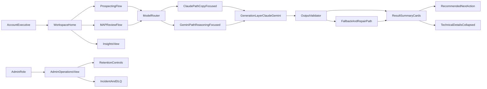

# Rula GTM Agent v1 Implementation Plan

## Goals
- Redesign the AE experience to be clean, minimal, and task-first (prospecting and MAP workflows in fewer clicks).
- Preserve trust with transparent outcomes (confidence, audit status, next action) while hiding technical complexity.
- Continue with platform v1 phases after UX: telemetry, reliability hardening, and integration readiness.

## Phased Build Model

### Phase 0: Foundations and Config Readiness
- **Objective**: establish secure configuration and provider routing prerequisites.
- **Build scope**:
  - secrets/config contract (`.env` + production secret manager strategy),
  - provider routing flags and startup validation checks.
- **Exit gate**:
  - app starts with clear behavior for key-present/key-missing cases,
  - no secrets leakage in logs.

### Phase 1: UX Research and Experience Blueprint
- **Objective**: convert AE pain points into prioritized UX requirements.
- **Build scope**:
  - lean usability baseline (5 AE sessions),
  - journey map and friction backlog,
  - task-first IA and navigation blueprint.
- **Exit gate**:
  - approved UX blueprint with measurable usability hypotheses.

### Phase 2: High-Fidelity UI Overhaul (app.py-first)
- **Objective**: deliver a clean, minimal AE-facing UI with reduced cognitive load.
- **Build scope**:
  - componentized `app.py` refactor,
  - result cards + progressive disclosure,
  - role-aware advanced panels.
- **Exit gate**:
  - AE can complete core flows within target time,
  - empty/loading/error/success states validated.

### Phase 3: Generative Layer v1 (Claude + Gemini)
- **Objective**: integrate dynamic content generation with efficient model routing.
- **Build scope**:
  - task-model mapping (Claude-first vs Gemini-first),
  - prompt templates and schema contracts,
  - fallback and repair chain.
- **Exit gate**:
  - generative reliability thresholds met,
  - ambiguous-output rate under guardrail.

### Phase 4: Validation, Explainability, and Calibration
- **Objective**: ensure outputs are trustworthy, explainable, and calibrated.
- **Build scope**:
  - syntactic/semantic validators,
  - explainability panels (`why value prop`, `why threshold`, `econ bridge`),
  - MAP false-positive recalibration loop.
- **Exit gate**:
  - explainability and MAP precision targets met on calibration sets.

### Phase 5: Telemetry, Iteration, and Reliability Ops
- **Objective**: make the system measurable and continuously improvable.
- **Build scope**:
  - adoption/quality/latency telemetry,
  - provider comparison dashboards,
  - reliability drills (provider outage, failover, rollback).
- **Exit gate**:
  - weekly iteration loop operational,
  - automatic alerts for guardrail breaches.

### Phase 6: Integration Readiness and Release
- **Objective**: prepare safe downstream usage and v1 go-live package.
- **Build scope**:
  - outbound payload contracts with provenance fields,
  - export actions for AEs,
  - release readiness report + docs/runbooks.
- **Exit gate**:
  - all “good enough” gates pass,
  - rollout/rollback plan approved.

## v1 System Parameters

### Secrets and Configuration Parameters
- **Credential source of truth**:
  - Local/dev: `.env` loaded into process environment.
  - Production: cloud secret manager (not checked into repo) injected as environment variables at runtime.
  - Do not rely on IDE/session tokens for runtime inference calls.
- **Required provider keys**:
  - `ANTHROPIC_API_KEY` for Claude
  - `GOOGLE_API_KEY` for Gemini API (or Vertex credentials in production)
- **Optional provider/runtime config**:
  - `GOOGLE_CLOUD_PROJECT`, `GOOGLE_CLOUD_LOCATION`, `GOOGLE_GENAI_USE_VERTEXAI`
  - `MODEL_PRIMARY`, `MODEL_FALLBACK`, `GENERATION_MODE` (`fast_mode`/`quality_mode`)
- **Environment separation strategy**:
  - `.env` for local testing only.
  - `.env.example` committed with placeholders only.
  - Production secrets provisioned via platform (e.g., GCP Secret Manager, AWS Secrets Manager, Vault).
- **Missing-key fallback behavior**:
  - If primary provider key is missing:
    - route to secondary provider if available.
  - If both provider keys are missing:
    - disable generative actions and return deterministic safe templates with `needs_human_review=true`.
    - UI shows clear “model unavailable” state and manual-edit path.
  - Log key-missing events as operational warnings (without exposing secret values).
- **Security guardrails**:
  - Never log secret values.
  - Rotate keys on schedule and on suspected exposure.
  - Enforce least-privilege for production service accounts.
  - Add startup config checks that fail fast in production if required secrets are absent.

### Measurement + Iteration Guardrail Parameters
- **How we measure if the system is working (north-star + guardrails)**:
  - **Adoption**: AE usage rate, output-copy/use rate, weekly active AEs, repeat usage.
  - **Outcome quality**:
    - Prospecting: edit distance before send, response/meeting-booked proxy, AE acceptance rating.
    - MAP: precision/recall by tier, false-positive rate, human override rate.
  - **Operational health**: latency, failure rate, fallback rate, human-review rate.
  - **Trust/clarity**: rationale-view rate, “understood recommendation” survey score.
- **Metric targets (v1 baseline targets)**:
  - Prospecting email use rate >= 60% (used with <= minor edits).
  - MAP false-positive rate <= 10% on calibration set.
  - Human override rate trending downward across 4-week window.
  - No safety/regression gate failures.

### Iteration Cadence Parameters
- **Weekly model+UX review loop**:
  1. Review telemetry + sampled outputs.
  2. Bucket failures by taxonomy (adoption, quality, calibration, UX friction, reliability).
  3. Prioritize top 3 interventions by expected impact and implementation effort.
  4. Ship controlled changes behind prompt/model/config versioning.
  5. Re-measure against control baseline for 1 week.
- **Change management guardrails**:
  - One major variable change per experiment cell (prompt, threshold, UI copy, model route) to preserve causal read.
  - Shadow evaluation required before widening rollout.
  - Rollback trigger if quality or trust metrics breach thresholds.
- **Model-fit recalibration loop**:
  - Monthly reassignment review for Claude-first vs Gemini-first tasks using:
    - acceptance rate, ambiguity rate, validation pass rate, latency, and cost per accepted output.
  - Re-route default provider only after statistically meaningful uplift and no trust/safety regression.

### Prospecting Non-Use Guardrails (If AEs Do Not Use Emails)
- **Diagnosis framework**:
  - Segment non-use causes: tone mismatch, low personalization, weak CTA, irrelevant value prop, too long, compliance concern.
  - Capture structured AE feedback at action point (`not usable because...`).
- **Interventions in order**:
  1. Prompt tuning for brevity, role tone, and personalization anchors.
  2. Stronger value-prop ranking signals and rationale visibility.
  3. Offer style presets (`concise`, `consultative`, `executive`) with policy-safe bounds.
  4. Add “regenerate with constraints” quick actions.
  5. Route low-confidence drafts to human-review-first mode.
- **Success criteria post-change**:
  - Increase use rate by >= 10pp over prior 2-week baseline.
  - Reduce median edits required before send.

### MAP False-Positive Recalibration Guardrails
- **Detection metrics**:
  - False-positive rate by tier/source type/channel.
  - Disagreement rate with human reviewers.
  - Confidence-score calibration error (expected vs observed correctness).
- **Recalibration levers**:
  1. Raise HIGH threshold or tighten cap conditions for secondhand evidence.
  2. Increase penalties for ambiguous/exploratory language.
  3. Re-weight source directness and blocker impacts.
  4. Add hard-stop rules for known unreliable patterns.
  5. Re-run calibration set and compare precision-recall deltas.
- **Safety guardrail**:
  - Any threshold update must pass no-regression tests on A/B/C fixtures and broader golden set before promotion.

### Generative Content Parameters (Claude + Gemini)
- **Scope of generation**:
  - Email drafts, subject lines, discovery questions, concise rationale copy, and follow-up snippets.
  - Deterministic scoring/risk/threshold logic remains rule-based; models generate language only unless explicitly enabled.
- **Model routing strategy**:
  - Primary model: configurable (`claude` or `gemini`) by content type.
  - Secondary model: automatic fallback on timeout, safety block, malformed output, or low confidence.
  - Optional dual-pass mode: generate with primary, review/refine with secondary for high-impact outputs.
- **Prompt non-determinism controls**:
  - Fixed prompt versioning (`prompt_id`, `prompt_version`) and stable system instructions.
  - Low-variance defaults for production (`temperature`, `top_p` constrained by policy).
  - Explicit style and length constraints to reduce variance.
  - Cache keying on normalized input + prompt version for repeatable outputs when appropriate.
- **Reliability SLO for generation**:
  - >= 99% valid structured responses after retry/fallback policy.
  - P95 generation latency threshold defined per content type (email vs short question set).

### Claude + Gemini Role Allocation (Strength-Based Architecture)
- **Model-fit assumptions from research**:
  - Claude: long-context grounding patterns (quote-first extraction, explicit evidence anchoring) and strong instruction adherence in document-heavy prompts.
  - Gemini: strong performance in complex reasoning, agentic/tool-use workflows, and very large-context handling in current model-card evaluations.
- **Primary assignment by task**:
  - **Claude-first**:
    - AE-facing email copy, subject lines, discovery-question phrasing, and concise rationale summaries.
    - Preferred when tone quality and concise communication are priority.
  - **Gemini-first**:
    - MAP evidence synthesis across large context, threshold-justification draft generation, and tool-assisted scenario synthesis.
    - Preferred when reasoning depth, context breadth, or tool orchestration is priority.
- **Fallback assignment**:
  - Claude invalid/ambiguous output -> one repair retry -> Gemini fallback with strict schema prompt.
  - Gemini verbose/low-actionability output -> one repair retry -> Claude fallback with brevity template.
- **Efficiency policy**:
  - `fast_mode` for iterative drafts; `quality_mode` for final send-ready output.
  - Escalate to `quality_mode` only for low confidence, detected ambiguity, or explicit user request.

### Edge-Case Handling Parameters
- **Input edge cases**:
  - Missing/partial account fields, malformed MAP evidence, long text payloads, duplicate submissions, stale session state.
  - Handling rule: sanitize -> validate -> recover with user-safe message and suggested next action.
- **Execution edge cases**:
  - Permission denied, breaker open, kill-switch active, timeout/retry exhaustion, judge disagreement after max retries.
  - Handling rule: deterministic fallback, visible status badge, and role-aware escalation path.
- **Output edge cases**:
  - Low confidence, conflicting signals, empty recommendations, unverifiable commitments.
  - Handling rule: downgrade confidence, require human follow-up, show explicit uncertainty reason.
- **UI edge cases**:
  - Empty states, loading stalls, failed actions, long company names, mobile/narrow view truncation.
  - Handling rule: every screen includes empty/loading/error/success states with recover actions.

### Output Structure Parameters (User + Technical)
- **AE-facing result contract** (always same order):
  1. `Outcome summary` (1 sentence)
  2. `Confidence` (tier + score)
  3. `Why this result` (2-4 bullets)
  4. `Recommended next action` (single primary CTA)
  5. `Send-ready artifact` (email snippet or MAP follow-up copy)
- **Technical details contract** (collapsed by default):
  - Audit status, retries used, risk flags, trace reference, source directness.
- **Operational contract**:
  - Structured event log per run with: role, action, latency, success/failure reason, confidence tier, fallback usage.
- **Generative output contract**:
  - `content_type`, `model_used`, `prompt_version`, `inputs_digest`, `output_text`, `validation_status`, `fallback_applied`, `safety_flags`.
  - Discovery questions output must be a bounded list with required min/max count.

### Decision Explainability Parameters
- **Value prop selection ("Why this value prop for this account")**:
  - Expose weighted signal breakdown for top recommendation:
    - industry fit, account size, workforce pattern, contact role, notes-derived signals.
  - Include `top_3_value_props` with:
    - `score`, `score_delta_vs_next`, `primary_evidence`, `counter_evidence`.
  - Show a concise rationale sentence:
    - `For [account], [value_prop] ranked highest because [top_signals], despite [tradeoff].`
  - Edge handling:
    - if sparse signals, mark rationale as `low-evidence` and recommend discovery questions before outreach.

- **MAP threshold selection ("Why this confidence threshold")**:
  - Publish a transparent confidence rubric with component bands:
    - source directness weight
    - commitment language strength
    - campaign specificity (type + quarter coverage)
    - blocker penalties
    - secondhand caps and guardrails
  - Expose threshold table in technical details:
    - `HIGH >= X`, `MEDIUM Y-Z`, `LOW < Y`, plus cap conditions.
  - For each output, include:
    - `threshold_triggered_by` (which rule set tier),
    - `what_would_change_tier` (minimum extra evidence needed).
  - Edge handling:
    - conflicting evidence forces threshold downgrade and explicit human validation requirement.

- **Campaign productivity -> unit economics linkage**:
  - Add a deterministic economics bridge panel in results:
    - `campaign_intensity` (planned campaigns/quarter),
    - `expected_engagement_lift_range`,
    - `pipeline_impact_proxy` (meetings/opportunities),
    - `unit_econ_proxy` (CAC payback direction, gross margin sensitivity proxy).
  - Define formula contract (v1 proxy, not finance truth):
    - inputs, assumptions, and confidence band displayed with each estimate.
  - Require explicit caveat:
    - `Directional estimate for prioritization; finance validation required for commitments.`
  - Edge handling:
    - if assumptions missing, hide numeric estimate and show scenario bands only.

### Prompt Architecture Parameters (Reliable Output)
- **Prompt structure**:
  1. System role + policy constraints
  2. Task objective (single clear outcome)
  3. Ground-truth context block (account/evidence facts only)
  4. Output schema contract (JSON or strict sections)
  5. Quality rubric (tone, personalization, compliance constraints)
  6. Negative instructions (no fabrication, no unstated claims)
  7. Few-shot examples for edge cases (sparse account, conflicting MAP evidence)
- **Prompting guardrails**:
  - Force citation to provided inputs for key claims (`evidence_anchors` field).
  - Disallow unsupported numerical claims unless present in inputs.
  - Normalize placeholders for missing values (`unknown`, `needs_confirmation`) instead of hallucination.
- **Model-specific prompt templates**:
  - `claude_template_vN`: tighter tone/clarity controls, concise prose targets, explicit personalization anchors.
  - `gemini_template_vN`: structured reasoning blocks, tool-call slots, indexed long-context references.
  - Shared output schema remains constant across providers to simplify validation and fallback.

### Model Response Validation Parameters
- **Syntactic validation**:
  - Parse/validate against schema for each content type.
  - Enforce character bounds, banned phrases, required sections, and question count constraints.
- **Semantic validation**:
  - Check that generated content references real account/evidence fields.
  - Check tone and role fit (AE-ready, concise, no internal jargon leakage).
  - Check policy constraints: no fabricated commitments, no PII expansion, no contradictory recommendations.
- **Cross-check validation**:
  - Rule-based validator score plus optional judge model pass/fail.
  - If semantic confidence below threshold, mark output as `needs_human_review`.
- **Cross-model adjudication (high-impact outputs)**:
  - Optional secondary-model critique for `claim_check`, `ambiguity_check`, and `actionability_check`.
  - Material disagreement triggers confidence downgrade and mandatory human review.

### Wrong/Ambiguous Output Handling Parameters
- **Failure taxonomy**:
  - malformed_structure, unsupported_claim, ambiguous_recommendation, policy_violation, low_specificity.
- **Recovery policy**:
  1. Auto-repair attempt with same model and stricter format reminder.
  2. Fallback to secondary model with same prompt contract.
  3. Deterministic safe template fallback (minimum viable output) if still invalid.
  4. Mark as `needs_human_review` and surface exact ambiguity reason.
- **User-facing behavior**:
  - Show a clean warning badge + recommended follow-up action.
  - Provide “regenerate” and “edit manually” paths.
  - Preserve prior valid output to avoid destructive overwrite.
- **Operational logging**:
  - Log full validation errors, retry count, model transitions, and final resolution path.
- **Model-routing telemetry**:
  - Track provider-specific validity, latency, acceptance rate, edit-distance-to-use, and cost-per-accepted output.

### “Good Enough” Definition Parameters (v1 Exit Gates)
- **Usability gate**:
  - >= 80% task completion in moderated AE tests.
  - Median time-to-first-useful-output <= 60s for prospecting, <= 90s for MAP review.
- **Clarity gate**:
  - >= 80% of AEs can correctly explain “why” and “next step” without opening technical details.
- **Reliability gate**:
  - >= 99% successful run completion in fixture/regression suite.
  - All critical edge-case paths return actionable UI states (no dead-end failures).
- **Quality gate**:
  - No regression in golden, drift, and shadow parity metrics.
  - Low-confidence outputs always include explicit human follow-up guidance.
- **Explainability gate**:
  - >= 90% of sampled runs include complete `why-value-prop`, `why-threshold`, and `econ-bridge` fields.
  - AE users can correctly restate recommendation rationale in >= 80% of usability checks.
- **Generative reliability gate**:
  - >= 95% first-pass valid generation rate for email/discovery outputs.
  - >= 99% valid output after retry + fallback chain.
  - < 2% ambiguous-output rate in staged evaluation set.
- **Iteration effectiveness gate**:
  - At least one measurable metric improvement each 2-week cycle without degrading safety/trust gates.
  - Failed experiments are documented with reversal path and learnings.

## UX/UI-First Phase (High-Fidelity)

### 1) UX Discovery + Journey Mapping (Lean, 1 sprint)
- Define primary persona: Account Executive (time-constrained, quota-driven, needs clear next step).
- Run 5 quick usability sessions on current app flow to confirm friction points:
  - tab overload, JSON-heavy outputs, low task guidance, mixed admin/system controls.
- Produce AE journey map and prioritize top UX issues by impact on time-to-value.
- Files to use as baseline: [/Users/neelmishra/.cursor/Rula/rula-gtm-agent/app.py](/Users/neelmishra/.cursor/Rula/rula-gtm-agent/app.py), [/Users/neelmishra/.cursor/Rula/rula-gtm-agent/data/accounts.json](/Users/neelmishra/.cursor/Rula/rula-gtm-agent/data/accounts.json), [/Users/neelmishra/.cursor/Rula/rula-gtm-agent/data/map_evidence.json](/Users/neelmishra/.cursor/Rula/rula-gtm-agent/data/map_evidence.json).

### 2) Information Architecture + Navigation Redesign
- Replace current multi-tab engineering-first layout with AE-first task architecture:
  - `Workspace` (default): single guided flow (Choose Account -> Run -> Review -> Next Step).
  - `MAP Review`: structured evidence input and recommendation.
  - `Insights`: performance metrics and recent runs.
  - `Admin` (role-gated): retention, shadow diagnostics, incident logs.
- Keep role-based access visible but non-intrusive.

### 3) High-Fidelity UI System + Component Spec
- Build a lightweight design system for Streamlit implementation:
  - Tokens: typography scale, spacing (8px grid), color semantics (success/warning/error/neutral), radius/shadows.
  - Components: cards, status pills, confidence meter, action panel, empty/loading/error states.
  - Interaction states: default/hover/active/disabled/loading/failure.
- Replace raw JSON-first outputs with human-readable cards and progressive disclosure (`Show technical details`).
- Ensure WCAG-friendly contrast and keyboard navigation for controls.

### 4) UI Implementation in `app.py` (and optional view split)
- Refactor [/Users/neelmishra/.cursor/Rula/rula-gtm-agent/app.py](/Users/neelmishra/.cursor/Rula/rula-gtm-agent/app.py) into composable view functions:
  - `render_header`, `render_primary_workflow`, `render_result_summary`, `render_recommendations`, `render_debug_panel`.
- Introduce session state model for:
  - selected account/evidence, last-run summary, saved snippets, undo/reset actions.
- Present outcomes in AE language:
  - `What happened`, `Confidence`, `Why`, `Recommended next action`, `Send-ready copy`.
- Keep advanced panes (audit/shadow/retention) role-gated and collapsed by default.

### 5) UX Acceptance Criteria (v1 UI)
- AE can complete prospecting in <= 60 seconds from landing.
- AE can understand MAP recommendation without opening raw JSON.
- At least 80% of test users rate clarity >= 4/5 in quick post-task survey.
- No regression in existing functional correctness tests.
- All primary edge-case scenarios render actionable UI recovery paths.

## Post-UX Platform v1 Phases

### 6) Product Analytics + UX Telemetry
- Add event instrumentation for task completion, error rate, time-to-first-output, and feature usage.
- Add `ux_metrics.jsonl` or equivalent event sink for early-stage measurement.
- Surface a compact `Insights` dashboard in app.
- Add edge-case event taxonomy (validation_error, permission_denied, low_confidence, retry_exhausted, fallback_used).
- Add explainability telemetry:
  - rationale_view_opened, threshold_details_opened, econ_panel_used, copy_next_step_clicked.
- Add generation telemetry:
  - generation_started, generation_validated, generation_failed, fallback_model_used, human_review_required.
- Add provider-comparison telemetry:
  - provider_selected, provider_latency_ms, provider_validation_pass, provider_acceptance_outcome, provider_cost_estimate.
- Add adoption + calibration telemetry:
  - email_used_without_edit, email_used_with_minor_edit, email_rejected_reason, map_human_override, map_false_positive_flagged.

### 7) Reliability + Operational Controls
- Extend safety layer with:
  - explicit retry banners, user-safe failure recovery UX, clearer incident surfaces.
  - DLQ replay tooling for ops users.
- Add smoke tests that simulate permission errors, disabled modes, and breaker-open states through UI pathways.
- Add generation-specific resilience:
  - provider timeout handling, model failover tests, schema-break regression tests, and ambiguous-output replay tests.
- Add calibration ops:
  - threshold version registry, calibration set replay job, and automatic alert when false-positive rate exceeds guardrail.
- Add model-routing resilience:
  - provider outage simulation, forced-provider canary tests, and automated traffic shift policy with rollback.

### 8) Integration Readiness (Sales Workflow)
- Define outbound payload contracts for CRM handoff (still shadow/no-write by default).
- Add export actions for AE: copy-to-CRM, download summary, share run link (local stub).
- Document promotion gates for enabling live write paths.
- Include outbound contract fields for:
  - `value_prop_rationale`,
  - `map_threshold_rationale`,
  - `campaign_productivity_unit_econ_summary`,
  - `confidence_caveats`.
- Include generative provenance fields:
  - `content_model`, `content_prompt_version`, `content_validation_status`, `content_review_required`.
- Include routing provenance fields:
  - `provider_primary`, `provider_fallback_used`, `routing_reason`, `validation_error_class`.

### 9) v1 Release Readiness
- Update docs and runbooks:
  - [/Users/neelmishra/.cursor/Rula/rula-gtm-agent/README.md](/Users/neelmishra/.cursor/Rula/rula-gtm-agent/README.md)
  - [/Users/neelmishra/.cursor/Rula/rula-gtm-agent/docs/walkthrough.md](/Users/neelmishra/.cursor/Rula/rula-gtm-agent/docs/walkthrough.md)
  - [/Users/neelmishra/.cursor/Rula/rula-gtm-agent/docs/panel_talk_track.md](/Users/neelmishra/.cursor/Rula/rula-gtm-agent/docs/panel_talk_track.md)
- Run full validation: tests, drift, shadow metrics, and UX acceptance checks.
- Run “good enough” gate review against usability, clarity, reliability, and quality thresholds before release.
- Add “working system” readiness report:
  - adoption dashboard snapshot, MAP calibration report, top failure buckets, and next-iteration backlog.

## Target Architecture for v1 UX

## Implementation Notes from UX/Visual Framework
- From UX-researcher guidance: keep research lean (5-user tests), prioritize measurable pain points, and tie every change to task success and time-on-task.
- From UI-designer guidance: enforce reusable component patterns, 8px spacing system, clear hierarchy, and complete state coverage for interactive elements.