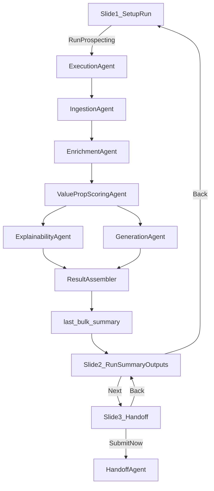

# Prospecting Agent v4 UI and System Infrastructure

## Objective
Convert the current single-page prospecting workflow into a guided slide-based journey that reduces cognitive load and makes navigation predictable:
- Slide 1: setup + run
- Slide 2: run summary + per-account outputs
- Slide 3: handoff

This plan prioritizes simplicity-first UX, consistent interaction patterns, and low-friction task completion.

## UX Principles Applied
- **Progressive disclosure:** show only what’s needed for the current step.
- **Single primary action per slide:** minimize CTA overload.
- **State persistence:** user inputs/results survive slide changes.
- **Navigation confidence:** Back/Next always work, with clear disabled states when prerequisites are unmet.
- **Scanability:** concise headers, card sections, and stable button placement.

## Scope
- In scope: prospecting page flow, navigation state model, button behavior, rendering boundaries, QA scenarios.
- In scope: subagent decomposition for prospecting workstreams and a top-level orchestrator execution agent for coordination/debugging.
- Out of scope: MAP page redesign, deep visual theme overhaul, non-prospecting architecture changes.

## Target Files
- [/Users/neelmishra/.cursor/Rula/rula-gtm-agent/app.py](/Users/neelmishra/.cursor/Rula/rula-gtm-agent/app.py)
- [/Users/neelmishra/.cursor/Rula/rula-gtm-agent/src/ui/components.py](/Users/neelmishra/.cursor/Rula/rula-gtm-agent/src/ui/components.py)
- New: `/Users/neelmishra/.cursor/Rula/rula-gtm-agent/src/orchestrator/execution_agent.py`
- New: `/Users/neelmishra/.cursor/Rula/rula-gtm-agent/src/orchestrator/subagents.py`
- New: `/Users/neelmishra/.cursor/Rula/rula-gtm-agent/src/orchestrator/contracts.py`
- [/Users/neelmishra/.cursor/Rula/rula-gtm-agent/tests/test_ux_acceptance.py](/Users/neelmishra/.cursor/Rula/rula-gtm-agent/tests/test_ux_acceptance.py)
- New: `/Users/neelmishra/.cursor/Rula/rula-gtm-agent/tests/test_prospecting_slide_flow_v4.py`
- New: `/Users/neelmishra/.cursor/Rula/rula-gtm-agent/tests/test_execution_agent_v4.py`

## Subagent System Design (Lightweight + Debuggable)
Apply a modular AI-engineering/solution-architecture pattern: isolate high-volatility workstreams into focused agents with strict contracts and independent telemetry.

### Workstream Decomposition
- **IngestionAgent**
  - Responsibility: resolve data source, normalize account payloads, validate required fields.
  - Inputs: source config, raw account list.
  - Outputs: normalized accounts, ingestion warnings.
- **EnrichmentAgent**
  - Responsibility: compute enrichment features and readiness metadata.
  - Inputs: normalized accounts.
  - Outputs: enriched accounts, confidence flags.
- **ValuePropScoringAgent**
  - Responsibility: run deterministic scoring/taxonomy and emit ranked props + signal attribution.
  - Inputs: enriched accounts.
  - Outputs: ranked value props, scoring evidence, scoring version.
- **ExplainabilityAgent**
  - Responsibility: generate account-specific value-prop rationale (Gemini-primary + deterministic fallback).
  - Inputs: scoring evidence and account signals.
  - Outputs: explanation payloads, specificity score, fallback flags.
- **GenerationAgent**
  - Responsibility: generate email + discovery questions (Claude-primary/Gemini-fallback + deterministic validators/fallbacks).
  - Inputs: segment context, company context, mapped value props.
  - Outputs: outreach payloads and policy validation metadata.
- **HandoffAgent**
  - Responsibility: route outputs to sequencer/CRM/review queues and archive manifests.
  - Inputs: reviewed run artifacts.
  - Outputs: handoff result package and delivery status.

### Orchestrator Execution Agent (Top Layer)
- Add an **ExecutionAgent** above subagents to coordinate end-to-end runs.
- Core responsibilities:
  - Stage ordering and dependency checks.
  - Retry/fallback policy at agent boundaries.
  - Circuit-break style containment (one failed subagent doesn’t crash unrelated stages).
  - Per-agent timing/error telemetry and correlation IDs.
  - Deterministic run log for postmortems.
- Execution strategy:
  - Sequential core path for dependency-bound stages (Ingestion -> Enrichment -> Scoring -> Explainability/Generation -> Handoff).
  - Parallelizable branches where safe (Explainability and Generation can run concurrently once scoring context is ready).

### Agent Contracts and Isolation
- Define strict typed contracts (`contracts.py`) for every handoff:
  - `IngestionResult`, `EnrichmentResult`, `ScoringResult`, `ExplainabilityResult`, `GenerationResult`, `HandoffResult`.
- Enforce:
  - Input schema validation at every boundary.
  - Explicit error envelopes (`code`, `message`, `recoverable`, `stage`).
  - Versioned contract fields for backward compatibility.
- Debuggability enhancements:
  - Per-subagent logs include `run_id`, `account_id`, `stage`, `attempt`, `provider`, `fallback_used`.
  - Emit stage-level metrics and failure counters for quick root-cause mapping.

### Subagent result contract schemas (draft v0 — implement as Pydantic in `contracts.py`)

All timestamps ISO 8601 UTC strings unless noted. Implement `model_config = ConfigDict(extra="forbid")` on public result types to catch drift early.

#### Shared primitives

| Field | Type | Required | Description |
| --- | --- | --- | --- |
| `contract_version` | `str` | yes | Contract schema version (e.g. `prospecting_contracts_v0.1`). Bump on breaking field changes. |
| `run_id` | `str` | yes | UUID for one end-to-end prospecting run (ExecutionAgent scope). |
| `correlation_id` | `str` | yes | Propagated across all subagent calls for log join. |
| `stage` | `str` | yes | Enum-like string: `ingestion`, `enrichment`, `scoring`, `explainability`, `generation`, `handoff`. |
| `started_at_ms` | `float` | yes | Monotonic or wall-clock ms at stage start. |
| `finished_at_ms` | `float` | yes | Stage end. |
| `duration_ms` | `float` | yes | `finished_at_ms - started_at_ms`. |

#### `SubagentErrorEnvelope` (optional on every result; present when `ok` is false or partial failure)

| Field | Type | Required | Description |
| --- | --- | --- | --- |
| `code` | `str` | yes | Stable machine code (e.g. `INGEST_EMPTY`, `SCORE_TIMEOUT`). |
| `message` | `str` | yes | Human-readable summary. |
| `stage` | `str` | yes | Which subagent emitted this. |
| `recoverable` | `bool` | yes | Whether ExecutionAgent may retry or use fallback path. |
| `account_id` | `int \| None` | no | Set when error is per-account in bulk runs. |
| `retry_after_ms` | `int \| None` | no | Hint for backoff. |

#### `SignalAttributionRecord` (used inside scoring / explainability payloads)

| Field | Type | Required | Description |
| --- | --- | --- | --- |
| `signal` | `str` | yes | Stable signal id (e.g. `industry_health_system`). |
| `value_prop` | `str` | yes | Target VP key or `_all` for global penalties. |
| `weight` | `int` | yes | Applied delta (may be negative). |
| `matched_text` | `str` | yes | Snippet or normalized value that triggered the signal. |
| `source_field` | `str` | yes | `industry`, `us_employees`, `health_plan`, `notes`, `interaction`, etc. |

#### `IngestionResult`

| Field | Type | Required | Description |
| --- | --- | --- | --- |
| `ok` | `bool` | yes | False if no usable accounts after validation. |
| `error` | `SubagentErrorEnvelope \| None` | no | Set when `ok` is false. |
| `source` | `str` | yes | `test_data`, `clay`, etc. |
| `accounts` | `list[dict]` | yes | Sanitized account dicts ready for `Account.model_validate`. |
| `account_count` | `int` | yes | `len(accounts)`. |
| `warnings` | `list[str]` | yes | Non-fatal issues (e.g. dropped malformed rows). |
| `dropped_count` | `int` | yes | Rows excluded from `accounts`. |
| `ingestion_profile` | `str` | yes | Version tag for loader behavior (e.g. `ingestion_v1`). |

#### `EnrichmentResult`

| Field | Type | Required | Description |
| --- | --- | --- | --- |
| `ok` | `bool` | yes | False if enrichment cannot proceed for any account. |
| `error` | `SubagentErrorEnvelope \| None` | no | Top-level failure. |
| `rows` | `list[EnrichmentRow]` | yes | One entry per ingested account. |

**`EnrichmentRow`**

| Field | Type | Required | Description |
| --- | --- | --- | --- |
| `account_id` | `int` | yes | Stable id. |
| `account_payload` | `dict` | yes | Original sanitized account dict (for UI/export). |
| `enriched` | `dict` | yes | Serialized `EnrichedAccount` (or nested model). |
| `row_error` | `SubagentErrorEnvelope \| None` | no | Per-row failure; other rows may still succeed. |

#### `ValuePropScoringResult`

| Field | Type | Required | Description |
| --- | --- | --- | --- |
| `ok` | `bool` | yes | |
| `error` | `SubagentErrorEnvelope \| None` | no | |
| `scoring_version` | `str` | yes | e.g. `v3.0` from scorer config. |
| `rows` | `list[ScoringRow]` | yes | Per-account scoring output. |

**`ScoringRow`**

| Field | Type | Required | Description |
| --- | --- | --- | --- |
| `account_id` | `int` | yes | |
| `matches` | `list[ValuePropMatch]` | yes | Sorted descending by score; top-N may be sliced by orchestrator. |
| `attributions` | `list[SignalAttributionRecord]` | yes | Full evidence trail for this account. |

#### `ExplainabilityResult`

| Field | Type | Required | Description |
| --- | --- | --- | --- |
| `ok` | `bool` | yes | |
| `error` | `SubagentErrorEnvelope \| None` | no | |
| `rows` | `list[ExplainabilityRow]` | yes | |

**`ExplainabilityRow`** (per account; typically top 3 VPs explained)

| Field | Type | Required | Description |
| --- | --- | --- | --- |
| `account_id` | `int` | yes | |
| `value_prop` | `str` | yes | Which VP this block explains. |
| `explanation_text` | `str` | yes | Final user-facing text. |
| `explanation_provider` | `str` | yes | `gemini`, `claude`, `template`, etc. |
| `explanation_prompt_version` | `str` | yes | Prompt contract version. |
| `evidence_refs` | `list[str]` | yes | Stable refs echoing attribution (e.g. `industry:Health System`). |
| `specificity_score` | `int` | yes | 0–100; must meet threshold or fallback path used. |
| `fallback_used` | `bool` | yes | True if LLM path skipped or failed into template. |
| `flags` | `list[str]` | yes | e.g. `EXPLAINABILITY_FALLBACK_USED`. |

#### `GenerationResult`

| Field | Type | Required | Description |
| --- | --- | --- | --- |
| `ok` | `bool` | yes | |
| `error` | `SubagentErrorEnvelope \| None` | no | |
| `rows` | `list[GenerationRow]` | yes | |

**`GenerationRow`**

| Field | Type | Required | Description |
| --- | --- | --- | --- |
| `account_id` | `int` | yes | |
| `email` | `OutreachEmail` (or dict) | yes | `subject_line`, `body`, `cta`. |
| `discovery_questions` | `list[str]` | yes | Length 3 when policy satisfied. |
| `email_provider` | `str` | yes | `claude`, `gemini`, `template`, etc. |
| `questions_provider` | `str` | yes | |
| `email_prompt_version` | `str` | yes | e.g. `v3`. |
| `questions_prompt_version` | `str` | yes | |
| `email_validation_passed` | `bool` | yes | Post-validator result. |
| `email_repair_attempted` | `bool` | yes | |
| `email_fallback_used` | `bool` | yes | |
| `questions_validation_passed` | `bool` | yes | |
| `questions_repair_attempted` | `bool` | yes | |
| `questions_fallback_used` | `bool` | yes | |
| `context_source` | `str` | yes | `linkedin`, `news`, `none`. |
| `context_snippet` | `str` | yes | May be empty if missing. |
| `segment_label` | `str` | yes | Resolved segment for prompts. |
| `emphasis_vp` | `str` | yes | Segment override or top VP. |
| `competitor_token` | `str` | yes | CTA competitor phrase. |
| `wedge` | `str` | yes | Strategic wedge label. |
| `policy_flags` | `list[str]` | yes | e.g. `TEMPLATE_FALLBACK_USED`, `MISSING_CONTEXT`. |

#### `HandoffResult` (align with existing `handoff_orchestrator` output; field names stable for UI)

| Field | Type | Required | Description |
| --- | --- | --- | --- |
| `ok` | `bool` | yes | |
| `error` | `SubagentErrorEnvelope \| None` | no | |
| `sequencer_payloads` | `list[dict]` | yes | One entry per routed draft (shape per existing integration). |
| `crm_manifest` | `list[dict]` | yes | |
| `review_queue` | `list[dict]` | yes | Human-review / DLQ rows. |
| `archive_path` | `str \| None` | yes | Durable archive location if written. |
| `telemetry_refs` | `list[str]` | no | Event ids or file paths for audit. |

#### `ExecutionAgentRunResult` (orchestrator aggregate — one per `run_id`)

| Field | Type | Required | Description |
| --- | --- | --- | --- |
| `run_id` | `str` | yes | |
| `correlation_id` | `str` | yes | |
| `ok` | `bool` | yes | True if run completed with usable bulk summary for UI. |
| `milestones` | `dict[str, str]` | yes | e.g. `slide1`: `prospecting_executed`, `slide2`: `results_materialized`, `slide3`: `handoff_ready`. |
| `ingestion` | `IngestionResult \| None` | no | |
| `enrichment` | `EnrichmentResult \| None` | no | |
| `scoring` | `ValuePropScoringResult \| None` | no | |
| `explainability` | `ExplainabilityResult \| None` | no | May be partial in bulk. |
| `generation` | `GenerationResult \| None` | no | |
| `handoff` | `HandoffResult \| None` | no | Only after user submits on Slide 3. |
| `fatal_error` | `SubagentErrorEnvelope \| None` | no | Stops pipeline. |
| `stage_errors` | `list[SubagentErrorEnvelope]` | yes | Non-fatal accumulated errors. |

#### Implementation notes
- Map existing `BulkRunSummary` / `ProspectingOutput` into these contracts at the orchestrator boundary; avoid duplicating business logic in the UI layer.
- Golden-file tests: serialize each result type to JSON and snapshot stable field sets.
- Deprecation: add new fields with defaults; bump `contract_version` only on removals or type changes.

## Slide Architecture
### Slide 1: Setup and Run
- Content:
  - Data source selector
  - Run mode selector
  - Preview accounts
  - Run prospecting for all accounts
- Bottom actions:
  - **Primary:** `Next`
- Rules:
  - `Next` disabled until a bulk run result exists (`last_bulk_summary` in session state).
  - Running prospecting remains on Slide 1 and updates state/results in background.

### Slide 2: Results
- Content:
  - Run summary cards
  - Per-account output panels (including edit/revert behavior already implemented)
- Bottom actions:
  - **Secondary:** `Back` -> Slide 1
  - **Primary:** `Next` -> Slide 3
- Rules:
  - `Next` disabled when no summary exists.
  - Account expanders/edit state persist across navigation.

### Slide 3: Handoff
- Content:
  - Handoff panel and `Submit Now`
- Bottom actions:
  - **Secondary:** `Back` -> Slide 2
- Rules:
  - `Submit Now` behavior unchanged (existing orchestration).
  - Back navigation never clears run outputs.

## State and Navigation Model
- Add a dedicated session-state key: `prospecting_slide` with values `{1,2,3}`.
- Add helper functions in `app.py`:
  - `get_current_slide()`
  - `go_to_slide(target:int)` with guard checks
  - `can_go_next_from_slide1()` and `can_go_next_from_slide2()`
- Persist and reuse existing keys:
  - `last_bulk_summary`, edit-state keys, `active_account_expander`, handoff result keys.
- Navigation actions should not reinitialize run data.

## Rendering Refactor Plan
- Split current `_page_prospecting()` body into three focused renderers:
  - `_render_prospecting_slide1_setup()`
  - `_render_prospecting_slide2_results(summary)`
  - `_render_prospecting_slide3_handoff(summary)`
- Add shared footer nav renderer:
  - `_render_slide_footer_nav(slide:int)` for consistent button placement and behavior.
- Keep existing business logic calls intact (`run_prospecting_bulk`, `_render_bulk_summary`, `_render_handoff_panel`), but place them in slide-appropriate containers.
- Wire slide transitions to the ExecutionAgent state so each slide reflects concrete orchestrator milestones:
  - Slide 1 completion => `run_initialized`/`prospecting_executed`
  - Slide 2 availability => `results_materialized`
  - Slide 3 availability => `handoff_ready`

## Interaction and UX Details
- Keep controls in a stable bottom row on every slide (same order, same sizing).
- Use concise slide titles and progress hint (e.g., `Step 1 of 3`).
- Prevent “dead clicks”:
  - disabled Next shows short helper text explaining why.
- Ensure Back is safe and reversible; no destructive behavior on navigation.

## Test Plan
- Add unit/integration tests for slide flow:
  - Initial load defaults to Slide 1.
  - Next from Slide 1 blocked until summary exists.
  - Next from Slide 1 moves to Slide 2 after successful run.
  - Back from Slide 2 returns to Slide 1 with state preserved.
  - Next from Slide 2 moves to Slide 3.
  - Back from Slide 3 returns to Slide 2.
  - Handoff CTA remains functional on Slide 3.
  - Existing per-account edit/revert counters remain correct after cross-slide navigation.
- Run existing UX acceptance and regression suite.
- Add orchestration tests:
  - Subagent contract validation and stage ordering.
  - Partial-failure containment and fallback behavior.
  - Parallel branch correctness (Explainability + Generation join behavior).
  - Per-subagent telemetry and correlation ID propagation.

## Rollout and QA Checklist
- Manual walkthrough:
  1. Run bulk on Slide 1 -> Next to Slide 2.
  2. Edit/revert an account email on Slide 2.
  3. Next to Slide 3, submit handoff.
  4. Back to Slide 2 and Slide 1, verify state persistence.
- Confirm no regressions in:
  - handoff archive outputs
  - global email-edits ratio
  - per-account indicators

## Data Flow (Prospecting v4 UI)

## Acceptance Criteria
- Prospecting UI is split into 3 slides with functional Back/Next controls.
- Slide 1 contains data source, run mode, preview, and run-all action.
- Slide 2 contains run summary and per-account outputs.
- Slide 3 contains handoff with `Submit Now` and Back.
- Navigation preserves run/edit/handoff state and does not reset context.
- Buttons are consistently placed, clearly labeled, and gated by valid prerequisites.
- Existing backend logic and handoff semantics remain unchanged.
- Prospecting execution is decomposed into independently testable subagents with typed contracts.
- A top-level ExecutionAgent orchestrates stage order, retries/fallbacks, and per-stage observability.
- Failures can be traced to a specific subagent/stage via correlation IDs and stage-scoped telemetry.