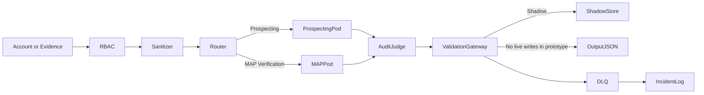

# Architecture Overview

## End-to-End Flow

## Pods

- Prospecting Pod: Enrichment, Matching, Generation, Evaluation
- MAP Pod: Parsing, Scoring, Flagging
- Shared controls: lineage, guardrails, validation gateway, feedback memory
- Hardening controls: RBAC, retention cleanup, DLQ + incidents, structured MAP capture

## Security model (prototype)

- **RBAC** (`src/security/rbac.py`) maps roles to permissions for pipeline actions (e.g. `prospecting:run`, `map:run`).
- **Not a full auth system:** the Streamlit UI can let the operator pick a role in non-production environments; that selection is **not** proof of identity. Treat it as UX for demos only.
- **`ENVIRONMENT=production`:** `resolve_role` forces an effective role of **`viewer`** and is intended to stop casual self-escalation; production deployments should still attach roles from a **trusted identity provider**, not from the client.

## Promotion Criteria (Shadow -> Live)

- Structural match rate >= 98%
- Directional match rate >= 80%
- No unresolved high-severity incidents
- Retention, RBAC, and kill-switch checks pass
