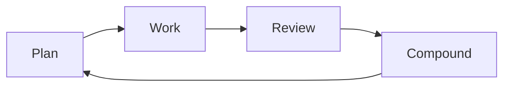

# End-to-End Compound Engineering SOP

## Document control

| Field | Value |
|-------|-------|
| **Version** | 1.0 |
| **Applies to** | All software delivery (features, fixes, refactors, infra) where AI assistance may be used |
| **Primary loop** | Plan → Work → Review → Compound → Repeat |
| **Conceptual source** | [Every — Compound Engineering](https://every.to/guides/compound-engineering) (synthesized into procedural SOP; aligned with this repo’s `02-compound-engineering-framework.md`) |

---

## 1. Purpose and scope

### 1.1 Purpose

This SOP defines a **repeatable end-to-end procedure** for engineering work such that:

- Each unit of work **reduces** future cost (understanding, change, verification), not increases it.
- Planning and review receive **most engineering attention**; implementation is **validated**, not babysat line-by-line.
- Learnings are **captured, classified, and wired into the system** (docs, rules, automation)—the **Compound** step is non-optional for sustained benefit.

### 1.2 When to use this SOP

Use for every non-trivial change, including:

- User-facing features and UX changes
- Bug fixes that imply class-level prevention
- Refactors touching contracts, data, or security boundaries
- Performance, reliability, and operational changes

**Exemptions** (document the reason in the PR or a one-line note):

- Typo-only or purely cosmetic changes with zero behavioral risk
- Emergency hotfixes—run a **retro compound** within one business day

### 1.3 Success criteria

A work item is “done” only when **all** are true:

1. An **approved plan** exists (or a recorded waiver for trivial work).
2. **Evidence of validation** matches the risk tier (tests, lint, types, integration checks as applicable).
3. **Review findings** are triaged (P1/P2/P3); P1 resolved; P2 resolved or explicitly deferred with owner and date.
4. A **compound artifact** exists per `10-compound-memory-spec.md` and at least one **system update** landed (rule, checklist, template, or automation).

---

## 2. Principles and operating assumptions

### 2.1 Core philosophy

- **Compound over accumulate:** Features should teach the system new capabilities; fixes should eliminate **categories** of future failure where feasible.
- **System over artifact:** A reliable process that produces good changes beats any single clever change.
- **Taste in the system:** Conventions, guardrails, and examples live in **versioned** agent/human context (e.g. project instructions, `CLAUDE.md` / `AGENTS.md`, style guides)—not only in senior engineers’ heads.
- **Trust through verification:** Prefer automated checks, reproducible evidence, and structured review over manual line-by-line gatekeeping.

### 2.2 Time allocation (guidance)

- **Within a single delivery cycle:** Aim for **most thinking before and after** implementation—heavyweight **Plan** and **Review**, lighter **Work** when the plan is sound. (The Every guide suggests ~**80%** Plan+Review vs ~**20%** Work+Compound for the feature loop; treat as a heuristic, not a stopwatch.)
- **Across the engineering portfolio:** Balance **~50%** direct product delivery with **~50%** **system investment**—documentation, review agents, generators, tooling—that makes future delivery cheaper. Traditional teams often invert this; compound teams **schedule** system work.

### 2.3 Beliefs to retire (common blockers)

| Old belief | Replacement |
|------------|-------------|
| Code must be typed by hand | Maintainability and correctness matter; **authorship** does not |
| Every line needs human eyeballing | Use **layered** review: automation, specialized checks, sampling, intent-focused human review |
| The engineer must originate every solution | Engineer supplies **taste, constraints, and selection** among researched options |
| Code is the primary artifact | **Plans, tests, docs, and compounding** are first-class deliverables |
| First drafts should be perfect | **Iterate fast**; use plans and review to converge |
| More typing = more learning | **Understanding** comes from research, review, and teaching the system |

### 2.4 Beliefs to adopt

1. **Extract taste into files and automation** (instructions, skills, linters, codeowners).
2. **Plans are source of truth** for agents and humans before large implementation.
3. **Parallelize** safe work (research, review dimensions, validation).
4. **Agent-native environments:** If a human can run tests, read logs, or open a PR, the agent should be able to as well—**progressively** (see §8.3).
5. **Compound every meaningful closure**—especially surprises, incidents, and “we fixed it twice” bugs.

---

## 3. Roles and responsibilities (RACI-style)

| Activity | **R**esponsible | **A**ccountable | **C**onsulted | **I**nformed |
|----------|-----------------|-----------------|---------------|--------------|
| Plan draft | Feature Owner | Feature Owner | Domain experts | Team |
| Plan approval | Feature Owner | Feature Owner | Reviewers / approvers | Team |
| Implementation | Feature Owner (+ AI/tools) | Feature Owner | — | Reviewers (as needed) |
| Review orchestration | Feature Owner | Feature Owner | Reviewers | Team |
| Finding triage & fixes | Feature Owner | Feature Owner | Specialists | Team |
| Compound artifact & system updates | Feature Owner | Feature Owner | Platform / tech lead | Team |
| Merge / release | Feature Owner | Feature Owner per `03-operating-model.md` | Domain approvers for high risk | Stakeholders |

**Rules:**

- **Single feature owner** across the full loop (per `02-compound-engineering-framework.md`).
- **Silence is not approval** on plans—require an explicit approval marker (comment, label, commit trailer, or doc sign-off).

---

## 4. End-to-end procedure

### 4.0 Lifecycle overview



---

### Phase 1 — Plan

#### Objective

Turn an idea into a **reviewable blueprint** with explicit risks, scope, and validation strategy.

#### Required inputs

- Problem / outcome statement
- Constraints (time, compliance, tech, UX)
- Links to tickets, designs, research, or incidents

#### Actions

1. **Understand the requirement**
   - What are we building **for users**?
   - **Why now?** What changes if we don’t ship?
   - What **constraints** (perf, privacy, accessibility, backwards compatibility)?

2. **Research internally**
   - How does **similar** functionality work today?
   - What **patterns** must we follow (architecture, DDD boundaries, error handling)?

3. **Research externally**
   - Framework / platform docs
   - Security and data-handling standards (e.g. OWASP ASVS for applicable surfaces—align with `12-external-best-practices.md`)

4. **Design the solution**
   - Approach and **non-goals**
   - **Affected components and files** (best-effort; refine during work)
   - **Data and API contracts** if touched
   - **Edge cases** and failure modes

5. **Validate the plan**
   - Does the story **hold together** end-to-end?
   - What **tests or proofs** will convince us it’s correct?
   - What’s the **rollback / feature-flag** posture (`03-operating-model.md`)?

6. **Classify risk** (low / medium / high) per `03-operating-model.md`.

7. **Obtain explicit approval** before substantial implementation.

#### Deliverables

- Plan document in `docs/plans/` (use `04-templates/plan-template.md` if available)
- Risk note for medium/high risk
- Approval marker recorded

#### Quality gate — exit criteria

- [ ] Problem, scope, and **non-goals** are explicit  
- [ ] Contracts and **failure modes** considered  
- [ ] Validation strategy matches **risk tier**  
- [ ] **Approved** by owner + required approvers  

#### Optional: fuzzy requirements

If requirements are unclear, run a **brainstorm** phase (questions, options, decisions) and **archive** outputs under `docs/brainstorms/` before planning.

---

### Phase 2 — Work

#### Objective

Execute the approved plan with **isolation**, **traceability**, and **continuous validation**.

#### Required inputs

- Approved plan
- Clean sync with mainline (or documented divergence window)

#### Actions

1. **Set up isolation**
   - Prefer **feature branch**; use **git worktrees** for parallel or risky experiments
   - Keep commits **coherent** (mechanical vs semantic changes)

2. **Execute in steps**
   - Map commits or subtasks to **plan sections**
   - If reality diverges, **update the plan** or record decision deltas

3. **Run validations continuously**
   - Unit/integration tests as applicable
   - Lint and **typecheck** where the stack supports it
   - For high risk: integration or staging evidence per merge gates (`03-operating-model.md`)

4. **Track progress**
   - Checklist of plan items vs done
   - Open risks and blockers visible to reviewers early

5. **Handle issues**
   - When something breaks, **pause**, adjust plan or scope, **do not** stack unrelated fixes

6. **Operational hygiene**
   - If using AI agents: **you do not need to watch every line** if the plan and checks are trustworthy—**you remain accountable** for outcomes

#### Deliverables

- Implementation on branch
- Validation evidence (CI green; notes for manual checks)
- Updated plan if material assumptions changed

#### Quality gate — exit criteria

- [ ] All **plan must-haves** implemented or explicitly descoped with approval  
- [ ] **CI / local validation** meets risk tier  
- [ ] **No known P1-class issues** remaining (security, data corruption, broken critical path)  

---

### Phase 3 — Review

#### Objective

Catch issues **before** merge and capture **structured** learnings that feed compounding.

#### Required inputs

- PR / changeset with description tied to plan
- Test and lint/type results

#### Actions

1. **Multi-layer review** (combine as appropriate; parallelize when safe)
   - **Automated:** security scanning, tests, coverage thresholds, static analysis
   - **Specialized perspectives:** security, performance, data integrity, architecture simplicity, framework conventions, accessibility, copy/voice (as relevant)
   - **Human:** intent, domain correctness, UX, whether the plan matches what shipped

2. **Triage findings** to **P1 / P2 / P3** (`09-governance-and-triage.md` if present)

   Suggested meanings:

   - **P1 — Must fix before merge:** exploitable security, data loss/corruption, broken authorization, critical reliability  
   - **P2 — Should fix before merge:** material perf/regression risk, maintainability traps, missing tests for critical logic  
   - **P3 — Nice to fix:** style nits, minor refactors, non-blocking suggestions  

3. **Resolve or defer**
   - Fix P1; fix P2 or **defer** with owner + **due date** + rationale
   - Queue P3 to backlog or compound notes

4. **Validate fixes**
   - Re-run targeted tests / checks for touched areas

5. **Capture emergent patterns**
   - Note repeated review themes for **Compound**

#### Deliverables

- Review record in `docs/reviews/` or PR thread with **prioritized** findings list
- Merge readiness decision

#### Quality gate — exit criteria

- [ ] P1 **empty**  
- [ ] P2 **resolved or explicitly deferred** with accountability  
- [ ] Human reviewer confirms **intent** and **risk posture**  
- [ ] **Evidence** of validation attached  

#### Human review focus (when AI/pre-review already ran)

Ask: **Does this match what we agreed to build?** Is domain logic right? Is UX/copy acceptable?

Do **not** spend human time on issues better caught by **linters** or **standardized agents**—fix the **tooling** if gaps repeat.

#### Three questions for any AI-generated output

Ask the implementer (human or agent transcript):

1. **What was the hardest decision here?**  
2. **What alternatives did you reject, and why?**  
3. **What are you least confident about?**  

---

### Phase 4 — Compound

#### Objective

Convert the completed work into **durable system memory** and **prevent recurrence**.

#### Required inputs

- Merged or ready-to-merge changeset
- Review summary and surprises encountered

#### Actions

1. **Capture the solution pattern**
   - What **worked**, what **didn’t**, what is **reusable**?

2. **Classify for retrieval**
   - Write a compound doc with YAML metadata per `10-compound-memory-spec.md`  
   - Tags: domains, components, risk, technologies

3. **Update the system** (at least one)
   - Agent/project instructions (`CLAUDE.md`, `AGENTS.md`, or equivalent)
   - Templates (`04-templates/`)
   - Checklists (`05-checklists/`)
   - Linters, codegen, CI checks
   - Runbooks (`docs/runbooks/`)

4. **Verify the learning**
   - **Would we catch this automatically next time?** If not, add a **test**, **lint rule**, or **review checklist** item.

5. **Schedule system investments**
   - If review surfaced a **class** of issues, allocate **system time** (50/50 guidance) to fix the class, not just the instance.

#### Deliverables

- Compound artifact in `docs/solutions/` (or team-standard location)
- Linked plan + PR references
- Proof of **system update** (file names or PR links)

#### Quality gate — exit criteria

- [ ] Metadata complete (`10-compound-memory-spec.md`)  
- [ ] **Prevention rules** explicit  
- [ ] At least one **durable asset** updated beyond the feature code  
- [ ] **Evidence** of validation referenced  

---

## 5. Quality gates summary

| Phase | Entry | Exit (minimum) |
|-------|--------|----------------|
| Plan | Problem known | Approved plan + risk tier |
| Work | Approved plan | Validation matches tier; no known P1 |
| Review | PR ready | P1 clear; P2 closed or deferred; intent OK |
| Compound | Merge / closure | Compound doc + system update |

---

## 6. Tooling and artifacts map

Align with `README.md` **Default Folder Contract**:

| Artifact | Typical path | Purpose |
|----------|--------------|---------|
| Plan | `docs/plans/` | Source of truth pre-implementation |
| Brainstorm | `docs/brainstorms/` | Fuzzy ideation before planning |
| Review notes | `docs/reviews/` or PR | Prioritized findings |
| Compound / solutions | `docs/solutions/` | Searchable institutional memory |
| Todos / triage | `todos/` | Prioritized follow-ups with status |
| Agent context | `CLAUDE.md`, `AGENTS.md`, `.cursor/rules/` | Session-zero instructions |

**Reference layout** (from Every’s compound-engineering plugin; adapt names to your org):

```text
your-project/
├── CLAUDE.md              # or AGENTS.md / equivalent
├── docs/
│   ├── brainstorms/
│   ├── solutions/
│   └── plans/
└── todos/
```

---

## 7. Adoption maturity model

Use this ladder for **honest self-assessment**; **do not skip stages** if trust isn’t there.

| Stage | Mode | Compounding |
|-------|------|-------------|
| **0** | Manual dev | Ad hoc docs |
| **1** | Chat assistance (copy/paste) | Personal prompt notes |
| **2** | Agent edits file-by-file approval | Start instruction file; log mistakes |
| **3** | **Plan-first, PR-level review** | **Compound engineering starts**—each cycle teaches the system |
| **4** | Idea → full pipeline locally (plan, build, validate, PR) | Strong docs + automation |
| **5** | Parallel cloud execution; fleet of agents | System investments dominate bottlenecks |

### 7.1 Level-up moves (condensed)

- **0 → 1:** Pick one daily tool; ask **explanatory** questions before coding; delegate boilerplate; **review everything**; save good prompts.  
- **1 → 2:** File-system agents; **small** scoped tasks; review **diffs**; start `CLAUDE.md` / equivalent.  
- **2 → 3:** **Invest in plans**; let agents research; **execute without line babysitting**; **review at PR**; document **plan gaps** after.  
- **3 → 4:** **Outcome-focused** directives; agent-owned planning after you **approve** direction; reuse **patterns** (“like we did X”).  
- **4 → 5:** Remote/parallel runners; **queues** of work; know **serial vs parallel** tasks to avoid thrash.

---

## 8. Specialized playbooks

### 8.1 Agent-native environment (progressive)

**Mindset prompts:**

- Building: “How will an **agent** interact with this?”  
- Debugging: “What would an agent **need to see**?”  
- Documenting: “Will an agent **understand** this tomorrow?”  

**Capability checklist** (expand over time):

- Run app locally, tests, lint, typecheck, migrations, seed data  
- Git: branch, commit, push, open PR, read comments  
- Debug: logs (local + **read-only** prod), traces, screenshots, network traces, error trackers  

**Levels:** basic dev → full local → prod visibility → full integration (tickets, deploy) — mirror `07-metrics-and-compounding.md` scoring where used.

### 8.2 Permissions and velocity (e.g. Claude Code)

Flags like `--dangerously-skip-permissions` trade **prompt friction** for **speed**. **Only** use when:

- You **trust** plan + review + rollback path  
- Environment is **non-production** or tightly scoped  
- **Git** and **tests** provide undo and detection  

**Never** use “skip permissions” as a substitute for **production safety**. Always **review before merge**.

### 8.3 Design and UX

- **Baby app / throwaway repo** for exploration; **do not** experiment blindly in production codebase.  
- **UX discovery:** generate variants, click through, **user test**, then **discard** prototypes and **re-plan** for real implementation.  
- **Figma / design handoff:** plan with design links; compare implementation vs spec; iterate on **live** builds.  
- **Codify design system** as a skill or doc so agents match **team taste**.

### 8.4 “Vibe coding” (fast path) — **with guardrails**

Acceptable for **personal tools, prototypes, spikes**—**not** for production systems, security-sensitive, or multi-team maintenance without full SOP.

**Rule:** If vibe coding informed discovery, **rewrite with a real plan** before merge to main.

### 8.5 Team collaboration

**Traditional:** Human A codes → Human B reviews → merge.  

**Compound:** Human A **plans** → AI implements → **multi-layer review** → Human B validates **intent + risk** → merge.

**Scaling patterns:**

- **One owner** per feature; async plan review  
- **Small PRs + feature flags** to reduce merge thrash  
- **Compound docs** replace “ask Sarah how auth works”

### 8.6 Research, analytics, and copy

- Structure interviews and personas so **agents can consume** them (`docs/research/…`).  
- Treat **copy as part of the plan**; codify **voice**; review copy like code.  
- Product marketing artifacts (release notes, screenshots) can **flow from the plan**—keep **one source of truth**.

---

## 9. Governance and metrics

### 9.1 Metrics (examples — align with `07-metrics-and-compounding.md`)

- **Cycle time** per risk tier  
- **Defect escape rate** after merge (P1/P2 found post-release)  
- **Compound throughput:** # of merged PRs with compliant compound artifacts  
- **Reuse:** instances where a `docs/solutions/` doc prevented repeat research  
- **System investment ratio:** time on tooling/docs vs feature delivery (target toward **50/50** over quarters)

### 9.2 Weekly ritual

Follow `03-operating-model.md` **Weekly Compounding Ritual** and `14-weekly-rollout-checklist.md` when rolling out.

---

## 10. Appendices

### Appendix A — Plan brief template

```markdown
---
title: <short title>
owner: <name>
date: <YYYY-MM-DD>
risk_tier: low|medium|high
status: draft|approved
---

## Outcome
What users can do / what problem disappears.

## Non-goals
What we are explicitly not doing.

## Approach
1. …
2. …

## Affected areas
- Components: …
- Data/contracts: …

## Edge cases & failure modes
- …

## Validation
- Tests: …
- Manual: …

## Rollout / rollback
- Flags: …
- Rollback: …

## Approval
- [ ] <Approver> on <date>
```

### Appendix B — Review findings template

```markdown
## PR: <link>
Owner: <name>
Risk: low|medium|high

### P1 — Must fix
- [ ] …

### P2 — Should fix
- [ ] …

### P3 — Nice to fix
- [ ] …

### Human intent check
- Matches plan: yes/no
- Domain concerns: …
```

### Appendix C — Compound note template

See `10-compound-memory-spec.md`. Minimal skeleton:

```markdown
---
title: …
owner: …
date: …
tags: […]
component_domains: […]
risk_tier: …
related_files: […]
related_prs: […]
---

## Problem pattern
## Solution pattern
## Prevention / guardrails
## Evidence
## System updates (files changed)
```

### Appendix D — Handoff snippet

```markdown
## Handoff: <Feature>
From: A → To: B
Status: <plan approved | in review | etc.>
Done: …
Remaining: …
Next command / branch: …
Risks: …
```

### Appendix E — Risk controls

- Prefer **feature flags** and **incremental rollout** for user-visible risk  
- **Git** is the safety net: branch isolation, revert, bisect  
- **Worktrees** for risky experiments  
- **Post-incident compound** mandatory for Sev-1/2 (or org equivalent)

---

## 11. References (in-repo)

- [`02-compound-engineering-framework.md`](02-compound-engineering-framework.md)  
- [`03-operating-model.md`](03-operating-model.md)  
- [`09-governance-and-triage.md`](09-governance-and-triage.md)  
- [`10-compound-memory-spec.md`](10-compound-memory-spec.md)  
- [`04-templates/`](04-templates/)  
- [`05-checklists/`](05-checklists/)  

---

## 12. External reference

- Every, **Compound Engineering**: https://every.to/guides/compound-engineering  
- Every compound-engineering plugin (optional tooling): https://github.com/EveryInc/compound-engineering-plugin  

This SOP is **tool-agnostic**: you can execute it with or without vendor plugins.
